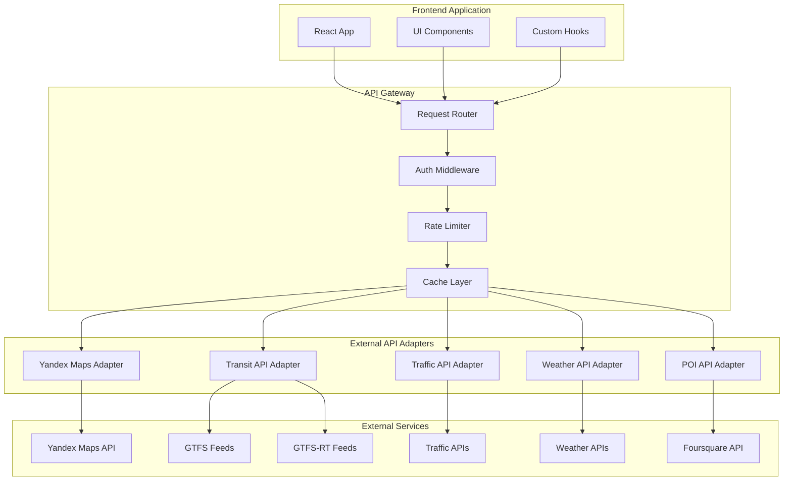

# API Integration Strategy for External Services

## Executive Summary

This document outlines the comprehensive API integration strategy for the multi-modal routing system. The strategy covers integration with Yandex Maps API, public transit data providers, traffic information services, weather APIs, and other external services necessary for delivering a robust routing experience.

## 1. API Integration Architecture

### 1.1 High-Level Integration Architecture



### 1.2 API Integration Flow

```mermaid
graph LR
    subgraph "Request Processing"
        Validate[Validate Request]
        Authenticate[Authenticate]
        Authorize[Authorize]
        RateLimit[Rate Limit]
        Cache[Check Cache]
    end
    
    subgraph "API Integration"
        Transform[Transform Request]
        Call[Call External API]
        HandleResponse[Handle Response]
        ErrorHandle[Handle Errors]
        Backoff[Exponential Backoff]
    end
    
    subgraph "Response Processing"
        ValidateResp[Validate Response]
        TransformResp[Transform Response]
        Enrich[Enrich Data]
        CacheResp[Cache Response]
        Return[Return Response]
    end
    
    Validate --> Authenticate
    Authenticate --> Authorize
    Authorize --> RateLimit
    RateLimit --> Cache
    
    Cache --> Transform
    Transform --> Call
    Call --> HandleResponse
    HandleResponse --> ErrorHandle
    ErrorHandle --> Backoff
    
    Backoff --> ValidateResp
    ValidateResp --> TransformResp
    TransformResp --> Enrich
    Enrich --> CacheResp
    CacheResp --> Return
```



## 2. Yandex Maps API Integration

### 2.1 Enhanced Yandex Maps Adapter

```typescript
class YandexMapsAdapter implements MapAPIAdapter {
    private apiKey: string;
    private baseURL: string;
    private cache: APICache;
    private rateLimiter: RateLimiter;
    
    constructor(config: YandexConfig) {
        this.apiKey = config.apiKey;
        this.baseURL = config.baseURL || 'https://api-maps.yandex.ru/2.1/';
        this.cache = new APICache(config.cacheConfig);
        this.rateLimiter = new RateLimiter(config.rateLimitConfig);
    }
    
    async geocode(address: string): Promise<GeocodeResult | null> {
        const cacheKey = `geocode:${encodeURIComponent(address)}`;
        
        // Check cache first
        const cached = await this.cache.get(cacheKey);
        if (cached) return cached;
        
        // Apply rate limiting
        await this.rateLimiter.wait('geocode');
        
        try {
            const url = this.buildURL('geocode', {
                apikey: this.apiKey,
                geocode: address,
                format: 'json',
                results: 1,
                lang: 'ru_RU'
            });
            
            const response = await fetch(url);
            const data = await response.json();
            
            const result = this.parseGeocodeResult(data);
            
            // Cache the result
            if (result) {
                await this.cache.set(cacheKey, result, 3600); // Cache for 1 hour
            }
            
            return result;
        } catch (error) {
            console.error('Geocode error:', error);
            return null;
        }
    }
    
    async reverseGeocode(coordinate: Coordinate): Promise<ReverseGeocodeResult | null> {
        const cacheKey = `reverse:${coordinate.latitude},${coordinate.longitude}`;
        
        // Check cache first
        const cached = await this.cache.get(cacheKey);
        if (cached) return cached;
        
        // Apply rate limiting
        await this.rateLimiter.wait('geocode');
        
        try {
            const url = this.buildURL('geocode', {
                apikey: this.apiKey,
                geocode: `${coordinate.longitude},${coordinate.latitude}`,
                format: 'json',
                results: 1,
                lang: 'ru_RU'
            });
            
            const response = await fetch(url);
            const data = await response.json();
            
            const result = this.parseReverseGeocodeResult(data);
            
            // Cache the result
            if (result) {
                await this.cache.set(cacheKey, result, 3600); // Cache for 1 hour
            }
            
            return result;
        } catch (error) {
            console.error('Reverse geocode error:', error);
            return null;
        }
    }
    
    async calculateRoute(request: RouteRequest): Promise<RouteResult | null> {
        const cacheKey = this.generateRouteCacheKey(request);
        
        // Check cache first
        const cached = await this.cache.get(cacheKey);
        if (cached) return cached;
        
        // Apply rate limiting
        await this.rateLimiter.wait('route');
        
        try {
            const params: Record<string, string> = {
                apikey: this.apiKey,
                format: 'json',
                lang: 'ru_RU'
            };
            
            // Add waypoints
            const waypoints = [request.origin, ...request.waypoints || [], request.destination];
            params.waypoints = waypoints
                .map(wp => `${wp.longitude},${wp.latitude}`)
                .join('|');
            
            // Add transport mode
            params.mode = this.mapTransportMode(request.mode);
            
            // Add avoid options
            if (request.avoidTolls) params.avoidTolls = 'true';
            if (request.avoidHighways) params.avoidHighways = 'true';
            
            const url = this.buildURL('route', params);
            
            const response = await fetch(url);
            const data = await response.json();
            
            const result = this.parseRouteResult(data);
            
            // Cache the result
            if (result) {
                const ttl = this.calculateRouteTTL(request.mode);
                await this.cache.set(cacheKey, result, ttl);
            }
            
            return result;
        } catch (error) {
            console.error('Route calculation error:', error);
            return null;
        }
    }
    
    async searchPlaces(request: PlaceSearchRequest): Promise<PlaceSearchResult> {
        const cacheKey = `places:${request.query}:${request.latitude}:${request.longitude}:${request.radius}`;
        
        // Check cache first
        const cached = await this.cache.get(cacheKey);
        if (cached) return cached;
        
        // Apply rate limiting
        await this.rateLimiter.wait('search');
        
        try {
            const params: Record<string, string> = {
                apikey: this.apiKey,
                text: request.query,
                ll: `${request.longitude},${request.latitude}`,
                spn: this.calculateSpan(request.radius),
                results: request.limit || 20,
                format: 'json',
                lang: 'ru_RU'
            };
            
            // Add type filters
            if (request.types && request.types.length > 0) {
                params.type = request.types.join(',');
            }
            
            const url = this.buildURL('search', params);
            
            const response = await fetch(url);
            const data = await response.json();
            
            const result = this.parsePlaceSearchResult(data);
            
            // Cache the result
            await this.cache.set(cacheKey, result, 1800); // Cache for 30 minutes
            
            return result;
        } catch (error) {
            console.error('Place search error:', error);
            return { places: [], totalCount: 0 };
        }
    }
    
    async getTransitRoutes(request: TransitRouteRequest): Promise<TransitRouteResult> {
        const cacheKey = `transit:${request.origin.latitude},${request.origin.longitude}:${request.destination.latitude},${request.destination.longitude}:${new Date(request.departureTime).getTime()}`;
        
        // Check cache first
        const cached = await this.cache.get(cacheKey);
        if (cached) return cached;
        
        // Apply rate limiting
        await this.rateLimiter.wait('transit');
        
        try {
            const params: Record<string, string> = {
                apikey: this.apiKey,
                format: 'json',
                lang: 'ru_RU',
                rll: `${request.origin.longitude},${request.origin.latitude}~${request.destination.longitude},${request.destination.latitude}`
            };
            
            // Add departure time
            if (request.departureTime) {
                params.dt = Math.floor(new Date(request.departureTime).getTime() / 1000);
            }
            
            // Add transport modes
            if (request.modes && request.modes.length > 0) {
                params.mt = this.mapTransitModes(request.modes);
            }
            
            const url = this.buildURL('masstransit', params);
            
            const response = await fetch(url);
            const data = await response.json();
            
            const result = this.parseTransitRouteResult(data);
            
            // Cache the result
            await this.cache.set(cacheKey, result, 300); // Cache for 5 minutes
            
            return result;
        } catch (error) {
            console.error('Transit route error:', error);
            return { routes: [], metadata: { total: 0 } };
        }
    }
    
    async getTrafficData(bounds: BoundingBox): Promise<TrafficData> {
        const cacheKey = `traffic:${bounds.south}:${bounds.west}:${bounds.north}:${bounds.east}`;
        
        // Check cache first
        const cached = await this.cache.get(cacheKey);
        if (cached && this.isTrafficDataFresh(cached.timestamp)) {
            return cached;
        }
        
        // Apply rate limiting
        await this.rateLimiter.wait('traffic');
        
        try {
            const params: Record<string, string> = {
                apikey: this.apiKey,
                format: 'json',
                lang: 'ru_RU',
                bbox: `${bounds.south},${bounds.west}~${bounds.north},${bounds.east}`,
                layer: 'traffic',
                style: 'normal'
            };
            
            const url = this.buildURL('static', params);
            
            const response = await fetch(url);
            // Note: Yandex Maps traffic data might require different endpoint
            // This is a placeholder implementation
            
            const result: TrafficData = {
                timestamp: new Date(),
                segments: [],
                level: 0 // Overall traffic level
            };
            
            // Cache the result
            await this.cache.set(cacheKey, result, 300); // Cache for 5 minutes
            
            return result;
        } catch (error) {
            console.error('Traffic data error:', error);
            return {
                timestamp: new Date(),
                segments: [],
                level: 0
            };
        }
    }
    
    private buildURL(endpoint: string, params: Record<string, string>): string {
        const url = new URL(`${this.baseURL}${endpoint}`);
        Object.entries(params).forEach(([key, value]) => {
            url.searchParams.append(key, value);
        });
        return url.toString();
    }
    
    private parseGeocodeResult(data: any): GeocodeResult | null {
        try {
            const featureMember = data.response.GeoObjectCollection.featureMember[0];
            if (!featureMember) return null;
            
            const geoObject = featureMember.GeoObject;
            const pos = geoObject.Point.pos.split(' ').map(Number);
            
            return {
                coordinate: {
                    latitude: pos[1],
                    longitude: pos[0]
                },
                address: geoObject.metaDataProperty.GeocoderMetaData.text,
                kind: geoObject.metaDataProperty.GeocoderMetaData.kind,
                precision: geoObject.metaDataProperty.GeocoderMetaData.precision
            };
        } catch (error) {
            console.error('Failed to parse geocode result:', error);
            return null;
        }
    }
    
    private parseRouteResult(data: any): RouteResult | null {
        try {
            const route = data.response.GeoObjectCollection.featureMember[0];
            if (!route) return null;
            
            const properties = route.GeoObject.metaDataProperty.GeocoderMetaData;
            const coordinates = route.GeoObject.LineString.coordinates.map((coord: number[]) => ({
                latitude: coord[1],
                longitude: coord[0]
            }));
            
            return {
                distance: properties.Distance,
                duration: properties.Duration,
                coordinates,
                instructions: [], // Would need to parse more detailed response
                mode: properties.mode
            };
        } catch (error) {
            console.error('Failed to parse route result:', error);
            return null;
        }
    }
    
    private mapTransportMode(mode: TransportMode): string {
        const modeMap: Record<TransportMode, string> = {
            [TransportMode.WALKING]: 'walking',
            [TransportMode.BICYCLE]: 'bicycle',
            [TransportMode.CAR]: 'driving',
            [TransportMode.BUS]: 'bus',
            [TransportMode.METRO]: 'metro',
            [TransportMode.TRAM]: 'tram',
            [TransportMode.TRAIN]: 'train'
        };
        
        return modeMap[mode] || 'driving';
    }
    
    private calculateRouteTTL(mode: TransportMode): number {
        // Different TTLs based on transport mode
        switch (mode) {
            case TransportMode.CAR:
                return 300; // 5 minutes for car routes (traffic-dependent)
            case TransportMode.BUS:
            case TransportMode.METRO:
            case TransportMode.TRAM:
                return 600; // 10 minutes for transit (schedule-dependent)
            case TransportMode.WALKING:
            case TransportMode.BICYCLE:
                return 3600; // 1 hour for walking/cycling (stable)
            default:
                return 600;
        }
    }
    
    private isTrafficDataFresh(timestamp: Date): boolean {
        const now = new Date();
        const diff = now.getTime() - timestamp.getTime();
        return diff < 5 * 60 * 1000; // 5 minutes
    }
}
```

### 2.2 Yandex Maps Client Wrapper

```typescript
class YandexMapsClient {
    private adapter: YandexMapsAdapter;
    private config: YandexConfig;
    
    constructor(config: YandexConfig) {
        this.config = config;
        this.adapter = new YandexMapsAdapter(config);
    }
    
    // Enhanced useYandexMaps hook integration
    createHook() {
        const useEnhancedYandexMaps = (apiKey: string) => {
            const [ymaps, setYmaps] = useState<any>(null);
            const [loading, setLoading] = useState(true);
            const [error, setError] = useState<string | null>(null);
            const [multiModalGraph, setMultiModalGraph] = useState<MultiModalGraph | null>(null);
            
            // Initialize Yandex Maps
            useEffect(() => {
                if (window.ymaps) {
                    setYmaps(window.ymaps);
                    setLoading(false);
                    return;
                }
                
                const script = document.createElement('script');
                script.src = `https://api-maps.yandex.ru/2.1/?apikey=${apiKey}&lang=ru_RU`;
                script.async = true;
                
                script.onload = () => {
                    window.ymaps.ready(() => {
                        setYmaps(window.ymaps);
                        setLoading(false);
                    });
                };
                
                script.onerror = () => {
                    setError('Failed to load Yandex Maps');
                    setLoading(false);
                };
                
                document.head.appendChild(script);
                
                return () => {
                    document.head.removeChild(script);
                };
            }, [apiKey]);
            
            // Initialize multi-modal graph
            useEffect(() => {
                if (ymaps) {
                    const initializeGraph = async () => {
                        const graph = await buildMultiModalGraph(ymaps);
                        setMultiModalGraph(graph);
                    };
                    
                    initializeGraph();
                }
            }, [ymaps]);
            
            const geocode = useCallback(async (address: string): Promise<Coordinate | null> => {
                try {
                    const result = await this.adapter.geocode(address);
                    return result ? result.coordinate : null;
                } catch (error) {
                    console.error('Geocoding failed:', error);
                    return null;
                }
            }, [this.adapter]);
            
            const calculateRoute = useCallback(async (
                from: [number, number],
                to: [number, number],
                mode: 'walking' | 'bike' | 'car' | 'public_transport'
            ): Promise<Route | null> => {
                try {
                    const request: RouteRequest = {
                        origin: { latitude: from[0], longitude: from[1] },
                        destination: { latitude: to[0], longitude: to[1] },
                        mode: mode as TransportMode
                    };
                    
                    const result = await this.adapter.calculateRoute(request);
                    
                    if (!result) return null;
                    
                    return {
                        distance: result.distance,
                        duration: result.duration,
                        coordinates: result.coordinates,
                        mode: result.mode
                    };
                } catch (error) {
                    console.error('Route calculation failed:', error);
                    return null;
                }
            }, [this.adapter]);
            
            const searchOrganizations = useCallback(async (
                center: [number, number],
                radius: number = 1000,
                types: string[] = []
            ): Promise<Place[]> => {
                try {
                    const request: PlaceSearchRequest = {
                        query: types.join(' '),
                        latitude: center[0],
                        longitude: center[1],
                        radius,
                        types,
                        limit: 20
                    };
                    
                    const result = await this.adapter.searchPlaces(request);
                    
                    return result.places.map(place => ({
                        id: place.id,
                        name: place.name,
                        type: place.type,
                        coordinates: [place.coordinate.latitude, place.coordinate.longitude],
                        description: place.description || '',
                        icon: place.icon || '📍',
                        address: place.address || '',
                        popularity: place.popularity,
                        rating: place.rating,
                        visitDuration: place.visitDuration,
                        priceLevel: place.priceLevel,
                        categories: place.categories
                    }));
                } catch (error) {
                    console.error('Place search failed:', error);
                    return [];
                }
            }, [this.adapter]);
            
            const calculateMultiModalRoute = useCallback(async (
                request: RouteRequest
            ): Promise<MultiModalRoute | null> => {
                if (!multiModalGraph) return null;
                
                const router = new MultiModalRouter(multiModalGraph);
                return await router.calculateRoute(request);
            }, [multiModalGraph]);
            
            const getPublicTransportData = useCallback(async (
                area: BoundingBox
            ): Promise<TransitData> => {
                try {
                    const request: TransitRouteRequest = {
                        origin: { latitude: area.south, longitude: area.west },
                        destination: { latitude: area.north, longitude: area.east },
                        modes: [TransportMode.BUS, TransportMode.METRO, TransportMode.TRAM],
                        departureTime: new Date()
                    };
                    
                    const result = await this.adapter.getTransitRoutes(request);
                    return transformTransitData(result);
                } catch (error) {
                    console.error('Transit data fetch failed:', error);
                    return { routes: [], stops: [] };
                }
            }, [this.adapter]);
            
            return {
                ymaps,
                loading,
                error,
                geocode,
                calculateRoute,
                searchOrganizations,
                multiModalGraph,
                calculateMultiModalRoute,
                getPublicTransportData
            };
        };
        
        return useEnhancedYandexMaps;
    }
}
```

## 3. Public Transport API Integration

### 3.1 GTFS Integration Adapter

```typescript
class GTFSAdapter implements TransitAPIAdapter {
    private feedProviders: Map<string, GTFSFeedProvider>;
    private realtimeProviders: Map<string, GTFSRealtimeProvider>;
    private cache: APICache;
    
    constructor(config: GTFSConfig) {
        this.feedProviders = new Map();
        this.realtimeProviders = new Map();
        this.cache = new APICache(config.cacheConfig);
        
        this.initializeProviders(config.providers);
    }
    
    private initializeProviders(providers: GTFSProviderConfig[]): void {
        for (const providerConfig of providers) {
            const provider = new GTFSFeedProvider(providerConfig);
            this.feedProviders.set(providerConfig.id, provider);
            
            if (providerConfig.realtimeUrl) {
                const realtimeProvider = new GTFSRealtimeProvider(providerConfig);
                this.realtimeProviders.set(providerConfig.id, realtimeProvider);
            }
        }
    }
    
    async loadGTFSData(providerId: string): Promise<GTFSData | null> {
        const cacheKey = `gtfs:${providerId}:static`;
        
        // Check cache first
        const cached = await this.cache.get(cacheKey);
        if (cached && this.isGTFSDataFresh(cached.lastUpdated)) {
            return cached;
        }
        
        try {
            const provider = this.feedProviders.get(providerId);
            if (!provider) {
                throw new Error(`Unknown GTFS provider: ${providerId}`);
            }
            
            const data = await provider.loadFeed();
            
            // Cache the data
            await this.cache.set(cacheKey, data, 86400); // Cache for 24 hours
            
            return data;
        } catch (error) {
            console.error(`Failed to load GTFS data for ${providerId}:`, error);
            return null;
        }
    }
    
    async getRealtimeUpdates(providerId: string): Promise<GTFSRealtimeData | null> {
        const cacheKey = `gtfs:${providerId}:realtime`;
        
        // Check cache first (short TTL for real-time data)
        const cached = await this.cache.get(cacheKey);
        if (cached && this.isRealtimeDataFresh(cached.timestamp)) {
            return cached;
        }
        
        try {
            const provider = this.realtimeProviders.get(providerId);
            if (!provider) {
                console.warn(`No real-time provider for ${providerId}`);
                return null;
            }
            
            const data = await provider.fetchUpdates();
            
            // Cache the data
            await this.cache.set(cacheKey, data, 60); // Cache for 1 minute
            
            return data;
        } catch (error) {
            console.error(`Failed to fetch real-time updates for ${providerId}:`, error);
            return null;
        }
    }
    
    async calculateTransitRoute(request: TransitRouteRequest): Promise<TransitRouteResult> {
        // Determine which providers to use based on origin/destination
        const providerIds = this.getProvidersForArea(request.origin, request.destination);
        
        if (providerIds.length === 0) {
            return { routes: [], metadata: { total: 0 } };
        }
        
        const allRoutes: TransitRoute[] = [];
        
        for (const providerId of providerIds) {
            try {
                // Load GTFS data if not cached
                const gtfsData = await this.loadGTFSData(providerId);
                if (!gtfsData) continue;
                
                // Get real-time updates
                const realtimeData = await this.getRealtimeUpdates(providerId);
                
                // Calculate routes using the provider's data
                const routes = await this.calculateRoutesForProvider(
                    request,
                    gtfsData,
                    realtimeData
                );
                
                allRoutes.push(...routes);
            } catch (error) {
                console.error(`Failed to calculate routes for provider ${providerId}:`, error);
            }
        }
        
        // Sort and rank routes
        const rankedRoutes = this.rankTransitRoutes(allRoutes, request);
        
        return {
            routes: rankedRoutes,
            metadata: {
                total: rankedRoutes.length,
                providers: providerIds
            }
        };
    }
    
    private async calculateRoutesForProvider(
        request: TransitRouteRequest,
        gtfsData: GTFSData,
        realtimeData: GTFSRealtimeData | null
    ): Promise<TransitRoute[]> {
        // Find nearby stops
        const originStops = this.findNearbyStops(request.origin, gtfsData, 500);
        const destinationStops = this.findNearbyStops(request.destination, gtfsData, 500);
        
        const routes: TransitRoute[] = [];
        
        // Calculate routes between all combinations of origin and destination stops
        for (const originStop of originStops) {
            for (const destStop of destinationStops) {
                const routeOptions = await this.findRoutesBetweenStops(
                    originStop,
                    destStop,
                    request,
                    gtfsData,
                    realtimeData
                );
                
                routes.push(...routeOptions);
            }
        }
        
        return routes;
    }
    
    private async findRoutesBetweenStops(
        originStop: GTFSStop,
        destinationStop: GTFSStop,
        request: TransitRouteRequest,
        gtfsData: GTFSData,
        realtimeData: GTFSRealtimeData | null
    ): Promise<TransitRoute[]> {
        // Use RAPTOR algorithm for routing
        const raptor = new RAPTOR(gtfsData, realtimeData);
        
        const journeyOptions = raptor.query(
            originStop.id,
            destinationStop.id,
            new Date(request.departureTime)
        );
        
        return journeyOptions.map(journey => this.transformJourneyToRoute(journey, gtfsData));
    }
    
    private findNearbyStops(
        coordinate: Coordinate,
        gtfsData: GTFSData,
        radiusMeters: number
    ): GTFSStop[] {
        const nearbyStops: GTFSStop[] = [];
        
        for (const stop of gtfsData.stops) {
            const distance = this.calculateDistance(coordinate, {
                latitude: stop.stop_lat,
                longitude: stop.stop_lon
            });
            
            if (distance <= radiusMeters) {
                nearbyStops.push(stop);
            }
        }
        
        // Sort by distance
        nearbyStops.sort((a, b) => {
            const distA = this.calculateDistance(coordinate, {
                latitude: a.stop_lat,
                longitude: a.stop_lon
            });
            const distB = this.calculateDistance(coordinate, {
                latitude: b.stop_lat,
                longitude: b.stop_lon
            });
            
            return distA - distB;
        });
        
        return nearbyStops.slice(0, 10); // Return top 10 nearest stops
    }
    
    private calculateDistance(coord1: Coordinate, coord2: Coordinate): number {
        // Haversine formula
        const R = 6371; // Earth's radius in km
        const dLat = (coord2.latitude - coord1.latitude) * Math.PI / 180;
        const dLon = (coord2.longitude - coord1.longitude) * Math.PI / 180;
        const a = 
            Math.sin(dLat/2) * Math.sin(dLat/2) +
            Math.cos(coord1.latitude * Math.PI / 180) * Math.cos(coord2.latitude * Math.PI / 180) * 
            Math.sin(dLon/2) * Math.sin(dLon/2);
        const c = 2 * Math.atan2(Math.sqrt(a), Math.sqrt(1-a));
        return R * c * 1000; // Return distance in meters
    }
    
    private rankTransitRoutes(routes: TransitRoute[], request: TransitRouteRequest): TransitRoute[] {
        // Score routes based on multiple factors
        const scoredRoutes = routes.map(route => ({
            route,
            score: this.calculateRouteScore(route, request)
        }));
        
        // Sort by score (descending)
        scoredRoutes.sort((a, b) => b.score - a.score);
        
        return scoredRoutes.map(sr => sr.route);
    }
    
    private calculateRouteScore(route: TransitRoute, request: TransitRouteRequest): number {
        let score = 100;
        
        // Penalize longer duration
        score -= (route.duration / 60) * 2; // 2 points per minute
        
        // Penalize more transfers
        score -= route.transfers * 10;
        
        // Penalize walking segments
        score -= route.walkingTime * 0.5;
        
        // Bonus for preferred modes
        if (request.modes) {
            const hasPreferredMode = route.legs.some(leg => 
                request.modes!.includes(leg.mode as TransportMode)
            );
            if (hasPreferredMode) {
                score += 20;
            }
        }
        
        return Math.max(0, score);
    }
    
    private isGTFSDataFresh(lastUpdated: Date): boolean {
        const now = new Date();
        const diff = now.getTime() - lastUpdated.getTime();
        return diff < 24 * 60 * 60 * 1000; // 24 hours
    }
    
    private isRealtimeDataFresh(timestamp: Date): boolean {
        const now = new Date();
        const diff = now.getTime() - timestamp.getTime();
        return diff < 60 * 1000; // 1 minute
    }
    
    private getProvidersForArea(origin: Coordinate, destination: Coordinate): string[] {
        // Simple implementation - in reality, this would use geographic boundaries
        // For now, return all available providers
        return Array.from(this.feedProviders.keys());
    }
}
```

### 3.2 GTFS Real-time Provider

```typescript
class GTFSRealtimeProvider {
    private config: GTFSProviderConfig;
    private lastUpdate: Date | null = null;
    private updateInterval: NodeJS.Timeout | null = null;
    
    constructor(config: GTFSProviderConfig) {
        this.config = config;
    }
    
    async startRealTimeUpdates(callback: (data: GTFSRealtimeData) => void): Promise<void> {
        if (!this.config.realtimeUrl) {
            console.warn(`No real-time URL configured for provider ${this.config.id}`);
            return;
        }
        
        // Start polling
        this.updateInterval = setInterval(async () => {
            try {
                const data = await this.fetchUpdates();
                callback(data);
            } catch (error) {
                console.error('Failed to fetch real-time updates:', error);
            }
        }, 30000); // Poll every 30 seconds
        
        // Fetch initial data
        try {
            const data = await this.fetchUpdates();
            callback(data);
        } catch (error) {
            console.error('Failed to fetch initial real-time updates:', error);
        }
    }
    
    stopRealTimeUpdates(): void {
        if (this.updateInterval) {
            clearInterval(this.updateInterval);
            this.updateInterval = null;
        }
    }
    
    async fetchUpdates(): Promise<GTFSRealtimeData> {
        if (!this.config.realtimeUrl) {
            throw new Error('No real-time URL configured');
        }
        
        const response = await fetch(this.config.realtimeUrl);
        if (!response.ok) {
            throw new Error(`Failed to fetch real-time data: ${response.statusText}`);
        }
        
        const buffer = await response.arrayBuffer();
        const feed = GtfsRealtimeBindings.FeedMessage.decode(new Uint8Array(buffer));
        
        return this.parseRealtimeFeed(feed);
    }
    
    private parseRealtimeFeed(feed: any): GTFSRealtimeData {
        const tripUpdates: TripUpdate[] = [];
        const vehiclePositions: VehiclePosition[] = [];
        const alerts: Alert[] = [];
        
        for (const entity of feed.entity) {
            if (entity.tripUpdate) {
                tripUpdates.push(this.parseTripUpdate(entity.tripUpdate));
            }
            
            if (entity.vehicle) {
                vehiclePositions.push(this.parseVehiclePosition(entity.vehicle));
            }
            
            if (entity.alert) {
                alerts.push(this.parseAlert(entity.alert));
            }
        }
        
        return {
            tripUpdates,
            vehiclePositions,
            alerts,
            timestamp: new Date(feed.header.timestamp * 1000)
        };
    }
    
    private parseTripUpdate(tripUpdate: any): TripUpdate {
        const stopTimeUpdates: StopTimeUpdate[] = [];
        
        for (const stopTimeUpdate of tripUpdate.stopTimeUpdate || []) {
            stopTimeUpdates.push({
                stopSequence: stopTimeUpdate.stopSequence,
                stopId: stopTimeUpdate.stopId,
                arrival: stopTimeUpdate.arrival ? {
                    delay: stopTimeUpdate.arrival.delay,
                    time: stopTimeUpdate.arrival.time ? new Date(stopTimeUpdate.arrival.time * 1000) : undefined,
                    uncertainty: stopTimeUpdate.arrival.uncertainty
                } : undefined,
                departure: stopTimeUpdate.departure ? {
                    delay: stopTimeUpdate.departure.delay,
                    time: stopTimeUpdate.departure.time ? new Date(stopTimeUpdate.departure.time * 1000) : undefined,
                    uncertainty: stopTimeUpdate.departure.uncertainty
                } : undefined,
                scheduleRelationship: stopTimeUpdate.scheduleRelationship || 0
            });
        }
        
        return {
            id: tripUpdate.id,
            trip: {
                tripId: tripUpdate.trip.tripId,
                routeId: tripUpdate.trip.routeId,
                directionId: tripUpdate.trip.directionId,
                startTime: tripUpdate.trip.startTime,
                startDate: tripUpdate.trip.startDate
            },
            vehicle: tripUpdate.vehicle ? {
                id: tripUpdate.vehicle.id,
                label: tripUpdate.vehicle.label,
                licensePlate: tripUpdate.vehicle.licensePlate
            } : undefined,
            stopTimeUpdates,
            timestamp: tripUpdate.timestamp ? new Date(tripUpdate.timestamp * 1000) : new Date(),
            delay: this.calculateAverageDelay(stopTimeUpdates)
        };
    }
    
    private parseVehiclePosition(vehicle: any): VehiclePosition {
        return {
            id: vehicle.id,
            vehicle: {
                id: vehicle.vehicle.id,
                label: vehicle.vehicle.label,
                licensePlate: vehicle.vehicle.licensePlate
            },
            trip: {
                tripId: vehicle.trip.tripId,
                routeId: vehicle.trip.routeId,
                directionId: vehicle.trip.directionId,
                startTime: vehicle.trip.startTime,
                startDate: vehicle.trip.startDate
            },
            position: {
                latitude: vehicle.position.latitude,
                longitude: vehicle.position.longitude,
                bearing: vehicle.position.bearing,
                speed: vehicle.position.speed
            },
            currentStatus: vehicle.currentStatus || 0,
            timestamp: vehicle.timestamp ? new Date(vehicle.timestamp * 1000) : new Date(),
            congestionLevel: vehicle.congestionLevel || 0,
            occupancyStatus: vehicle.occupancyStatus || 0
        };
    }
    
    private parseAlert(alert: any): Alert {
        return {
            id: alert.id || generateId(),
            cause: alert.cause || 0,
            effect: alert.effect || 0,
            url: alert.url,
            headerText: alert.headerText ? this.parseTranslatedString(alert.headerText) : undefined,
            descriptionText: alert.descriptionText ? this.parseTranslatedString(alert.descriptionText) : undefined,
            activePeriod: alert.activePeriod ? alert.activePeriod.map((period: any) => ({
                start: period.start ? new Date(period.start * 1000) : undefined,
                end: period.end ? new Date(period.end * 1000) : undefined
            })) : [],
            informedEntity: alert.informedEntity ? alert.informedEntity.map((entity: any) => ({
                agencyId: entity.agencyId,
                routeId: entity.routeId,
                routeType: entity.routeType,
                tripId: entity.tripId,
                stopId: entity.stopId
            })) : [],
            severityLevel: alert.severityLevel || undefined
        };
    }
    
    private parseTranslatedString(translatedString: any): TranslatedString {
        return {
            text: translatedString.text || '',
            language: translatedString.language || 'ru'
        };
    }
    
    private calculateAverageDelay(stopTimeUpdates: StopTimeUpdate[]): number {
        if (stopTimeUpdates.length === 0) return 0;
        
        let totalDelay = 0;
        let count = 0;
        
        for (const update of stopTimeUpdates) {
            if (update.arrival && update.arrival.delay !== undefined) {
                totalDelay += update.arrival.delay;
                count++;
            }
            
            if (update.departure && update.departure.delay !== undefined) {
                totalDelay += update.departure.delay;
                count++;
            }
        }
        
        return count > 0 ? totalDelay / count : 0;
    }
}
```

## 4. Traffic API Integration

### 4.1 Traffic Data Provider

```typescript
class TrafficDataAdapter implements TrafficAPIAdapter {
    private providers: Map<string, TrafficProvider>;
    private cache: APICache;
    
    constructor(config: TrafficConfig) {
        this.providers = new Map();
        this.cache = new APICache(config.cacheConfig);
        
        this.initializeProviders(config.providers);
    }
    
    private initializeProviders(providers: TrafficProviderConfig[]): void {
        for (const providerConfig of providers) {
            const provider = this.createProvider(providerConfig);
            this.providers.set(providerConfig.id, provider);
        }
    }
    
    private createProvider(config: TrafficProviderConfig): TrafficProvider {
        switch (config.type) {
            case 'yandex':
                return new YandexTrafficProvider(config);
            case 'here':
                return new HereTrafficProvider(config);
            case 'tomtom':
                return new TomTomTrafficProvider(config);
            default:
                throw new Error(`Unknown traffic provider type: ${config.type}`);
        }
    }
    
    async getTrafficData(bounds: BoundingBox): Promise<TrafficData> {
        const cacheKey = `traffic:${bounds.south}:${bounds.west}:${bounds.north}:${bounds.east}`;
        
        // Check cache first
        const cached = await this.cache.get(cacheKey);
        if (cached && this.isTrafficDataFresh(cached.timestamp)) {
            return cached;
        }
        
        const providerData: TrafficData[] = [];
        
        // Fetch data from all configured providers
        for (const [providerId, provider] of this.providers) {
            try {
                const data = await provider.getTrafficData(bounds);
                providerData.push(data);
            } catch (error) {
                console.error(`Failed to fetch traffic data from ${providerId}:`, error);
            }
        }
        
        // Merge data from multiple providers
        const mergedData = this.mergeTrafficData(providerData);
        
        // Cache the merged data
        await this.cache.set(cacheKey, mergedData, 300); // Cache for 5 minutes
        
        return mergedData;
    }
    
    async getTrafficIncidentData(bounds: BoundingBox): Promise<TrafficIncident[]> {
        const cacheKey = `incidents:${bounds.south}:${bounds.west}:${bounds.north}:${bounds.east}`;
        
        // Check cache first
        const cached = await this.cache.get(cacheKey);
        if (cached && this.isIncidentDataFresh(cached.timestamp)) {
            return cached;
        }
        
        const allIncidents: TrafficIncident[] = [];
        
        // Fetch incidents from all providers
        for (const [providerId, provider] of this.providers) {
            try {
                const incidents = await provider.getTrafficIncidents(bounds);
                allIncidents.push(...incidents);
            } catch (error) {
                console.error(`Failed to fetch traffic incidents from ${providerId}:`, error);
            }
        }
        
        // Deduplicate incidents
        const deduplicatedIncidents = this.deduplicateIncidents(allIncidents);
        
        // Cache the incidents
        await this.cache.set(cacheKey, deduplicatedIncidents, 600); // Cache for 10 minutes
        
        return deduplicatedIncidents;
    }
    
    async subscribeToTrafficUpdates(
        bounds: BoundingBox,
        callback: (data: TrafficData) => void
    ): Promise<() => void> {
        const subscriptions: (() => void)[] = [];
        
        // Subscribe to updates from all providers
        for (const [providerId, provider] of this.providers) {
            try {
                const unsubscribe = provider.subscribeToTrafficUpdates(bounds, callback);
                subscriptions.push(unsubscribe);
            } catch (error) {
                console.error(`Failed to subscribe to traffic updates from ${providerId}:`, error);
            }
        }
        
        // Return unsubscribe function
        return () => {
            subscriptions.forEach(unsubscribe => unsubscribe());
        };
    }
    
    private mergeTrafficData(dataList: TrafficData[]): TrafficData {
        if (dataList.length === 0) {
            return {
                timestamp: new Date(),
                segments: [],
                level: 0
            };
        }
        
        if (dataList.length === 1) {
            return dataList[0];
        }
        
        // Merge segments from multiple providers
        const segmentsMap = new Map<string, TrafficSegment>();
        
        for (const data of dataList) {
            for (const segment of data.segments) {
                const key = this.generateSegmentKey(segment);
                const existing = segmentsMap.get(key);
                
                if (!existing) {
                    segmentsMap.set(key, segment);
                } else {
                    // Average the data from multiple providers
                    segmentsMap.set(key, this.mergeTrafficSegments(existing, segment));
                }
            }
        }
        
        const segments = Array.from(segmentsMap.values());
        
        // Calculate overall traffic level
        const totalSpeed = segments.reduce((sum, segment) => sum + segment.currentSpeed, 0);
        const totalFreeFlowSpeed = segments.reduce((sum, segment) => sum + segment.freeFlowSpeed, 0);
        const overallLevel = totalSpeed / totalFreeFlowSpeed;
        
        return {
            timestamp: new Date(),
            segments,
            level: overallLevel
        };
    }
    
    private mergeTrafficSegments(segment1: TrafficSegment, segment2: TrafficSegment): TrafficSegment {
        return {
            id: segment1.id, // Keep the first segment's ID
            coordinates: segment1.coordinates, // Assume they're the same
            currentSpeed: (segment1.currentSpeed + segment2.currentSpeed) / 2,
            freeFlowSpeed: (segment1.freeFlowSpeed + segment2.freeFlowSpeed) / 2,
            congestionLevel: this.calculateCongestionLevel(
                (segment1.currentSpeed + segment2.currentSpeed) / 2,
                (segment1.freeFlowSpeed + segment2.freeFlowSpeed) / 2
            ),
            travelTime: Math.max(segment1.travelTime, segment2.travelTime),
            reliability: (segment1.reliability + segment2.reliability) / 2,
            lastUpdated: new Date()
        };
    }
    
    private calculateCongestionLevel(currentSpeed: number, freeFlowSpeed: number): CongestionLevel {
        const ratio = currentSpeed / freeFlowSpeed;
        
        if (ratio > 0.8) return CongestionLevel.FREE_FLOW;
        if (ratio > 0.6) return CongestionLevel.LIGHT;
        if (ratio > 0.4) return CongestionLevel.MODERATE;
        if (ratio > 0.2) return CongestionLevel.HEAVY;
        return CongestionLevel.SEVERE;
    }
    
    private deduplicateIncidents(incidents: TrafficIncident[]): TrafficIncident[] {
        const uniqueIncidents = new Map<string, TrafficIncident>();
        
        for (const incident of incidents) {
            // Generate a key based on location and type
            const key = `${incident.coordinate.latitude.toFixed(4)},${incident.coordinate.longitude.toFixed(4)}:${incident.type}`;
            
            const existing = uniqueIncidents.get(key);
            
            if (!existing || incident.severity > existing.severity) {
                uniqueIncidents.set(key, incident);
            }
        }
        
        return Array.from(uniqueIncidents.values());
    }
    
    private generateSegmentKey(segment: TrafficSegment): string {
        const start = segment.coordinates[0];
        const end = segment.coordinates[segment.coordinates.length - 1];
        return `${start.latitude.toFixed(4)},${start.longitude.toFixed(4)}-${end.latitude.toFixed(4)},${end.longitude.toFixed(4)}`;
    }
    
    private isTrafficDataFresh(timestamp: Date): boolean {
        const now = new Date();
        const diff = now.getTime() - timestamp.getTime();
        return diff < 5 * 60 * 1000; // 5 minutes
    }
    
    private isIncidentDataFresh(timestamp: Date): boolean {
        const now = new Date();
        const diff = now.getTime() - timestamp.getTime();
        return diff < 10 * 60 * 1000; // 10 minutes
    }
}
```

## 5. Weather API Integration

### 5.1 Weather Data Provider

```typescript
class WeatherDataAdapter implements WeatherAPIAdapter {
    private provider: WeatherProvider;
    private cache: APICache;
    
    constructor(config: WeatherConfig) {
        this.cache = new APICache(config.cacheConfig);
        this.provider = this.createProvider(config.provider);
    }
    
    private createProvider(config: WeatherProviderConfig): WeatherProvider {
        switch (config.type) {
            case 'openweathermap':
                return new OpenWeatherMapProvider(config);
            case 'weatherapi':
                return new WeatherAPIProvider(config);
            default:
                throw new Error(`Unknown weather provider type: ${config.type}`);
        }
    }
    
    async getCurrentWeather(coordinate: Coordinate): Promise<CurrentWeather | null> {
        const cacheKey = `weather:current:${coordinate.latitude}:${coordinate.longitude}`;
        
        // Check cache first
        const cached = await this.cache.get(cacheKey);
        if (cached && this.isCurrentWeatherFresh(cached.timestamp)) {
            return cached;
        }
        
        try {
            const weather = await this.provider.getCurrentWeather(coordinate);
            
            // Cache the result
            await this.cache.set(cacheKey, weather, 600); // Cache for 10 minutes
            
            return weather;
        } catch (error) {
            console.error('Failed to fetch current weather:', error);
            return null;
        }
    }
    
    async getForecast(coordinate: Coordinate, days: number = 5): Promise<WeatherForecast[]> {
        const cacheKey = `weather:forecast:${coordinate.latitude}:${coordinate.longitude}:${days}`;
        
        // Check cache first
        const cached = await this.cache.get(cacheKey);
        if (cached && this.isForecastFresh(cached[0]?.date)) {
            return cached;
        }
        
        try {
            const forecast = await this.provider.getForecast(coordinate, days);
            
            // Cache the result
            await this.cache.set(cacheKey, forecast, 3600); // Cache for 1 hour
            
            return forecast;
        } catch (error) {
            console.error('Failed to fetch weather forecast:', error);
            return [];
        }
    }
    
    async getWeatherAlerts(coordinate: Coordinate): Promise<WeatherAlert[]> {
        const cacheKey = `weather:alerts:${coordinate.latitude}:${coordinate.longitude}`;
        
        // Check cache first
        const cached = await this.cache.get(cacheKey);
        if (cached && this.isAlertDataFresh(cached[0]?.startTime)) {
            return cached;
        }
        
        try {
            const alerts = await this.provider.getWeatherAlerts(coordinate);
            
            // Cache the result
            await this.cache.set(cacheKey, alerts, 1800); // Cache for 30 minutes
            
            return alerts;
        } catch (error) {
            console.error('Failed to fetch weather alerts:', error);
            return [];
        }
    }
    
    async subscribeToWeatherUpdates(
        coordinate: Coordinate,
        callback: (data: WeatherData) => void
    ): Promise<() => void> {
        return this.provider.subscribeToWeatherUpdates(coordinate, callback);
    }
    
    private isCurrentWeatherFresh(timestamp: Date): boolean {
        const now = new Date();
        const diff = now.getTime() - timestamp.getTime();
        return diff < 10 * 60 * 1000; // 10 minutes
    }
    
    private isForecastFresh(date: Date): boolean {
        const now = new Date();
        const diff = Math.abs(now.getTime() - date.getTime());
        return diff < 60 * 60 * 1000; // 1 hour
    }
    
    private isAlertDataFresh(startTime: Date): boolean {
        const now = new Date();
        const diff = now.getTime() - startTime.getTime();
        return diff < 30 * 60 * 1000; // 30 minutes
    }
}

class OpenWeatherMapProvider implements WeatherProvider {
    private apiKey: string;
    private baseURL: string;
    
    constructor(config: WeatherProviderConfig) {
        this.apiKey = config.apiKey;
        this.baseURL = config.baseURL || 'https://api.openweathermap.org/data/2.5/';
    }
    
    async getCurrentWeather(coordinate: Coordinate): Promise<CurrentWeather> {
        const params = new URLSearchParams({
            lat: coordinate.latitude.toString(),
            lon: coordinate.longitude.toString(),
            appid: this.apiKey,
            units: 'metric'
        });
        
        const response = await fetch(`${this.baseURL}weather?${params}`);
        const data = await response.json();
        
        return {
            temperature: data.main.temp,
            feelsLike: data.main.feels_like,
            humidity: data.main.humidity,
            pressure: data.main.pressure,
            visibility: data.visibility,
            windSpeed: data.wind.speed,
            windDirection: data.wind.deg,
            conditions: {
                primary: this.mapWeatherCondition(data.weather[0].main),
                secondary: undefined,
                intensity: this.mapIntensity(data.weather[0].description),
                visibility: this.mapVisibility(data.visibility)
            },
            precipitation: this.calculatePrecipitation(data),
            timestamp: new Date()
        };
    }
    
    async getForecast(coordinate: Coordinate, days: number): Promise<WeatherForecast[]> {
        const params = new URLSearchParams({
            lat: coordinate.latitude.toString(),
            lon: coordinate.longitude.toString(),
            appid: this.apiKey,
            units: 'metric',
            cnt: (days * 8).toString() // 8 forecasts per day (every 3 hours)
        });
        
        const response = await fetch(`${this.baseURL}forecast?${params}`);
        const data = await response.json();
        
        // Group forecasts by day
        const dailyForecasts = this.groupForecastsByDay(data.list);
        
        return dailyForecasts.map(day => ({
            date: new Date(day.date),
            temperature: {
                min: day.minTemp,
                max: day.maxTemp,
                morning: day.morningTemp,
                day: day.dayTemp,
                evening: day.eveningTemp,
                night: day.nightTemp
            },
            precipitation: {
                probability: day.precipitationProbability,
                amount: day.precipitationAmount,
                type: day.precipitationType
            },
            wind: {
                speed: day.windSpeed,
                direction: day.windDirection,
                gust: day.windGust
            },
            conditions: {
                primary: day.primaryCondition,
                secondary: day.secondaryCondition,
                intensity: day.intensity,
                visibility: day.visibility
            },
            humidity: day.humidity,
            pressure: day.pressure,
            uvIndex: day.uvIndex
        }));
    }
    
    async getWeatherAlerts(coordinate: Coordinate): Promise<WeatherAlert[]> {
        // OpenWeatherMap requires a subscription for alerts
        // This is a placeholder implementation
        return [];
    }
    
    subscribeToWeatherUpdates(
        coordinate: Coordinate,
        callback: (data: WeatherData) => void
    ): () => void {
        // Weather data doesn't change frequently enough to need real-time updates
        // This would typically use polling
        const interval = setInterval(async () => {
            const current = await this.getCurrentWeather(coordinate);
            const forecast = await this.getForecast(coordinate);
            const alerts = await this.getWeatherAlerts(coordinate);
            
            callback({
                timestamp: new Date(),
                location: coordinate,
                current,
                forecast,
                alerts
            });
        }, 15 * 60 * 1000); // Update every 15 minutes
        
        return () => clearInterval(interval);
    }
    
    private mapWeatherCondition(condition: string): WeatherType {
        const conditionMap: Record<string, WeatherType> = {
            'Clear': WeatherType.CLEAR,
            'Clouds': WeatherType.CLOUDS,
            'Rain': WeatherType.RAIN,
            'Drizzle': WeatherType.RAIN,
            'Thunderstorm': WeatherType.THUNDERSTORM,
            'Snow': WeatherType.SNOW,
            'Mist': WeatherType.FOG,
            'Smoke': WeatherType.FOG,
            'Haze': WeatherType.FOG,
            'Dust': WeatherType.FOG,
            'Fog': WeatherType.FOG,
            'Sand': WeatherType.FOG,
            'Ash': WeatherType.FOG,
            'Squall': WeatherType.THUNDERSTORM,
            'Tornado': WeatherType.THUNDERSTORM
        };
        
        return conditionMap[condition] || WeatherType.CLEAR;
    }
    
    private mapIntensity(description: string): WeatherIntensity {
        if (description.includes('light')) return WeatherIntensity.LIGHT;
        if (description.includes('heavy') || description.includes('extreme')) return WeatherIntensity.HEAVY;
        return WeatherIntensity.MODERATE;
    }
    
    private mapVisibility(visibility: number): VisibilityLevel {
        if (visibility > 10000) return VisibilityLevel.EXCELLENT;
        if (visibility > 5000) return VisibilityLevel.GOOD;
        if (visibility > 2000) return VisibilityLevel.FAIR;
        if (visibility > 1000) return VisibilityLevel.POOR;
        return VisibilityLevel.VERY_POOR;
    }
    
    private calculatePrecipitation(data: any): Precipitation {
        return {
            amount: data.rain?.['1h'] || data.snow?.['1h'] || 0,
            type: data.rain ? 'rain' : data.snow ? 'snow' : 'none',
            intensity: data.rain?.['1h'] ? this.mapIntensityFromAmount(data.rain['1h']) :
                     data.snow?.['1h'] ? this.mapIntensityFromAmount(data.snow['1h']) :
                     WeatherIntensity.LIGHT
        };
    }
    
    private mapIntensityFromAmount(amount: number): WeatherIntensity {
        if (amount < 2.5) return WeatherIntensity.LIGHT;
        if (amount < 10) return WeatherIntensity.MODERATE;
        return WeatherIntensity.HEAVY;
    }
    
    private groupForecastsByDay(forecasts: any[]): any[] {
        const dailyData: Map<string, any> = new Map();
        
        for (const forecast of forecasts) {
            const date = new Date(forecast.dt * 1000);
            const dateKey = date.toISOString().split('T')[0];
            
            if (!dailyData.has(dateKey)) {
                dailyData.set(dateKey, {
                    date: dateKey,
                    temps: [],
                    precipitationProbability: 0,
                    precipitationAmount: 0,
                    windSpeeds: [],
                    windDirections: [],
                    humidityValues: [],
                    pressureValues: [],
                    conditions: [],
                    uvIndex: 0
                });
            }
            
            const day = dailyData.get(dateKey);
            
            day.temps.push(forecast.main.temp);
            day.precipitationProbability = Math.max(day.precipitationProbability, forecast.pop * 100);
            day.precipitationAmount += forecast.rain?.['3h'] || forecast.snow?.['3h'] || 0;
            day.windSpeeds.push(forecast.wind.speed);
            day.windDirections.push(forecast.wind.deg);
            day.humidityValues.push(forecast.main.humidity);
            day.pressureValues.push(forecast.main.pressure);
            day.conditions.push(forecast.weather[0].main);
            day.uvIndex = Math.max(day.uvIndex, forecast.uvi || 0);
        }
        
        // Process daily data
        return Array.from(dailyData.values()).map(day => ({
            date: day.date,
            minTemp: Math.min(...day.temps),
            maxTemp: Math.max(...day.temps),
            morningTemp: day.temps[0] || 0,
            dayTemp: day.temps[Math.floor(day.temps.length / 2)] || 0,
            eveningTemp: day.temps[day.temps.length - 1] || 0,
            nightTemp: day.temps[day.temps.length - 1] || 0,
            precipitationProbability: day.precipitationProbability,
            precipitationAmount: day.precipitationAmount,
            precipitationType: day.precipitationAmount > 0 ? 'rain' : 'none',
            windSpeed: day.windSpeeds.reduce((sum: number, speed: number) => sum + speed, 0) / day.windSpeeds.length,
            windDirection: day.windDirections[Math.floor(day.windDirections.length / 2)] || 0,
            windGust: Math.max(...day.windSpeeds),
            humidity: day.humidityValues.reduce((sum: number, humidity: number) => sum + humidity, 0) / day.humidityValues.length,
            pressure: day.pressureValues.reduce((sum: number, pressure: number) => sum + pressure, 0) / day.pressureValues.length,
            primaryCondition: this.getMostFrequentCondition(day.conditions),
            secondaryCondition: undefined,
            intensity: WeatherIntensity.MODERATE,
            visibility: VisibilityLevel.GOOD,
            uvIndex: day.uvIndex
        }));
    }
    
    private getMostFrequentCondition(conditions: string[]): string {
        const frequency: Record<string, number> = {};
        
        for (const condition of conditions) {
            frequency[condition] = (frequency[condition] || 0) + 1;
        }
        
        let mostFrequent = '';
        let maxCount = 0;
        
        for (const [condition, count] of Object.entries(frequency)) {
            if (count > maxCount) {
                mostFrequent = condition;
                maxCount = count;
            }
        }
        
        return mostFrequent;
    }
}
```

## 6. API Gateway and Rate Limiting

### 6.1 API Gateway Implementation

```typescript
class APIGateway {
    private adapters: Map<string, APIAdapter>;
    private rateLimiters: Map<string, RateLimiter>;
    private cache: APICache;
    private middleware: Middleware[];
    
    constructor() {
        this.adapters = new Map();
        this.rateLimiters = new Map();
        this.middleware = [];
        this.cache = new APICache({ maxSize: 1000, ttl: 300 });
    }
    
    registerAdapter(name: string, adapter: APIAdapter, rateLimitConfig?: RateLimitConfig): void {
        this.adapters.set(name, adapter);
        
        if (rateLimitConfig) {
            this.rateLimiters.set(name, new RateLimiter(rateLimitConfig));
        }
    }
    
    addMiddleware(middleware: Middleware): void {
        this.middleware.push(middleware);
    }
    
    async callAPI<T>(
        adapterName: string,
        method: string,
        params: any = {},
        options: APIOptions = {}
    ): Promise<T | null> {
        const adapter = this.adapters.get(adapterName);
        if (!adapter) {
            throw new Error(`Unknown adapter: ${adapterName}`);
        }
        
        const rateLimiter = this.rateLimiters.get(adapterName);
        if (rateLimiter) {
            await rateLimiter.wait(adapterName);
        }
        
        // Generate cache key
        const cacheKey = options.cacheKey || this.generateCacheKey(adapterName, method, params);
        
        // Check cache if enabled
        if (options.cache !== false) {
            const cached = await this.cache.get(cacheKey);
            if (cached) {
                return cached;
            }
        }
        
        try {
            // Apply middleware
            let context: RequestContext = {
                adapterName,
                method,
                params,
                options,
                cache: options.cache !== false,
                timestamp: new Date()
            };
            
            for (const middleware of this.middleware) {
                context = await middleware.beforeRequest(context);
            }
            
            // Call the adapter
            const result = await (adapter as any)[method](context.params);
            
            // Apply post-middleware
            for (const middleware of this.middleware) {
                await middleware.afterRequest(context, result);
            }
            
            // Cache result if enabled
            if (options.cache !== false && result) {
                const ttl = options.cacheTTL || this.getDefaultTTL(adapterName, method);
                await this.cache.set(cacheKey, result, ttl);
            }
            
            return result;
        } catch (error) {
            // Handle error middleware
            for (const middleware of this.middleware) {
                await middleware.onError(adapterName, method, params, error);
            }
            
            throw error;
        }
    }
    
    private generateCacheKey(adapterName: string, method: string, params: any): string {
        const paramsString = JSON.stringify(params);
        return `${adapterName}:${method}:${this.hashString(paramsString)}`;
    }
    
    private hashString(str: string): string {
        let hash = 0;
        for (let i = 0; i < str.length; i++) {
            const char = str.charCodeAt(i);
            hash = ((hash << 5) - hash) + char;
            hash = hash & hash; // Convert to 32-bit integer
        }
        return hash.toString();
    }
    
    private getDefaultTTL(adapterName: string, method: string): number {
        // Default TTL based on adapter and method
        if (adapterName === 'traffic' && method === 'getTrafficData') {
            return 300; // 5 minutes for traffic data
        }
        
        if (adapterName === 'weather' && method === 'getCurrentWeather') {
            return 600; // 10 minutes for current weather
        }
        
        return 3600; // 1 hour default
    }
}

class RateLimiter {
    private requests: Map<string, number[]> = new Map();
    private config: RateLimitConfig;
    
    constructor(config: RateLimitConfig) {
        this.config = config;
    }
    
    async wait(key: string): Promise<void> {
        const now = Date.now();
        const requests = this.requests.get(key) || [];
        
        // Remove old requests outside the window
        const windowStart = now - this.config.windowMs;
        const validRequests = requests.filter(timestamp => timestamp > windowStart);
        
        // Check if limit exceeded
        if (validRequests.length >= this.config.maxRequests) {
            const oldestRequest = Math.min(...validRequests);
            const waitTime = this.config.windowMs - (now - oldestRequest);
            
            if (waitTime > 0) {
                await new Promise(resolve => setTimeout(resolve, waitTime));
            }
        }
        
        // Add current request
        validRequests.push(now);
        this.requests.set(key, validRequests);
    }
}

// Example middleware implementations
class LoggingMiddleware implements Middleware {
    async beforeRequest(context: RequestContext): Promise<RequestContext> {
        console.log(`API Call: ${context.adapterName}.${context.method}`, context.params);
        return context;
    }
    
    async afterRequest(context: RequestContext, result: any): Promise<void> {
        console.log(`API Response: ${context.adapterName}.${context.method}`, {
            success: result !== null,
            cache: context.cache
        });
    }
    
    async onError(adapterName: string, method: string, params: any, error: Error): Promise<void> {
        console.error(`API Error: ${adapterName}.${method}`, { params, error: error.message });
    }
}

class RetryMiddleware implements Middleware {
    private maxRetries: number;
    private retryDelay: number;
    
    constructor(maxRetries = 3, retryDelay = 1000) {
        this.maxRetries = maxRetries;
        this.retryDelay = retryDelay;
    }
    
    async beforeRequest(context: RequestContext): Promise<RequestContext> {
        return context;
    }
    
    async afterRequest(context: RequestContext, result: any): Promise<void> {
        // No action needed on success
    }
    
    async onError(adapterName: string, method: string, params: any, error: Error): Promise<void> {
        // Retry logic would be implemented at a higher level
        // This middleware logs retry attempts
        console.log(`Potential retry for ${adapterName}.${method}: ${error.message}`);
    }
}
```

## 7. Integration with Existing Codebase

### 7.1 Enhanced useYandexMaps Hook

```typescript
// Enhanced version of existing useYandexMaps hook with API integration
const useEnhancedYandexMapsWithAPI = (apiKey: string) => {
    const {
        ymaps,
        loading: mapsLoading,
        error: mapsError,
        geocode,
        calculateRoute,
        searchOrganizations
    } = useYandexMaps(apiKey);
    
    const [apiGateway] = useState(() => {
        const gateway = new APIGateway();
        
        // Register adapters
        gateway.registerAdapter('yandex', new YandexMapsAdapter({
            apiKey,
            cacheConfig: { maxSize: 1000, ttl: 300 },
            rateLimitConfig: { maxRequests: 100, windowMs: 60000 }
        }));
        
        gateway.registerAdapter('gtfs', new GTFSAdapter({
            providers: gtfsProvidersConfig,
            cacheConfig: { maxSize: 500, ttl: 3600 }
        }));
        
        gateway.registerAdapter('traffic', new TrafficDataAdapter({
            providers: trafficProvidersConfig,
            cacheConfig: { maxSize: 200, ttl: 300 }
        }));
        
        gateway.registerAdapter('weather', new WeatherDataAdapter({
            provider: weatherProviderConfig,
            cacheConfig: { maxSize: 100, ttl: 600 }
        }));
        
        // Add middleware
        gateway.addMiddleware(new LoggingMiddleware());
        gateway.addMiddleware(new RetryMiddleware());
        
        return gateway;
    });
    
    const [trafficData, setTrafficData] = useState<TrafficData | null>(null);
    const [transitData, setTransitData] = useState<TransitData | null>(null);
    const [weatherData, setWeatherData] = useState<WeatherData | null>(null);
    
    // Enhanced methods using API gateway
    const calculateMultiModalRoute = useCallback(async (
        request: RouteRequest
    ): Promise<MultiModalRoute | null> => {
        if (!ymaps) return null;
        
        try {
            // Get traffic data for the route area
            const bounds = calculateBoundingBox(request.origin, request.destination);
            const traffic = await apiGateway.callAPI<TrafficData>(
                'traffic',
                'getTrafficData',
                { bounds },
                { cacheKey: `traffic:route:${request.origin.latitude},${request.origin.longitude}:${request.destination.latitude},${request.destination.longitude}` }
            );
            
            // Get weather data
            const weather = await apiGateway.callAPI<WeatherData>(
                'weather',
                'getCurrentWeather',
                { coordinate: request.origin }
            );
            
            // Get transit options if needed
            let transitOptions = null;
            if (request.transportModes.includes(TransportMode.BUS) || 
                request.transportModes.includes(TransportMode.METRO) ||
                request.transportModes.includes(TransportMode.TRAM)) {
                transitOptions = await apiGateway.callAPI<TransitRouteResult>(
                    'gtfs',
                    'calculateTransitRoute',
                    {
                        origin: request.origin,
                        destination: request.destination,
                        modes: request.transportModes.filter(mode => 
                            mode === TransportMode.BUS || 
                            mode === TransportMode.METRO || 
                            mode === TransportMode.TRAM
                        ),
                        departureTime: new Date()
                    }
                );
            }
            
            // Route with real-time data
            const routingEngine = new MultiModalRoutingEngine();
            return await routingEngine.calculateRoute({
                ...request,
                trafficData: traffic,
                weatherData: weather,
                transitOptions: transitOptions
            });
        } catch (error) {
            console.error('Multi-modal route calculation failed:', error);
            return null;
        }
    }, [ymaps, apiGateway]);
    
    const getRealTimeTrafficData = useCallback(async (
        bounds: BoundingBox
    ): Promise<TrafficData | null> => {
        try {
            const data = await apiGateway.callAPI<TrafficData>(
                'traffic',
                'getTrafficData',
                { bounds }
            );
            
            setTrafficData(data);
            return data;
        } catch (error) {
            console.error('Failed to get traffic data:', error);
            return null;
        }
    }, [apiGateway]);
    
    const getRealTimeTransitData = useCallback(async (
        bounds: BoundingBox
    ): Promise<TransitData | null> => {
        try {
            // Get center point for transit data
            const center = {
                latitude: (bounds.south + bounds.north) / 2,
                longitude: (bounds.west + bounds.east) / 2
            };
            
            const data = await apiGateway.callAPI<TransitData>(
                'gtfs',
                'getTransitData',
                { center, radius: 5000 }
            );
            
            setTransitData(data);
            return data;
        } catch (error) {
            console.error('Failed to get transit data:', error);
            return null;
        }
    }, [apiGateway]);
    
    const getRealTimeWeatherData = useCallback(async (
        coordinate: Coordinate
    ): Promise<WeatherData | null> => {
        try {
            const current = await apiGateway.callAPI<CurrentWeather>(
                'weather',
                'getCurrentWeather',
                { coordinate }
            );
            
            const forecast = await apiGateway.callAPI<WeatherForecast[]>(
                'weather',
                'getForecast',
                { coordinate, days: 5 }
            );
            
            const alerts = await apiGateway.callAPI<WeatherAlert[]>(
                'weather',
                'getWeatherAlerts',
                { coordinate }
            );
            
            const weatherData: WeatherData = {
                timestamp: new Date(),
                location: coordinate,
                current: current!,
                forecast,
                alerts
            };
            
            setWeatherData(weatherData);
            return weatherData;
        } catch (error) {
            console.error('Failed to get weather data:', error);
            return null;
        }
    }, [apiGateway]);
    
    return {
        // Existing methods
        ymaps,
        loading: mapsLoading,
        error: mapsError,
        geocode,
        calculateRoute,
        searchOrganizations,
        
        // Real-time data
        trafficData,
        transitData,
        weatherData,
        
        // Enhanced methods
        calculateMultiModalRoute,
        getRealTimeTrafficData,
        getRealTimeTransitData,
        getRealTimeWeatherData
    };
};
```

This comprehensive API integration strategy provides a robust foundation for connecting with external services while managing rate limiting, caching, and error handling. The architecture is designed to be extensible, allowing for easy addition of new API providers and services.