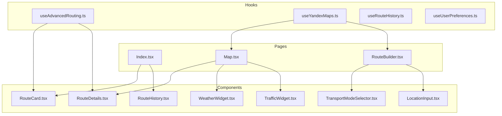
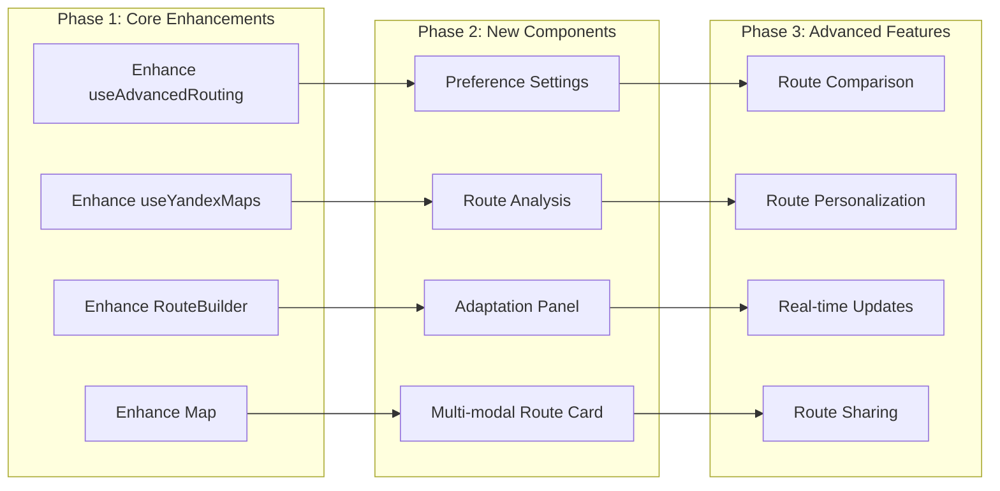

# Component Extension Plan for Existing React Components

## Executive Summary

This document outlines the plan for extending existing React components to support the new multi-modal routing system. The plan focuses on enhancing the current UI components with new features while maintaining backward compatibility and a smooth user experience.

## 1. Component Analysis and Extension Strategy

### 1.1 Current Component Inventory



### 1.2 Extension Strategy



## 2. Hook Extensions

### 2.1 Enhanced useAdvancedRouting Hook

```typescript
// Enhanced version of existing useAdvancedRouting hook
const useEnhancedAdvancedRouting = () => {
    const [isCalculating, setIsCalculating] = useState(false);
    const [preferences, setPreferences] = useState<UserPreferences>(getDefaultPreferences());
    const [adaptationHistory, setAdaptationHistory] = useState<RouteAdaptation[]>([]);
    const [activeNotifications, setActiveNotifications] = useState<Notification[]>([]);
    const [isMonitoring, setIsMonitoring] = useState(false);
    const [monitoringId, setMonitoringId] = useState<string | null>(null);
    const [currentRoute, setCurrentRoute] = useState<MultiModalRoute | null>(null);
    
    // Initialize routing system
    const routingEngine = useMemo(() => new MultiModalRoutingEngine(), []);
    const adaptationEngine = useMemo(() => new AdaptationEngine(), []);
    const notificationEngine = useMemo(() => new NotificationEngine(), []);
    
    // Load user preferences
    useEffect(() => {
        const loadPreferences = async () => {
            try {
                const userPrefs = await getUserPreferences(getCurrentUserId());
                setPreferences(userPrefs);
            } catch (error) {
                console.error('Failed to load preferences:', error);
            }
        };
        
        loadPreferences();
    }, []);
    
    // Adaptation event listeners
    useEffect(() => {
        if (!monitoringId) return;
        
        const unsubscribeAdaptations = adaptationEngine.onAdaptation((adaptation) => {
            setAdaptationHistory(prev => [...prev, adaptation]);
            
            // Show notification
            showAdaptationNotification(adaptation);
            
            // Update current route if adaptation is accepted
            if (adaptation.status === AdaptationStatus.ACCEPTED) {
                setCurrentRoute(adaptation.newRoute);
            }
        });
        
        const unsubscribeNotifications = notificationEngine.onNotification((notification) => {
            setActiveNotifications(prev => [...prev, notification]);
            
            // Auto-remove notifications after expiry
            setTimeout(() => {
                setActiveNotifications(prev => prev.filter(n => n.id !== notification.id));
            }, notification.expiry.getTime() - Date.now());
        });
        
        return () => {
            unsubscribeAdaptations();
            unsubscribeNotifications();
        };
    }, [monitoringId, adaptationEngine, notificationEngine]);
    
    const calculateOptimalRoute = useCallback(async (
        from: [number, number],
        to: [number, number],
        places: any[],
        requestPrefs: UserPreferences,
        mode: string
    ): Promise<EnhancedAdvancedRoute> => {
        setIsCalculating(true);
        
        try {
            // Get context
            const context = await getContext();
            
            // Calculate personalized weights
            const weights = await routingEngine.calculateWeights(
                getCurrentUserId(),
                context,
                {
                    origin: from,
                    destination: to,
                    transportModes: [mode as TransportMode],
                    preferences: requestPrefs.criteria,
                    constraints: requestPrefs.constraints
                }
            );
            
            // Calculate routes using different algorithms
            const routes = await routingEngine.calculateMultipleRoutes(from, to, mode, places);
            
            // Score routes with personalized weights
            const scoredRoutes = routes.map(route => ({
                route,
                score: routingEngine.scoreRoute(route, weights)
            }));
            
            // Find Pareto-optimal routes
            const paretoOptimizer = new ParetoOptimizer(Object.keys(weights));
            const paretoResult = paretoOptimizer.findParetoOptimalRoutes(routes);
            
            // Select best route
            const bestRoute = scoredRoutes[0];
            
            const enhancedRoute: EnhancedAdvancedRoute = {
                ...bestRoute.route,
                personalizedScore: bestRoute.score,
                alternatives: paretoResult.paretoOptimal.slice(1).map(r => r.route),
                tradeoffs: paretoResult.tradeoffs,
                personalizationInsights: routingEngine.generatePersonalizationInsights(bestRoute.score, weights),
                weightExplanation: routingEngine.explainWeights(weights)
            };
            
            setCurrentRoute(enhancedRoute);
            
            return enhancedRoute;
        } catch (error) {
            console.error('Route calculation failed:', error);
            throw error;
        } finally {
            setIsCalculating(false);
        }
    }, [routingEngine]);
    
    const startRouteMonitoring = useCallback(async (route: MultiModalRoute) => {
        try {
            setIsMonitoring(true);
            setCurrentRoute(route);
            
            const userContext: UserContext = {
                userId: getCurrentUserId(),
                preferences: preferences,
                deviceInfo: getDeviceInfo(),
                isActive: true,
                isDriving: route.primaryMode === 'car'
            };
            
            const monitoringId = await adaptationEngine.startMonitoring(route, userContext);
            setMonitoringId(monitoringId);
            
            toast.success('Route monitoring started');
        } catch (error) {
            console.error('Failed to start route monitoring:', error);
            toast.error('Failed to start route monitoring');
            setIsMonitoring(false);
        }
    }, [preferences, adaptationEngine]);
    
    const stopRouteMonitoring = useCallback(async () => {
        if (!monitoringId) return;
        
        try {
            await adaptationEngine.stopMonitoring(monitoringId);
            setIsMonitoring(false);
            setMonitoringId(null);
            setCurrentRoute(null);
            setAdaptationHistory([]);
            
            toast.success('Route monitoring stopped');
        } catch (error) {
            console.error('Failed to stop route monitoring:', error);
            toast.error('Failed to stop route monitoring');
        }
    }, [monitoringId, adaptationEngine]);
    
    const acceptAdaptation = useCallback(async (adaptationId: string) => {
        try {
            await adaptationEngine.acceptAdaptation(adaptationId);
            
            // Update UI
            setAdaptationHistory(prev => 
                prev.map(a => 
                    a.id === adaptationId 
                        ? { ...a, status: AdaptationStatus.ACCEPTED }
                        : a
                )
            );
            
            toast.success('Route adaptation accepted');
        } catch (error) {
            console.error('Failed to accept adaptation:', error);
            toast.error('Failed to accept adaptation');
        }
    }, [adaptationEngine]);
    
    const declineAdaptation = useCallback(async (adaptationId: string) => {
        try {
            await adaptationEngine.declineAdaptation(adaptationId);
            
            // Update UI
            setAdaptationHistory(prev => 
                prev.map(a => 
                    a.id === adaptationId 
                        ? { ...a, status: AdaptationStatus.DECLINED }
                        : a
                )
            );
            
            toast.info('Route adaptation declined');
        } catch (error) {
            console.error('Failed to decline adaptation:', error);
            toast.error('Failed to decline adaptation');
        }
    }, [adaptationEngine]);
    
    const provideFeedback = useCallback(async (feedback: RouteFeedback) => {
        if (!currentRoute) return;
        
        try {
            await adaptationEngine.provideFeedback(currentRoute.id, feedback);
            toast.success('Thank you for your feedback!');
        } catch (error) {
            console.error('Failed to provide feedback:', error);
            toast.error('Failed to provide feedback');
        }
    }, [currentRoute, adaptationEngine]);
    
    const updatePreferences = useCallback(async (newPreferences: UserPreferences) => {
        try {
            await saveUserPreferences(getCurrentUserId(), newPreferences);
            setPreferences(newPreferences);
            toast.success('Preferences updated successfully');
        } catch (error) {
            console.error('Failed to update preferences:', error);
            toast.error('Failed to update preferences');
        }
    }, []);
    
    const showAdaptationNotification = useCallback((adaptation: RouteAdaptation) => {
        const notification = (
            <div className="p-4 bg-white rounded-lg shadow-lg border-l-4 border-blue-500">
                <div className="flex items-start">
                    <div className="flex-1">
                        <h4 className="text-sm font-medium text-gray-900">
                            Route Update Available
                        </h4>
                        <p className="mt-1 text-sm text-gray-500">
                            {adaptation.reason}
                        </p>
                        <div className="mt-3 flex space-x-2">
                            <Button
                                size="sm"
                                onClick={() => acceptAdaptation(adaptation.id)}
                            >
                                Accept
                            </Button>
                            <Button
                                size="sm"
                                variant="outline"
                                onClick={() => declineAdaptation(adaptation.id)}
                            >
                                Decline
                            </Button>
                        </div>
                    </div>
                </div>
            </div>
        );
        
        toast.custom(notification, {
            duration: 10000,
            position: 'top-center'
        });
    }, [acceptAdaptation, declineAdaptation]);
    
    return {
        // Existing methods
        isCalculating,
        calculateOptimalRoute,
        
        // New multi-modal methods
        currentRoute,
        adaptationHistory,
        activeNotifications,
        isMonitoring,
        currentPreferences: preferences,
        
        // Adaptation methods
        startRouteMonitoring,
        stopRouteMonitoring,
        acceptAdaptation,
        declineAdaptation,
        provideFeedback,
        
        // Preference methods
        updatePreferences
    };
};
```

### 2.2 Enhanced useYandexMaps Hook

```typescript
// Enhanced version of existing useYandexMaps hook with multi-modal support
const useEnhancedYandexMaps = (apiKey: string) => {
    const {
        ymaps,
        loading: mapsLoading,
        error: mapsError,
        geocode,
        calculateRoute,
        searchOrganizations
    } = useYandexMaps(apiKey);
    
    const [trafficData, setTrafficData] = useState<TrafficData | null>(null);
    const [transitData, setTransitData] = useState<TransitData | null>(null);
    const [weatherData, setWeatherData] = useState<WeatherData | null>(null);
    const [activeRoutes, setActiveRoutes] = useState<ActiveRoute[]>([]);
    const [mapLayers, setMapLayers] = useState<MapLayer[]>([
        { id: 'base', name: 'Base Map', visible: true, type: 'base' },
        { id: 'traffic', name: 'Traffic', visible: true, type: 'overlay' },
        { id: 'transit', name: 'Public Transport', visible: true, type: 'overlay' },
        { id: 'weather', name: 'Weather', visible: false, type: 'overlay' }
    ]);
    
    // Initialize API gateway
    const apiGateway = useMemo(() => {
        const gateway = new APIGateway();
        
        // Register adapters
        gateway.registerAdapter('yandex', new YandexMapsAdapter({
            apiKey,
            cacheConfig: { maxSize: 1000, ttl: 300 },
            rateLimitConfig: { maxRequests: 100, windowMs: 60000 }
        }));
        
        gateway.registerAdapter('gtfs', new GTFSAdapter({
            providers: gtfsProvidersConfig,
            cacheConfig: { maxSize: 500, ttl: 3600 }
        }));
        
        gateway.registerAdapter('traffic', new TrafficDataAdapter({
            providers: trafficProvidersConfig,
            cacheConfig: { maxSize: 200, ttl: 300 }
        }));
        
        gateway.registerAdapter('weather', new WeatherDataAdapter({
            provider: weatherProviderConfig,
            cacheConfig: { maxSize: 100, ttl: 600 }
        }));
        
        // Add middleware
        gateway.addMiddleware(new LoggingMiddleware());
        gateway.addMiddleware(new RetryMiddleware());
        
        return gateway;
    }, [apiKey]);
    
    // Enhanced route calculation with real-time data
    const calculateRouteWithRealTimeData = useCallback(async (
        from: [number, number],
        to: [number, number],
        mode: 'walking' | 'bike' | 'car' | 'public_transport'
    ): Promise<EnhancedRoute | null> => {
        if (!ymaps) return null;
        
        try {
            // Calculate base route using Yandex Maps
            const baseRoute = await calculateRoute(from, to, mode);
            if (!baseRoute) return null;
            
            // Get traffic data for the route area
            const bounds = calculateBoundingBox(from, to);
            const traffic = await apiGateway.callAPI<TrafficData>(
                'traffic',
                'getTrafficData',
                { bounds },
                { cacheKey: `traffic:route:${from[0]},${from[1]}:${to[0]},${to[1]}` }
            );
            
            // Get weather data
            const weather = await apiGateway.callAPI<WeatherData>(
                'weather',
                'getCurrentWeather',
                { coordinate: { latitude: from[0], longitude: from[1] } }
            );
            
            // Get transit options if needed
            let transitOptions = null;
            if (mode === 'public_transport') {
                transitOptions = await apiGateway.callAPI<TransitRouteResult>(
                    'gtfs',
                    'getTransitRoutes',
                    {
                        origin: { latitude: from[0], longitude: from[1] },
                        destination: { latitude: to[0], longitude: to[1] },
                        modes: [TransportMode.BUS, TransportMode.METRO, TransportMode.TRAM],
                        departureTime: new Date()
                    }
                );
            }
            
            // Enhance route with real-time data
            const enhancedRoute = enhanceRouteWithRealTimeData(baseRoute, {
                traffic: traffic || null,
                weather: weather || null,
                transit: transitOptions || null
            });
            
            // Add to active routes
            setActiveRoutes(prev => [
                ...prev.filter(r => r.id !== enhancedRoute.id),
                {
                    id: enhancedRoute.id,
                    route: enhancedRoute,
                    from,
                    to,
                    mode,
                    lastUpdated: new Date()
                }
            ]);
            
            return enhancedRoute;
        } catch (error) {
            console.error('Enhanced route calculation failed:', error);
            return null;
        }
    }, [ymaps, calculateRoute, apiGateway]);
    
    // Real-time data fetching methods
    const getRealTimeTrafficData = useCallback(async (
        bounds: BoundingBox
    ): Promise<TrafficData | null> => {
        try {
            const data = await apiGateway.callAPI<TrafficData>(
                'traffic',
                'getTrafficData',
                { bounds }
            );
            
            setTrafficData(data);
            return data;
        } catch (error) {
            console.error('Failed to get traffic data:', error);
            return null;
        }
    }, [apiGateway]);
    
    const getRealTimeTransitData = useCallback(async (
        bounds: BoundingBox
    ): Promise<TransitData | null> => {
        try {
            // Get center point for transit data
            const center = {
                latitude: (bounds.south + bounds.north) / 2,
                longitude: (bounds.west + bounds.east) / 2
            };
            
            const data = await apiGateway.callAPI<TransitData>(
                'gtfs',
                'getTransitData',
                { center, radius: 5000 }
            );
            
            setTransitData(data);
            return data;
        } catch (error) {
            console.error('Failed to get transit data:', error);
            return null;
        }
    }, [apiGateway]);
    
    const getRealTimeWeatherData = useCallback(async (
        coordinate: Coordinate
    ): Promise<WeatherData | null> => {
        try {
            const current = await apiGateway.callAPI<CurrentWeather>(
                'weather',
                'getCurrentWeather',
                { coordinate }
            );
            
            const forecast = await apiGateway.callAPI<WeatherForecast[]>(
                'weather',
                'getForecast',
                { coordinate, days: 5 }
            );
            
            const alerts = await apiGateway.callAPI<WeatherAlert[]>(
                'weather',
                'getWeatherAlerts',
                { coordinate }
            );
            
            const weatherData: WeatherData = {
                timestamp: new Date(),
                location: coordinate,
                current: current!,
                forecast,
                alerts
            };
            
            setWeatherData(weatherData);
            return weatherData;
        } catch (error) {
            console.error('Failed to get weather data:', error);
            return null;
        }
    }, [apiGateway]);
    
    // Map layer management
    const toggleMapLayer = useCallback((layerId: string) => {
        setMapLayers(prev => 
            prev.map(layer => 
                layer.id === layerId 
                    ? { ...layer, visible: !layer.visible }
                    : layer
            )
        );
    }, []);
    
    // Active route management
    const updateActiveRoute = useCallback((routeId: string, updates: Partial<ActiveRoute>) => {
        setActiveRoutes(prev => 
            prev.map(route => 
                route.id === routeId 
                    ? { ...route, ...updates, lastUpdated: new Date() }
                    : route
            )
        );
    }, []);
    
    const removeActiveRoute = useCallback((routeId: string) => {
        setActiveRoutes(prev => prev.filter(route => route.id !== routeId));
    }, []);
    
    return {
        // Existing methods
        ymaps,
        loading: mapsLoading,
        error: mapsError,
        geocode,
        calculateRoute,
        searchOrganizations,
        
        // Real-time data
        trafficData,
        transitData,
        weatherData,
        
        // Enhanced methods
        calculateRouteWithRealTimeData,
        getRealTimeTrafficData,
        getRealTimeTransitData,
        getRealTimeWeatherData,
        
        // Map layer management
        mapLayers,
        toggleMapLayer,
        
        // Active route management
        activeRoutes,
        updateActiveRoute,
        removeActiveRoute
    };
};
```

## 3. Page Component Extensions

### 3.1 Enhanced Index Page

```typescript
// Enhanced version of Index.tsx with multi-modal routing features
const EnhancedIndex: React.FC = () => {
    const navigate = useNavigate();
    const [fromLocation, setFromLocation] = useState("");
    const [toLocation, setToLocation] = useState("");
    const [transportMode, setTransportMode] = useState<string>("walking");
    const [isBuilding, setIsBuilding] = useState(false);
    const [showPreferences, setShowPreferences] = useState(false);
    const [showHistory, setShowHistory] = useState(false);
    
    const {
        calculateOptimalRoute,
        currentPreferences,
        updatePreferences,
        isCalculating,
        adaptationHistory
    } = useEnhancedAdvancedRouting();
    
    const {
        routeHistory,
        saveRoute,
        deleteRoute,
        clearHistory
    } = useRouteHistory();
    
    const handleBuildRoute = async (isSmart: boolean = false) => {
        if (!fromLocation || !toLocation) {
            toast.error("Заполните точки маршрута");
            return;
        }
        
        setIsBuilding(true);
        
        try {
            // Geocode addresses
            const fromCoords = await geocode(fromLocation);
            const toCoords = await geocode(toLocation);
            
            if (!fromCoords || !toCoords) {
                toast.error("Не удалось найти указанные адреса");
                return;
            }
            
            // Calculate optimal route with preferences
            const route = await calculateOptimalRoute(
                fromCoords,
                toCoords,
                [], // places
                currentPreferences,
                transportMode
            );
            
            // Store route data for map display
            const routeData = {
                ...route,
                from: fromLocation,
                to: toLocation,
                fromCoords,
                toCoords,
                mode: transportMode,
                isSmart
            };
            
            // Save to history
            await saveRoute(routeData);
            
            localStorage.setItem('routeData', JSON.stringify(routeData));
            
            toast.success("Персонализированный маршрут построен!");
            
            // Navigate to map
            setTimeout(() => {
                navigate("/map");
            }, 800);
            
        } catch (error) {
            toast.error("Ошибка при построении маршрута");
        } finally {
            setIsBuilding(false);
        }
    };
    
    return (
        <div className="w-full max-w-4xl mx-auto space-y-6 min-h-screen py-6">
            <Card className="shadow-lg">
                <CardHeader className="space-y-1">
                    <div className="flex items-center justify-between">
                        <CardTitle className="text-2xl flex items-center gap-2">
                            <MapPin className="h-6 w-6 text-primary" />
                            Построение маршрута
                        </CardTitle>
                        <div className="flex gap-2">
                            <Button
                                variant="outline"
                                size="sm"
                                onClick={() => setShowPreferences(true)}
                            >
                                <Settings className="h-4 w-4 mr-2" />
                                Preferences
                            </Button>
                            <Button
                                variant="outline"
                                size="sm"
                                onClick={() => setShowHistory(true)}
                            >
                                <History className="h-4 w-4 mr-2" />
                                History
                            </Button>
                        </div>
                    </div>
                    <CardDescription>
                        Постройте маршрут с учетом ваших личных предпочтений
                    </CardDescription>
                </CardHeader>
                <CardContent className="space-y-4">
                    {/* Existing route builder UI */}
                    <div className="space-y-2">
                        <Label htmlFor="from">Откуда</Label>
                        <div className="relative">
                            <MapPin className="absolute left-3 top-3 h-4 w-4 text-muted-foreground" />
                            <Input
                                id="from"
                                placeholder="Введите адрес или название места"
                                value={fromLocation}
                                onChange={(e) => setFromLocation(e.target.value)}
                                className="pl-10"
                            />
                        </div>
                    </div>
                    
                    <div className="space-y-2">
                        <Label htmlFor="to">Куда</Label>
                        <div className="relative">
                            <MapPin className="absolute left-3 top-3 h-4 w-4 text-accent" />
                            <Input
                                id="to"
                                placeholder="Введите адрес или название места"
                                value={toLocation}
                                onChange={(e) => setToLocation(e.target.value)}
                                className="pl-10"
                            />
                        </div>
                    </div>
                    
                    <div className="space-y-2">
                        <Label>Способ передвижения</Label>
                        <div className="grid grid-cols-2 md:grid-cols-4 gap-2">
                            {transportModes.map((mode) => {
                                const Icon = mode.icon;
                                return (
                                    <button
                                        key={mode.id}
                                        onClick={() => setTransportMode(mode.id)}
                                        className={`flex flex-col items-center gap-1 p-3 rounded-lg border-2 transition-all text-xs ${
                                            transportMode === mode.id
                                                ? "border-primary bg-primary/5 text-primary"
                                                : "border-border hover:border-primary/50"
                                        }`}
                                    >
                                        <Icon className="h-4 w-4" />
                                        <span>{mode.label}</span>
                                    </button>
                                );
                            })}
                        </div>
                    </div>
                    
                    {/* Current preferences summary */}
                    <div className="space-y-2">
                        <Label>Текущие приоритеты</Label>
                        <div className="grid grid-cols-2 gap-2 text-sm">
                            {Object.entries(currentPreferences.criteria).map(([criterion, pref]) => (
                                <div key={criterion} className="flex justify-between">
                                    <span className="capitalize">{criterion}</span>
                                    <span>{(pref.weight * 100).toFixed(0)}%</span>
                                </div>
                            ))}
                        </div>
                    </div>
                    
                    {/* Recent adaptation history */}
                    {adaptationHistory.length > 0 && (
                        <div className="space-y-2">
                            <Label>Последние адаптации маршрута</Label>
                            <div className="space-y-1">
                                {adaptationHistory.slice(0, 3).map(adaptation => (
                                    <div key={adaptation.id} className="flex items-center justify-between text-sm p-2 bg-muted rounded">
                                        <span>{adaptation.reason}</span>
                                        <Badge variant={adaptation.status === AdaptationStatus.ACCEPTED ? 'default' : 'secondary'}>
                                            {adaptation.status === AdaptationStatus.ACCEPTED ? 'Принято' : 'Отклонено'}
                                        </Badge>
                                    </div>
                                ))}
                            </div>
                        </div>
                    )}
                    
                    <Button 
                        onClick={() => handleBuildRoute(false)} 
                        className="w-full" 
                        size="lg"
                        disabled={isBuilding}
                    >
                        {isBuilding ? (
                            <Loader2 className="h-4 w-4 animate-spin" />
                        ) : (
                            <Search className="h-4 w-4" />
                        )}
                        {isBuilding ? "Строим маршрут..." : "Построить персонализированный маршрут"}
                    </Button>
                </CardContent>
            </Card>
            
            {/* Recent routes */}
            {routeHistory.length > 0 && (
                <Card>
                    <CardHeader>
                        <CardTitle className="flex items-center justify-between">
                            Последние маршруты
                            <Button variant="outline" size="sm" onClick={() => setShowHistory(true)}>
                                View All
                            </Button>
                        </CardTitle>
                    </CardHeader>
                    <CardContent>
                        <div className="space-y-2">
                            {routeHistory.slice(0, 3).map(route => (
                                <div 
                                    key={route.id} 
                                    className="flex items-center justify-between p-3 border rounded-lg hover:bg-muted cursor-pointer"
                                    onClick={() => {
                                        localStorage.setItem('routeData', JSON.stringify(route));
                                        navigate("/map");
                                    }}
                                >
                                    <div>
                                        <div className="font-medium">{route.from}</div>
                                        <div className="text-sm text-muted-foreground">{route.to}</div>
                                    </div>
                                    <div className="flex items-center gap-2">
                                        <Badge variant="outline">{route.mode}</Badge>
                                        <span className="text-sm text-muted-foreground">
                                            {formatDistance(route.distance)} • {formatDuration(route.duration)}
                                        </span>
                                    </div>
                                </div>
                            ))}
                        </div>
                    </CardContent>
                </Card>
            )}
            
            {/* Preferences Dialog */}
            <Dialog open={showPreferences} onOpenChange={setShowPreferences}>
                <DialogContent className="max-w-4xl max-h-[80vh] overflow-auto">
                    <DialogHeader>
                        <DialogTitle>Настройки предпочтений</DialogTitle>
                        <DialogDescription>
                            Настройте параметры для получения персонализированных маршрутов
                        </DialogDescription>
                    </DialogHeader>
                    <PreferenceSettings
                        userId={getCurrentUserId()}
                        initialPreferences={currentPreferences}
                        onSave={updatePreferences}
                    />
                </DialogContent>
            </Dialog>
            
            {/* History Dialog */}
            <Dialog open={showHistory} onOpenChange={setShowHistory}>
                <DialogContent className="max-w-4xl max-h-[80vh] overflow-auto">
                    <DialogHeader>
                        <DialogTitle>История маршрутов</DialogTitle>
                        <DialogDescription>
                            Просмотр и управление историей ваших маршрутов
                        </DialogDescription>
                    </DialogHeader>
                    <RouteHistoryComponent
                        routes={routeHistory}
                        onSelect={(route) => {
                            localStorage.setItem('routeData', JSON.stringify(route));
                            navigate("/map");
                            setShowHistory(false);
                        }}
                        onDelete={deleteRoute}
                        onClear={clearHistory}
                    />
                </DialogContent>
            </Dialog>
        </div>
    );
};
```

### 3.2 Enhanced Map Page

```typescript
// Enhanced version of Map.tsx with real-time updates and multi-modal features
const EnhancedMap: React.FC = () => {
    const navigate = useNavigate();
    const [routeData, setRouteData] = useState<EnhancedRoute | null>(null);
    const [showPreferences, setShowPreferences] = useState(false);
    const [showAnalysis, setShowAnalysis] = useState(false);
    const [showAdaptations, setShowAdaptations] = useState(false);
    const [showLayers, setShowLayers] = useState(false);
    const [mapCenter, setMapCenter] = useState<[number, number]>([55.7558, 37.6173]); // Moscow
    const [mapZoom, setMapZoom] = useState(12);
    
    const {
        ymaps,
        loading: mapsLoading,
        calculateRouteWithRealTimeData,
        trafficData,
        transitData,
        weatherData,
        activeRoutes,
        mapLayers,
        toggleMapLayer,
        removeActiveRoute
    } = useEnhancedYandexMaps(process.env.YANDEX_MAPS_API_KEY || '');
    
    const {
        currentRoute,
        adaptationHistory,
        activeNotifications,
        isMonitoring,
        startRouteMonitoring,
        stopRouteMonitoring,
        acceptAdaptation,
        declineAdaptation,
        provideFeedback
    } = useEnhancedAdvancedRouting();
    
    // Initialize map with route data
    useEffect(() => {
        const savedRouteData = localStorage.getItem('routeData');
        if (savedRouteData) {
            try {
                const data = JSON.parse(savedRouteData);
                setRouteData(data);
                
                // Set map center to route start
                if (data.fromCoords) {
                    setMapCenter([data.fromCoords.latitude, data.fromCoords.longitude]);
                }
                
                // Start route monitoring
                if (data.id) {
                    startRouteMonitoring(data);
                }
            } catch (error) {
                console.error('Failed to parse route data:', error);
            }
        }
    }, [startRouteMonitoring]);
    
    // Handle route recalculation
    const handleRecalculateRoute = useCallback(async () => {
        if (!routeData) return;
        
        try {
            const newRoute = await calculateRouteWithRealTimeData(
                [routeData.fromCoords.latitude, routeData.fromCoords.longitude],
                [routeData.toCoords.latitude, routeData.toCoords.longitude],
                routeData.mode as any
            );
            
            if (newRoute) {
                setRouteData(newRoute);
                localStorage.setItem('routeData', JSON.stringify(newRoute));
                toast.success('Маршрут обновлен с учетом текущих условий');
            }
        } catch (error) {
            console.error('Failed to recalculate route:', error);
            toast.error('Ошибка при обновлении маршрута');
        }
    }, [routeData, calculateRouteWithRealTimeData]);
    
    // Handle route completion
    const handleCompleteRoute = useCallback(() => {
        if (routeData) {
            // Save to history
            saveRoute({
                ...routeData,
                completedAt: new Date()
            });
            
            // Stop monitoring
            stopRouteMonitoring();
            
            // Clear route data
            setRouteData(null);
            localStorage.removeItem('routeData');
            
            toast.success('Маршрут завершен');
            navigate('/');
        }
    }, [routeData, stopRouteMonitoring, saveRoute, navigate]);
    
    // Render map with Yandex Maps
    const renderMap = () => {
        if (!ymaps || mapsLoading) {
            return (
                <div className="w-full h-[500px] flex items-center justify-center bg-muted rounded-lg">
                    <Loader2 className="h-8 w-8 animate-spin" />
                </div>
            );
        }
        
        return (
            <YandexMap
                state={{
                    center: mapCenter,
                    zoom: mapZoom,
                    controls: ['zoomControl', 'typeSelector', 'fullscreenControl']
                }}
                width="100%"
                height="500px"
                modules={['control.ZoomControl', 'control.TypeSelector', 'control.FullscreenControl']}
            >
                {/* Base map layer */}
                <TileLayer />
                
                {/* Traffic layer */}
                {mapLayers.find(l => l.id === 'traffic')?.visible && trafficData && (
                    <TrafficLayer data={trafficData} />
                )}
                
                {/* Transit layer */}
                {mapLayers.find(l => l.id === 'transit')?.visible && transitData && (
                    <TransitLayer data={transitData} />
                )}
                
                {/* Weather layer */}
                {mapLayers.find(l => l.id === 'weather')?.visible && weatherData && (
                    <WeatherLayer data={weatherData} />
                )}
                
                {/* Route display */}
                {routeData && (
                    <RouteDisplay
                        route={routeData}
                        isMonitoring={isMonitoring}
                        onComplete={handleCompleteRoute}
                        onRecalculate={handleRecalculateRoute}
                    />
                )}
                
                {/* Active routes */}
                {activeRoutes
                    .filter(route => route.id !== routeData?.id)
                    .map(route => (
                        <ActiveRouteDisplay
                            key={route.id}
                            route={route.route}
                            onSelect={() => {
                                setRouteData(route.route);
                                localStorage.setItem('routeData', JSON.stringify(route.route));
                            }}
                        />
                    ))}
                
                {/* User location marker */}
                <UserLocationMarker />
            </YandexMap>
        );
    };
    
    return (
        <div className="w-full h-full flex flex-col">
            {/* Map controls */}
            <div className="flex items-center justify-between p-4 bg-background border-b">
                <div className="flex items-center gap-2">
                    <Button variant="outline" size="sm" onClick={() => navigate('/')}>
                        <ArrowLeft className="h-4 w-4 mr-2" />
                        Back
                    </Button>
                    {routeData && (
                        <>
                            <Button variant="outline" size="sm" onClick={handleRecalculateRoute}>
                                <RefreshCw className="h-4 w-4 mr-2" />
                                Recalculate
                            </Button>
                            <Button variant="outline" size="sm" onClick={handleCompleteRoute}>
                                <Check className="h-4 w-4 mr-2" />
                                Complete
                            </Button>
                        </>
                    )}
                </div>
                
                <div className="flex items-center gap-2">
                    <Button variant="outline" size="sm" onClick={() => setShowLayers(true)}>
                        <Layers className="h-4 w-4 mr-2" />
                        Layers
                    </Button>
                    {routeData && (
                        <>
                            <Button variant="outline" size="sm" onClick={() => setShowAnalysis(true)}>
                                <BarChart className="h-4 w-4 mr-2" />
                                Analysis
                            </Button>
                            <Button variant="outline" size="sm" onClick={() => setShowAdaptations(true)}>
                                <Route className="h-4 w-4 mr-2" />
                                Adaptations
                            </Button>
                        </>
                    )}
                    <Button variant="outline" size="sm" onClick={() => setShowPreferences(true)}>
                        <Settings className="h-4 w-4 mr-2" />
                        Preferences
                    </Button>
                </div>
            </div>
            
            {/* Map display */}
            <div className="flex-1 relative">
                {renderMap()}
                
                {/* Monitoring status indicator */}
                {isMonitoring && (
                    <div className="absolute top-4 left-4 z-10">
                        <Badge variant="default" className="bg-green-500">
                            <div className="flex items-center gap-1">
                                <div className="w-2 h-2 bg-white rounded-full animate-pulse"></div>
                                Monitoring Active
                            </div>
                        </Badge>
                    </div>
                )}
                
                {/* Active notifications */}
                <div className="absolute top-4 right-4 z-10 space-y-2">
                    {activeNotifications.map(notification => (
                        <NotificationCard
                            key={notification.id}
                            notification={notification}
                            onDismiss={() => dismissNotification(notification.id)}
                        />
                    ))}
                </div>
                
                {/* Real-time data indicators */}
                <div className="absolute bottom-4 left-4 z-10 flex gap-2">
                    {trafficData && (
                        <Badge variant="outline" className="bg-white">
                            <div className="flex items-center gap-1">
                                <div className={`w-2 h-2 rounded-full ${
                                    trafficData.level > 0.7 ? 'bg-red-500' : 
                                    trafficData.level > 0.4 ? 'bg-yellow-500' : 'bg-green-500'
                                }`}></div>
                                Traffic
                            </div>
                        </Badge>
                    )}
                    {weatherData && weatherData.current && (
                        <Badge variant="outline" className="bg-white">
                            <div className="flex items-center gap-1">
                                {getWeatherIcon(weatherData.current.conditions.primary)}
                                {Math.round(weatherData.current.temperature)}°C
                            </div>
                        </Badge>
                    )}
                </div>
            </div>
            
            {/* Preferences Dialog */}
            <Dialog open={showPreferences} onOpenChange={setShowPreferences}>
                <DialogContent className="max-w-4xl max-h-[80vh] overflow-auto">
                    <DialogHeader>
                        <DialogTitle>Настройки предпочтений</DialogTitle>
                        <DialogDescription>
                            Настройте параметры для получения персонализированных маршрутов
                        </DialogDescription>
                    </DialogHeader>
                    <PreferenceSettings
                        userId={getCurrentUserId()}
                        initialPreferences={currentPreferences}
                        onSave={updatePreferences}
                    />
                </DialogContent>
            </Dialog>
            
            {/* Analysis Dialog */}
            <Dialog open={showAnalysis} onOpenChange={setShowAnalysis}>
                <DialogContent className="max-w-6xl max-h-[80vh] overflow-auto">
                    <DialogHeader>
                        <DialogTitle>Анализ маршрута</DialogTitle>
                        <DialogDescription>
                            Детальный анализ маршрута с учетом ваших предпочтений
                        </DialogDescription>
                    </DialogHeader>
                    {routeData && (
                        <PreferenceVisualization
                            preferences={currentPreferences}
                            routes={[routeData, ...(routeData.alternatives || [])]}
                        />
                    )}
                </DialogContent>
            </Dialog>
            
            {/* Adaptations Dialog */}
            <Dialog open={showAdaptations} onOpenChange={setShowAdaptations}>
                <DialogContent className="max-w-4xl max-h-[80vh] overflow-auto">
                    <DialogHeader>
                        <DialogTitle>Адаптации маршрута</DialogTitle>
                        <DialogDescription>
                            История адаптаций и изменения маршрута в реальном времени
                        </DialogDescription>
                    </DialogHeader>
                    <AdaptationHistoryPanel
                        adaptations={adaptationHistory}
                        onAccept={acceptAdaptation}
                        onDecline={declineAdaptation}
                    />
                </DialogContent>
            </Dialog>
            
            {/* Layers Dialog */}
            <Dialog open={showLayers} onOpenChange={setShowLayers}>
                <DialogContent>
                    <DialogHeader>
                        <DialogTitle>Слои карты</DialogTitle>
                        <DialogDescription>
                            Управление видимостью слоев на карте
                        </DialogDescription>
                    </DialogHeader>
                    <div className="space-y-2">
                        {mapLayers.map(layer => (
                            <div key={layer.id} className="flex items-center justify-between">
                                <div className="flex items-center gap-2">
                                    <Switch
                                        checked={layer.visible}
                                        onCheckedChange={() => toggleMapLayer(layer.id)}
                                    />
                                    <span>{layer.name}</span>
                                </div>
                                <Badge variant="outline">{layer.type}</Badge>
                            </div>
                        ))}
                    </div>
                </DialogContent>
            </Dialog>
        </div>
    );
};
```

## 4. New Component Implementations

### 4.1 Preference Settings Component

```typescript
const PreferenceSettings: React.FC<PreferenceSettingsProps> = ({ 
    userId, 
    initialPreferences, 
    onSave 
}) => {
    const [preferences, setPreferences] = useState<UserPreferences>(initialPreferences || getDefaultPreferences());
    const [activeTab, setActiveTab] = useState<string>('criteria');
    const [isLoading, setIsLoading] = useState(false);
    
    const handleCriterionChange = (criterion: string, field: string, value: any) => {
        setPreferences(prev => ({
            ...prev,
            criteria: {
                ...prev.criteria,
                [criterion]: {
                    ...prev.criteria[criterion],
                    [field]: value
                }
            }
        }));
    };
    
    const handleConstraintChange = (field: string, value: any) => {
        setPreferences(prev => ({
            ...prev,
            constraints: {
                ...prev.constraints,
                [field]: value
            }
        }));
    };
    
    const handleContextChange = (context: string, criterion: string, value: any) => {
        setPreferences(prev => ({
            ...prev,
            context: {
                ...prev.context,
                [context]: {
                    ...prev.context[context],
                    [criterion]: value
                }
            }
        }));
    };
    
    const handleSave = async () => {
        setIsLoading(true);
        try {
            await onSave(preferences);
            toast.success('Preferences saved successfully');
        } catch (error) {
            toast.error('Failed to save preferences');
        } finally {
            setIsLoading(false);
        }
    };
    
    return (
        <div className="space-y-6">
            <Tabs value={activeTab} onValueChange={setActiveTab}>
                <TabsList className="grid w-full grid-cols-4">
                    <TabsTrigger value="criteria">Criteria</TabsTrigger>
                    <TabsTrigger value="constraints">Constraints</TabsTrigger>
                    <TabsTrigger value="context">Context</TabsTrigger>
                    <TabsTrigger value="profiles">Profiles</TabsTrigger>
                </TabsList>
                
                <TabsContent value="criteria" className="space-y-4">
                    <CriteriaSettings
                        criteria={preferences.criteria}
                        onChange={handleCriterionChange}
                    />
                </TabsContent>
                
                <TabsContent value="constraints" className="space-y-4">
                    <ConstraintsSettings
                        constraints={preferences.constraints}
                        onChange={handleConstraintChange}
                    />
                </TabsContent>
                
                <TabsContent value="context" className="space-y-4">
                    <ContextSettings
                        context={preferences.context}
                        onChange={handleContextChange}
                    />
                </TabsContent>
                
                <TabsContent value="profiles" className="space-y-4">
                    <ProfileSettings
                        userId={userId}
                        currentPreferences={preferences}
                        onSelect={setPreferences}
                    />
                </TabsContent>
            </Tabs>
            
            <div className="mt-6 flex justify-end">
                <Button onClick={handleSave} disabled={isLoading}>
                    {isLoading ? <Loader2 className="mr-2 h-4 w-4 animate-spin" /> : null}
                    Save Preferences
                </Button>
            </div>
        </div>
    );
};

const CriteriaSettings: React.FC<CriteriaSettingsProps> = ({ criteria, onChange }) => {
    return (
        <div className="space-y-6">
            {Object.entries(criteria).map(([name, criterion]) => (
                <CriterionSettings
                    key={name}
                    name={name}
                    criterion={criterion}
                    onChange={(field, value) => onChange(name, field, value)}
                />
            ))}
        </div>
    );
};

const CriterionSettings: React.FC<CriterionSettingsProps> = ({ name, criterion, onChange }) => {
    const criterionInfo = getCriterionInfo(name);
    
    return (
        <Card>
            <CardHeader>
                <CardTitle className="flex items-center gap-2">
                    {criterionInfo.icon}
                    {criterionInfo.label}
                </CardTitle>
                <CardDescription>{criterionInfo.description}</CardDescription>
            </CardHeader>
            <CardContent className="space-y-4">
                <div className="space-y-2">
                    <Label>Importance</Label>
                    <Select
                        value={criterion.importance}
                        onValueChange={(value) => onChange('importance', value)}
                    >
                        <SelectTrigger>
                            <SelectValue />
                        </SelectTrigger>
                        <SelectContent>
                            <SelectItem value="optional">Optional</SelectItem>
                            <SelectItem value="low">Low</SelectItem>
                            <SelectItem value="medium">Medium</SelectItem>
                            <SelectItem value="high">High</SelectItem>
                            <SelectItem value="critical">Critical</SelectItem>
                        </SelectContent>
                    </Select>
                </div>
                
                <div className="space-y-2">
                    <Label>Weight ({(criterion.weight * 100).toFixed(0)}%)</Label>
                    <Slider
                        value={[criterion.weight * 100]}
                        onValueChange={([value]) => onChange('weight', value / 100)}
                        min={0}
                        max={100}
                        step={5}
                    />
                </div>
                
                {criterionInfo.preferenceFields && (
                    <div className="space-y-2">
                        <Label>Preferences</Label>
                        <div className="grid grid-cols-2 gap-4">
                            {criterionInfo.preferenceFields.map(field => (
                                <PreferenceField
                                    key={field.name}
                                    field={field}
                                    value={criterion.preferences[field.name]}
                                    onChange={(value) => onChange('preferences', {
                                        ...criterion.preferences,
                                        [field.name]: value
                                    })}
                                />
                            ))}
                        </div>
                    </div>
                )}
            </CardContent>
        </Card>
    );
};
```

### 4.2 Route Analysis Component

```typescript
const RouteAnalysis: React.FC<RouteAnalysisProps> = ({ route, alternatives, preferences }) => {
    const [selectedRoute, setSelectedRoute] = useState<MultiModalRoute>(route);
    const [comparisonMode, setComparisonMode] = useState<'radar' | 'bar'>('radar');
    const [showDetails, setShowDetails] = useState(false);
    
    const handleRouteSelect = (route: MultiModalRoute) => {
        setSelectedRoute(route);
    };
    
    const handleShowDetails = () => {
        setShowDetails(true);
    };
    
    return (
        <div className="space-y-6">
            <Card>
                <CardHeader>
                    <div className="flex items-center justify-between">
                        <CardTitle>Route Analysis</CardTitle>
                        <div className="flex gap-2">
                            <Button
                                variant={comparisonMode === 'radar' ? 'default' : 'outline'}
                                size="sm"
                                onClick={() => setComparisonMode('radar')}
                            >
                                Radar Chart
                            </Button>
                            <Button
                                variant={comparisonMode === 'bar' ? 'default' : 'outline'}
                                size="sm"
                                onClick={() => setComparisonMode('bar')}
                            >
                                Bar Chart
                            </Button>
                            <Button
                                variant="outline"
                                size="sm"
                                onClick={handleShowDetails}
                            >
                                Details
                            </Button>
                        </div>
                    </div>
                </CardHeader>
                <CardContent>
                    {comparisonMode === 'radar' ? (
                        <RadarChart
                            routes={[route, ...alternatives]}
                            criteria={Object.keys(preferences.criteria)}
                            selectedRoute={selectedRoute}
                            onSelectRoute={handleRouteSelect}
                        />
                    ) : (
                        <BarChart
                            routes={[route, ...alternatives]}
                            criteria={Object.keys(preferences.criteria)}
                            selectedRoute={selectedRoute}
                            onSelectRoute={handleRouteSelect}
                        />
                    )}
                </CardContent>
            </Card>
            
            <Card>
                <CardHeader>
                    <CardTitle>Route Rankings</CardTitle>
                </CardHeader>
                <CardContent>
                    <RouteRankingTable
                        routes={[route, ...alternatives]}
                        selectedRoute={selectedRoute}
                        onSelectRoute={handleRouteSelect}
                    />
                </CardContent>
            </Card>
            
            <Dialog open={showDetails} onOpenChange={setShowDetails}>
                <DialogContent className="max-w-4xl max-h-[80vh] overflow-auto">
                    <DialogHeader>
                        <DialogTitle>Route Details</DialogTitle>
                        <DialogDescription>
                            Detailed information about the selected route
                        </DialogDescription>
                    </DialogHeader>
                    {selectedRoute && (
                        <RouteDetailsPanel
                            route={selectedRoute}
                            preferences={preferences}
                        />
                    )}
                </DialogContent>
            </Dialog>
        </div>
    );
};

const RadarChart: React.FC<RadarChartProps> = ({ routes, criteria, selectedRoute, onSelectRoute }) => {
    const data = useMemo(() => {
        return routes.map(route => {
            const scores: Record<string, number> = {};
            
            criteria.forEach(criterion => {
                scores[criterion] = route.scores?.[criterion] || 0;
            });
            
            return {
                name: route.name || `Route ${route.id}`,
                ...scores
            };
        });
    }, [routes, criteria]);
    
    return (
        <div className="h-96">
            <ResponsiveContainer width="100%" height="100%">
                <RadarChart data={data}>
                    <PolarGrid />
                    <PolarAngleAxis dataKey="name" />
                    <PolarRadiusAxis angle={90} domain={[0, 1]} />
                    {routes.map((route, index) => (
                        <Radar
                            key={route.id}
                            name={route.name || `Route ${route.id}`}
                            dataKey={route.id}
                            stroke={colors[index % colors.length]}
                            fill={colors[index % colors.length]}
                            fillOpacity={0.1}
                            strokeWidth={selectedRoute?.id === route.id ? 3 : 1}
                        />
                    ))}
                    <Tooltip />
                    <Legend />
                </RadarChart>
            </ResponsiveContainer>
        </div>
    );
};

const BarChart: React.FC<BarChartProps> = ({ routes, criteria, selectedRoute, onSelectRoute }) => {
    const data = useMemo(() => {
        return criteria.map(criterion => {
            const result: any = { criterion };
            
            routes.forEach(route => {
                result[route.id] = route.scores?.[criterion] || 0;
            });
            
            return result;
        });
    }, [routes, criteria]);
    
    return (
        <div className="h-96">
            <ResponsiveContainer width="100%" height="100%">
                <BarChart data={data}>
                    <CartesianGrid strokeDasharray="3 3" />
                    <XAxis dataKey="criterion" />
                    <YAxis domain={[0, 1]} />
                    <Tooltip />
                    <Legend />
                    {routes.map((route, index) => (
                        <Bar
                            key={route.id}
                            dataKey={route.id}
                            fill={colors[index % colors.length]}
                            stroke={selectedRoute?.id === route.id ? 'black' : 'none'}
                            strokeWidth={selectedRoute?.id === route.id ? 2 : 0}
                            onClick={() => onSelectRoute(route)}
                        />
                    ))}
                </BarChart>
            </ResponsiveContainer>
        </div>
    );
};
```

### 4.3 Adaptation Panel Component

```typescript
const AdaptationPanel: React.FC<AdaptationPanelProps> = ({ 
    adaptations, 
    onAccept, 
    onDecline 
}) => {
    const [selectedAdaptation, setSelectedAdaptation] = useState<RouteAdaptation | null>(null);
    const [showDetails, setShowDetails] = useState(false);
    
    const handleAdaptationSelect = (adaptation: RouteAdaptation) => {
        setSelectedAdaptation(adaptation);
    };
    
    const handleShowDetails = () => {
        setShowDetails(true);
    };
    
    const handleAccept = () => {
        if (selectedAdaptation) {
            onAccept(selectedAdaptation.id);
            setSelectedAdaptation(null);
        }
    };
    
    const handleDecline = () => {
        if (selectedAdaptation) {
            onDecline(selectedAdaptation.id);
            setSelectedAdaptation(null);
        }
    };
    
    return (
        <div className="space-y-4">
            <div className="flex items-center justify-between">
                <h3 className="text-lg font-medium">Route Adaptations</h3>
                {selectedAdaptation && (
                    <div className="flex gap-2">
                        <Button size="sm" onClick={handleAccept}>
                            Accept
                        </Button>
                        <Button size="sm" variant="outline" onClick={handleDecline}>
                            Decline
                        </Button>
                        <Button size="sm" variant="outline" onClick={handleShowDetails}>
                            Details
                        </Button>
                    </div>
                )}
            </div>
            
            <div className="space-y-2 max-h-96 overflow-y-auto">
                {adaptations.length === 0 ? (
                    <div className="text-center py-8 text-muted-foreground">
                        No route adaptations available
                    </div>
                ) : (
                    adaptations.map(adaptation => (
                        <AdaptationCard
                            key={adaptation.id}
                            adaptation={adaptation}
                            isSelected={selectedAdaptation?.id === adaptation.id}
                            onSelect={() => handleAdaptationSelect(adaptation)}
                        />
                    ))
                )}
            </div>
            
            <Dialog open={showDetails} onOpenChange={setShowDetails}>
                <DialogContent className="max-w-4xl">
                    <DialogHeader>
                        <DialogTitle>Adaptation Details</DialogTitle>
                        <DialogDescription>
                            Detailed information about the route adaptation
                        </DialogDescription>
                    </DialogHeader>
                    {selectedAdaptation && (
                        <AdaptationDetailsPanel
                            adaptation={selectedAdaptation}
                            onAccept={handleAccept}
                            onDecline={handleDecline}
                        />
                    )}
                </DialogContent>
            </Dialog>
        </div>
    );
};

const AdaptationCard: React.FC<AdaptationCardProps> = ({ 
    adaptation, 
    isSelected, 
    onSelect 
}) => {
    const getAdaptationIcon = (type: AdaptationType) => {
        switch (type) {
            case AdaptationType.REROUTE:
                return <Route className="h-4 w-4" />;
            case AdaptationType.MODE_CHANGE:
                return <Shuffle className="h-4 w-4" />;
            case AdaptationType.DELAY:
                return <Clock className="h-4 w-4" />;
            case AdaptationType.CANCELLATION:
                return <XCircle className="h-4 w-4" />;
            default:
                return <Info className="h-4 w-4" />;
        }
    };
    
    const getStatusColor = (status: AdaptationStatus) => {
        switch (status) {
            case AdaptationStatus.PENDING:
                return 'bg-yellow-100 text-yellow-800';
            case AdaptationStatus.ACCEPTED:
                return 'bg-green-100 text-green-800';
            case AdaptationStatus.DECLINED:
                return 'bg-red-100 text-red-800';
            case AdaptationStatus.EXPIRED:
                return 'bg-gray-100 text-gray-800';
            default:
                return 'bg-gray-100 text-gray-800';
        }
    };
    
    return (
        <Card 
            className={`cursor-pointer transition-all ${
                isSelected ? 'ring-2 ring-primary' : 'hover:bg-muted'
            }`}
            onClick={onSelect}
        >
            <CardContent className="p-4">
                <div className="flex items-start justify-between">
                    <div className="flex items-start gap-3">
                        <div className="mt-1">
                            {getAdaptationIcon(adaptation.type)}
                        </div>
                        <div>
                            <div className="font-medium">{adaptation.reason}</div>
                            <div className="text-sm text-muted-foreground mt-1">
                                {adaptation.description}
                            </div>
                            <div className="flex items-center gap-2 mt-2">
                                <Badge className={getStatusColor(adaptation.status)}>
                                    {adaptation.status}
                                </Badge>
                                <span className="text-xs text-muted-foreground">
                                    {formatTime(adaptation.timestamp)}
                                </span>
                            </div>
                        </div>
                    </div>
                    <div className="text-right">
                        {adaptation.timeImpact !== 0 && (
                            <div className="text-sm">
                                {adaptation.timeImpact > 0 ? '+' : ''}
                                {formatDuration(adaptation.timeImpact)}
                            </div>
                        )}
                        {adaptation.costImpact !== 0 && (
                            <div className="text-sm">
                                {adaptation.costImpact > 0 ? '+' : ''}
                                {adaptation.costImpact} руб.
                            </div>
                        )}
                    </div>
                </div>
            </CardContent>
        </Card>
    );
};
```

## 5. Integration Strategy

### 5.1 Backward Compatibility

The component extension plan ensures backward compatibility by:

1. **Progressive Enhancement**: Existing components are enhanced with new features without breaking existing functionality
2. **Optional Features**: New features are designed to be optional and can be toggled on/off
3. **Graceful Degradation**: If new features fail, the system gracefully falls back to existing functionality
4. **Configuration-Driven**: New features can be enabled/disabled through configuration

### 5.2 Migration Path

The migration path for existing components follows these phases:

1. **Phase 1**: Enhance existing hooks with new functionality
2. **Phase 2**: Add new UI components for new features
3. **Phase 3**: Integrate new components into existing pages
4. **Phase 4**: Add advanced features and polish

### 5.3 Testing Strategy

The testing strategy for extended components includes:

1. **Unit Tests**: Test individual components and hooks in isolation
2. **Integration Tests**: Test interactions between components
3. **E2E Tests**: Test complete user journeys with new features
4. **Visual Regression Tests**: Ensure UI changes don't break existing layouts

This comprehensive component extension plan provides a clear path for enhancing the existing React components with new multi-modal routing features while maintaining backward compatibility and a smooth user experience.