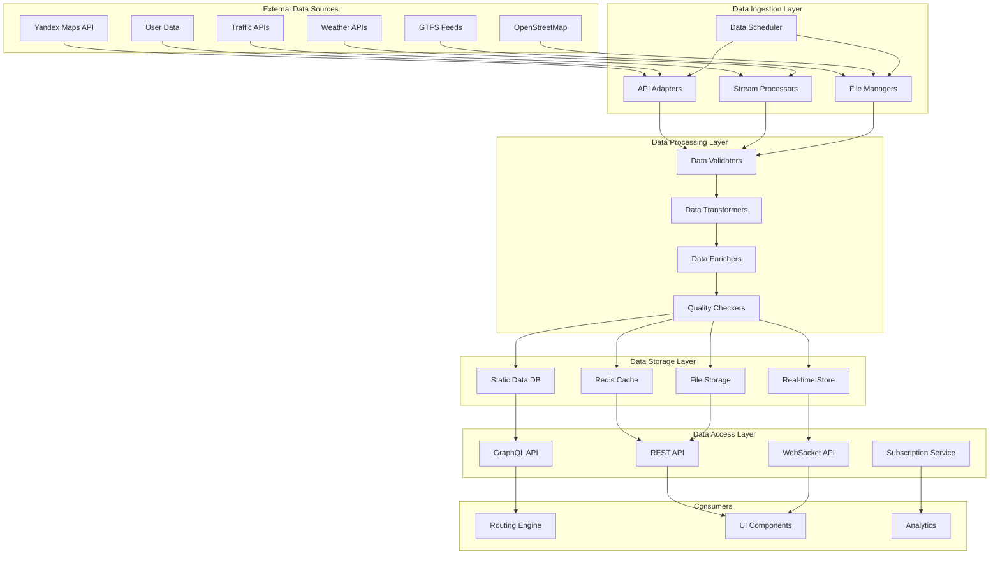
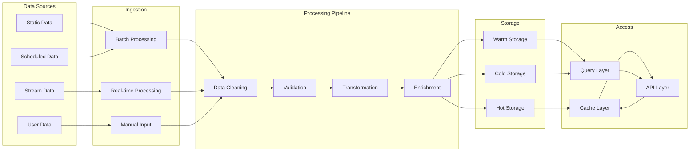

# Data Integration Layer Architecture

## Executive Summary

This document outlines the architecture of the data integration layer that powers the multi-modal routing system. The layer is responsible for acquiring, processing, and managing both static and real-time data from various sources, including road networks, public transport information, traffic conditions, and user-generated content.

## 1. Data Integration Architecture Overview

### 1.1 High-Level Architecture



### 1.2 Data Flow Architecture



## 2. Static Data Integration

### 2.1 Static Data Sources

#### Road Network Data
```typescript
interface RoadNetworkData {
  nodes: RoadNode[];
  edges: RoadEdge[];
  metadata: RoadNetworkMetadata;
}

interface RoadNode {
  id: string;
  coordinate: Coordinate;
  elevation?: number;
  roadClass: RoadClass;
  restrictions: AccessRestriction[];
  attributes: NodeAttributes;
}

interface RoadEdge {
  id: string;
  from: string;
  to: string;
  geometry: LineString;
  distance: number;
  roadClass: RoadClass;
  speedLimit?: number;
  lanes?: number;
  surface: SurfaceType;
  restrictions: AccessRestriction[];
  attributes: EdgeAttributes;
}

enum RoadClass {
  MOTORWAY = 'motorway',
  TRUNK = 'trunk',
  PRIMARY = 'primary',
  SECONDARY = 'secondary',
  TERTIARY = 'tertiary',
  RESIDENTIAL = 'residential',
  SERVICE = 'service'
}

enum SurfaceType {
  ASPHALT = 'asphalt',
  CONCRETE = 'concrete',
  PAVED = 'paved',
  UNPAVED = 'unpaved',
  GRAVEL = 'gravel',
  DIRT = 'dirt'
}
```

#### Public Transport Data (GTFS)
```typescript
interface GTFSData {
  agency: Agency[];
  stops: Stop[];
  routes: Route[];
  trips: Trip[];
  stopTimes: StopTime[];
  calendar: Calendar[];
  calendarDates: CalendarDate[];
  feedInfo: FeedInfo;
}

interface Stop {
  id: string;
  code?: string;
  name: string;
  description?: string;
  coordinate: Coordinate;
  zoneId?: string;
  url?: string;
  locationType: LocationType;
  parentStation?: string;
  wheelchairBoarding: WheelchairBoarding;
}

interface Trip {
  id: string;
  routeId: string;
  serviceId: string;
  headsign?: string;
  shortName?: string;
  directionId?: Direction;
  blockId?: string;
  shapeId?: string;
  wheelchairAccessible: WheelchairAccessible;
  bikesAllowed: BikesAllowed;
}

interface StopTime {
  tripId: string;
  arrivalTime: TimeValue;
  departureTime: TimeValue;
  stopId: string;
  stopSequence: number;
  stopHeadsign?: string;
  pickupType: PickupType;
  dropOffType: DropOffType;
  shapeDistTraveled?: number;
  timepoint: Timepoint;
}
```

#### Points of Interest Data
```typescript
interface POIData {
  places: POI[];
  categories: POICategory[];
  attributes: POIAttributes;
}

interface POI {
  id: string;
  name: string;
  category: POICategory;
  coordinate: Coordinate;
  address?: Address;
  description?: string;
  url?: string;
  phone?: string;
  openingHours?: OpeningHours[];
  accessibility: AccessibilityInfo;
  ratings: RatingInfo;
  attributes: POIAttributes;
  lastUpdated: Date;
}

interface POICategory {
  id: string;
  name: string;
  icon: string;
  color: string;
  parent?: string;
  attributes: CategoryAttributes;
}

interface AccessibilityInfo {
  wheelchairAccessible: boolean;
  audioSignals: boolean;
  tactilePaving: boolean;
  disabledParking: boolean;
  disabledToilet: boolean;
  levelAccess: boolean;
  inductionLoop: boolean;
}
```

### 2.2 Static Data Ingestion Pipeline

#### Base Data Ingestor
```typescript
abstract class DataIngestor<T> {
  protected validator: DataValidator<T>;
  protected transformer: DataTransformer<T>;
  protected enricher: DataEnricher<T>;
  
  constructor(
    validator: DataValidator<T>,
    transformer: DataTransformer<T>,
    enricher: DataEnricher<T>
  ) {
    this.validator = validator;
    this.transformer = transformer;
    this.enricher = enricher;
  }
  
  abstract async ingest(source: DataSource): Promise<T[]>;
  
  async process(source: DataSource): Promise<ProcessedData<T>> {
    try {
      // 1. Ingest raw data
      const rawData = await this.ingest(source);
      
      // 2. Validate data
      const validationResults = await this.validator.validate(rawData);
      if (!validationResults.isValid) {
        throw new ValidationError(validationResults.errors);
      }
      
      // 3. Transform data
      const transformedData = await this.transformer.transform(validationResults.validData);
      
      // 4. Enrich data
      const enrichedData = await this.enricher.enrich(transformedData);
      
      // 5. Quality check
      const qualityResults = await this.performQualityCheck(enrichedData);
      
      return {
        data: enrichedData,
        quality: qualityResults,
        metadata: this.generateMetadata(source, qualityResults)
      };
    } catch (error) {
      throw new IngestionError(`Failed to process data from ${source.name}: ${error.message}`);
    }
  }
  
  protected abstract async performQualityCheck(data: T[]): Promise<QualityResults>;
  
  protected generateMetadata(source: DataSource, quality: QualityResults): ProcessingMetadata {
    return {
      source: source.name,
      ingestTime: new Date(),
      recordCount: quality.validRecordCount,
      validationErrors: quality.validationErrors.length,
      enrichmentCount: quality.enrichmentCount
    };
  }
}
```

#### OpenStreetMap Data Ingestor
```typescript
class OSMDataIngestor extends DataIngestor<OSMData> {
  private osmClient: OSMClient;
  
  constructor(
    osmClient: OSMClient,
    validator: OSMDataValidator,
    transformer: OSMDataTransformer,
    enricher: OSMDataEnricher
  ) {
    super(validator, transformer, enricher);
    this.osmClient = osmClient;
  }
  
  async ingest(source: DataSource): Promise<OSMData[]> {
    if (source.type === 'file') {
      return await this.ingestFromFile(source.path);
    } else if (source.type === 'api') {
      return await this.ingestFromAPI(source.config);
    } else {
      throw new Error(`Unsupported source type: ${source.type}`);
    }
  }
  
  private async ingestFromFile(filePath: string): Promise<OSMData[]> {
    const data = await this.osmClient.parsePBF(filePath);
    return this.extractRelevantData(data);
  }
  
  private async ingestFromAPI(config: APIConfig): Promise<OSMData[]> {
    const { bbox, filters } = config;
    const data = await this.osmClient.fetchData(bbox, filters);
    return this.extractRelevantData(data);
  }
  
  private extractRelevantData(rawData: any): OSMData[] {
    const extracted: OSMData[] = [];
    
    // Extract road data
    const roads = this.extractRoads(rawData);
    extracted.push(...roads);
    
    // Extract POI data
    const pois = this.extractPOIs(rawData);
    extracted.push(...pois);
    
    // Extract public transport data
    const transit = this.extractTransitData(rawData);
    extracted.push(...transit);
    
    return extracted;
  }
  
  private extractRoads(data: any): OSMData[] {
    return data.elements
      .filter(element => element.type === 'way' && this.isRoad(element))
      .map(element => this.transformRoadElement(element));
  }
  
  private extractPOIs(data: any): OSMData[] {
    return data.elements
      .filter(element => 
        (element.type === 'node' && this.isPOI(element)) ||
        (element.type === 'way' && this.isPOIArea(element))
      )
      .map(element => this.transformPOIElement(element));
  }
  
  private extractTransitData(data: any): OSMData[] {
    const transitElements: OSMData[] = [];
    
    // Extract stops
    const stops = data.elements
      .filter(element => 
        element.type === 'node' && 
        (element.tags?.highway === 'bus_stop' || 
         element.tags?.public_transport === 'platform')
      )
      .map(element => this.transformStopElement(element));
    
    transitElements.push(...stops);
    
    // Extract routes
    const routes = data.elements
      .filter(element => 
        element.type === 'relation' && 
        element.tags?.type === 'route'
      )
      .map(element => this.transformRouteElement(element));
    
    transitElements.push(...routes);
    
    return transitElements;
  }
}
```

#### GTFS Data Ingestor
```typescript
class GTFSDataIngestor extends DataIngestor<GTFSData> {
  private gtfsParser: GTFSParser;
  
  constructor(
    gtfsParser: GTFSParser,
    validator: GTFSDataValidator,
    transformer: GTFSDataTransformer,
    enricher: GTFSDataEnricher
  ) {
    super(validator, transformer, enricher);
    this.gtfsParser = gtfsParser;
  }
  
  async ingest(source: DataSource): Promise<GTFSData> {
    if (source.type === 'file') {
      return await this.ingestFromZip(source.path);
    } else if (source.type === 'url') {
      return await this.ingestFromURL(source.url);
    } else {
      throw new Error(`Unsupported source type: ${source.type}`);
    }
  }
  
  private async ingestFromZip(zipPath: string): Promise<GTFSData> {
    const gtfsData = await this.gtfsParser.parseZip(zipPath);
    
    // Validate required files
    this.validateGTFSFiles(gtfsData);
    
    return this.processGTFSData(gtfsData);
  }
  
  private async ingestFromURL(url: string): Promise<GTFSData> {
    const response = await fetch(url);
    if (!response.ok) {
      throw new Error(`Failed to fetch GTFS data: ${response.statusText}`);
    }
    
    const arrayBuffer = await response.arrayBuffer();
    const gtfsData = await this.gtfsParser.parseBuffer(arrayBuffer);
    
    return this.processGTFSData(gtfsData);
  }
  
  private validateGTFSFiles(data: GTFSRawData): void {
    const requiredFiles = ['stops.txt', 'routes.txt', 'trips.txt', 'stop_times.txt'];
    
    for (const file of requiredFiles) {
      if (!data[file]) {
        throw new Error(`Required GTFS file missing: ${file}`);
      }
    }
  }
  
  private processGTFSData(rawData: GTFSRawData): GTFSData {
    return {
      agency: this.processAgencies(rawData['agency.txt'] || []),
      stops: this.processStops(rawData['stops.txt'] || []),
      routes: this.processRoutes(rawData['routes.txt'] || []),
      trips: this.processTrips(rawData['trips.txt'] || []),
      stopTimes: this.processStopTimes(rawData['stop_times.txt'] || []),
      calendar: this.processCalendar(rawData['calendar.txt'] || []),
      calendarDates: this.processCalendarDates(rawData['calendar_dates.txt'] || []),
      feedInfo: this.processFeedInfo(rawData['feed_info.txt'] || [])
    };
  }
}
```

## 3. Real-time Data Integration

### 3.1 Real-time Data Sources

#### Traffic Data
```typescript
interface TrafficData {
  timestamp: Date;
  segments: TrafficSegment[];
  incidents: TrafficIncident[];
  predictions: TrafficPrediction[];
}

interface TrafficSegment {
  id: string;
  coordinates: Coordinate[];
  currentSpeed: number;
  freeFlowSpeed: number;
  congestionLevel: CongestionLevel;
  travelTime: number;
  reliability: number;
  lastUpdated: Date;
}

interface TrafficIncident {
  id: string;
  type: IncidentType;
  severity: IncidentSeverity;
  coordinate: Coordinate;
  description: string;
  startTime: Date;
  endTime?: Date;
  affectedSegments: string[];
  lanesBlocked: number;
  detourAvailable: boolean;
}

interface TrafficPrediction {
  segmentId: string;
  predictedSpeed: number;
  predictionTime: Date;
  confidence: number;
  factors: PredictionFactor[];
}

enum CongestionLevel {
  FREE_FLOW = 'free_flow',
  LIGHT = 'light',
  MODERATE = 'moderate',
  HEAVY = 'heavy',
  SEVERE = 'severe'
}

enum IncidentType {
  ACCIDENT = 'accident',
  CONSTRUCTION = 'construction',
  ROAD_CLOSURE = 'road_closure',
  WEATHER = 'weather',
  SPECIAL_EVENT = 'special_event'
}
```

#### Public Transport Real-time Data (GTFS-RT)
```typescript
interface GTFSRealtimeData {
  tripUpdates: TripUpdate[];
  vehiclePositions: VehiclePosition[];
  alerts: Alert[];
  timestamp: Date;
}

interface TripUpdate {
  id: string;
  trip: TripDescriptor;
  stopTimeUpdates: StopTimeUpdate[];
  timestamp: Date;
  delay: number;
}

interface StopTimeUpdate {
  stopSequence?: number;
  stopId: string;
  arrival?: StopTimeEvent;
  departure?: StopTimeEvent;
  scheduleRelationship: ScheduleRelationship;
}

interface VehiclePosition {
  id: string;
  vehicle: VehicleDescriptor;
  trip: TripDescriptor;
  position: Position;
  currentStatus: VehicleStatus;
  timestamp: Date;
  congestionLevel?: CongestionLevel;
  occupancyStatus?: OccupancyStatus;
}

interface Alert {
  id: string;
  cause: AlertCause;
  effect: AlertEffect;
  url?: string;
  headerText?: TranslatedString;
  descriptionText?: TranslatedString;
  activePeriod: TimeRange[];
  informedEntity: EntitySelector[];
  severityLevel?: AlertSeverityLevel;
}
```

#### Weather Data
```typescript
interface WeatherData {
  timestamp: Date;
  location: Coordinate;
  current: CurrentWeather;
  forecast: WeatherForecast[];
  alerts: WeatherAlert[];
}

interface CurrentWeather {
  temperature: number;
  feelsLike: number;
  humidity: number;
  pressure: number;
  visibility: number;
  uvIndex: number;
  windSpeed: number;
  windDirection: number;
  precipitation: Precipitation;
  conditions: WeatherCondition;
}

interface WeatherCondition {
  primary: WeatherType;
  secondary?: WeatherType;
  intensity?: WeatherIntensity;
  visibility: VisibilityLevel;
}

interface WeatherForecast {
  timestamp: Date;
  temperature: TemperatureRange;
  precipitation: PrecipitationForecast;
  wind: WindForecast;
  conditions: WeatherCondition;
}

enum WeatherType {
  CLEAR = 'clear',
  CLOUDS = 'clouds',
  RAIN = 'rain',
  SNOW = 'snow',
  SLEET = 'sleet',
  FOG = 'fog',
  THUNDERSTORM = 'thunderstorm'
}

enum WeatherIntensity {
  LIGHT = 'light',
  MODERATE = 'moderate',
  HEAVY = 'heavy'
}
```

### 3.2 Real-time Data Stream Processing

#### Stream Processor Base
```typescript
abstract class StreamProcessor<T> {
  protected consumers: Map<string, StreamConsumer<T>>;
  protected filters: StreamFilter<T>[];
  protected transformers: StreamTransformer<T>[];
  
  constructor() {
    this.consumers = new Map();
    this.filters = [];
    this.transformers = [];
  }
  
  async start(): Promise<void> {
    await this.connect();
    this.setupEventHandlers();
    this.startConsumers();
  }
  
  async stop(): Promise<void> {
    await this.stopConsumers();
    await this.disconnect();
  }
  
  protected abstract async connect(): Promise<void>;
  protected abstract async disconnect(): Promise<void>;
  protected abstract setupEventHandlers(): void;
  
  protected addConsumer(id: string, consumer: StreamConsumer<T>): void {
    this.consumers.set(id, consumer);
  }
  
  protected removeConsumer(id: string): void {
    this.consumers.delete(id);
  }
  
  protected addFilter(filter: StreamFilter<T>): void {
    this.filters.push(filter);
  }
  
  protected addTransformer(transformer: StreamTransformer<T>): void {
    this.transformers.push(transformer);
  }
  
  protected async processData(data: T): Promise<void> {
    try {
      // Apply filters
      let filteredData = data;
      for (const filter of this.filters) {
        if (!filter.shouldProcess(filteredData)) {
          return; // Skip this data
        }
        filteredData = filter.transform(filteredData);
      }
      
      // Apply transformers
      let transformedData = filteredData;
      for (const transformer of this.transformers) {
        transformedData = transformer.transform(transformedData);
      }
      
      // Send to consumers
      for (const consumer of this.consumers.values()) {
        await consumer.consume(transformedData);
      }
    } catch (error) {
      console.error('Error processing stream data:', error);
    }
  }
  
  private async startConsumers(): Promise<void> {
    for (const [id, consumer] of this.consumers) {
      try {
        await consumer.start();
      } catch (error) {
        console.error(`Failed to start consumer ${id}:`, error);
      }
    }
  }
  
  private async stopConsumers(): Promise<void> {
    for (const [id, consumer] of this.consumers) {
      try {
        await consumer.stop();
      } catch (error) {
        console.error(`Failed to stop consumer ${id}:`, error);
      }
    }
  }
}
```

#### Traffic Stream Processor
```typescript
class TrafficStreamProcessor extends StreamProcessor<TrafficData> {
  private trafficAPI: TrafficAPI;
  private websocket: WebSocket;
  private reconnectAttempts: number = 0;
  private maxReconnectAttempts: number = 5;
  
  constructor(trafficAPI: TrafficAPI) {
    super();
    this.trafficAPI = trafficAPI;
  }
  
  protected async connect(): Promise<void> {
    try {
      const wsUrl = await this.trafficAPI.getStreamURL();
      this.websocket = new WebSocket(wsUrl);
      
      this.websocket.onopen = () => {
        console.log('Traffic stream connected');
        this.reconnectAttempts = 0;
      };
      
      this.websocket.onmessage = (event) => {
        const data = JSON.parse(event.data) as TrafficData;
        this.processData(data);
      };
      
      this.websocket.onclose = () => {
        console.log('Traffic stream disconnected');
        this.handleReconnect();
      };
      
      this.websocket.onerror = (error) => {
        console.error('Traffic stream error:', error);
      };
    } catch (error) {
      throw new Error(`Failed to connect to traffic stream: ${error.message}`);
    }
  }
  
  protected async disconnect(): Promise<void> {
    if (this.websocket) {
      this.websocket.close();
      this.websocket = null;
    }
  }
  
  protected setupEventHandlers(): void {
    // Add filters for relevant data
    this.addFilter(new TrafficDataFilter());
    this.addFilter(new GeospatialFilter());
    
    // Add transformers
    this.addTransformer(new TrafficDataNormalizer());
    this.addTransformer(new TrafficDataEnricher());
    
    // Add consumers
    this.addConsumer('cache', new TrafficCacheConsumer());
    this.addConsumer('alerts', new TrafficAlertsConsumer());
    this.addConsumer('analytics', new TrafficAnalyticsConsumer());
  }
  
  private async handleReconnect(): Promise<void> {
    if (this.reconnectAttempts < this.maxReconnectAttempts) {
      this.reconnectAttempts++;
      const delay = Math.pow(2, this.reconnectAttempts) * 1000; // Exponential backoff
      
      console.log(`Attempting to reconnect in ${delay}ms (attempt ${this.reconnectAttempts})`);
      
      setTimeout(async () => {
        try {
          await this.connect();
        } catch (error) {
          console.error('Reconnection failed:', error);
        }
      }, delay);
    } else {
      console.error('Max reconnection attempts reached');
    }
  }
}
```

#### GTFS-RT Stream Processor
```typescript
class GTFSRealtimeProcessor extends StreamProcessor<GTFSRealtimeData> {
  private gtfsRTClient: GTFSRTClient;
  private pollInterval: NodeJS.Timeout;
  private pollFrequency: number = 30000; // 30 seconds
  
  constructor(gtfsRTClient: GTFSRTClient) {
    super();
    this.gtfsRTClient = gtfsRTClient;
  }
  
  protected async connect(): Promise<void> {
    // GTFS-RT typically uses polling rather than websockets
    this.startPolling();
  }
  
  protected async disconnect(): Promise<void> {
    if (this.pollInterval) {
      clearInterval(this.pollInterval);
      this.pollInterval = null;
    }
  }
  
  protected setupEventHandlers(): void {
    // Add filters
    this.addFilter(new GTFSRTDataFilter());
    this.addFilter(new RelevantRouteFilter());
    
    // Add transformers
    this.addTransformer(new GTFSRTDataNormalizer());
    this.addTransformer(new TripUpdateTransformer());
    
    // Add consumers
    this.addConsumer('cache', new GTFSRTCacheConsumer());
    this.addConsumer('alerts', new TransitAlertsConsumer());
    this.addConsumer('positions', new VehiclePositionsConsumer());
  }
  
  private startPolling(): void {
    this.pollInterval = setInterval(async () => {
      try {
        const tripUpdates = await this.gtfsRTClient.getTripUpdates();
        const vehiclePositions = await this.gtfsRTClient.getVehiclePositions();
        const alerts = await this.gtfsRTClient.getAlerts();
        
        const realtimeData: GTFSRealtimeData = {
          tripUpdates: tripUpdates,
          vehiclePositions: vehiclePositions,
          alerts: alerts,
          timestamp: new Date()
        };
        
        await this.processData(realtimeData);
      } catch (error) {
        console.error('Error polling GTFS-RT data:', error);
      }
    }, this.pollFrequency);
  }
}
```

### 3.3 Data Storage Architecture

#### Time Series Database for Real-time Data
```typescript
class TimeSeriesStorage {
  private connection: Connection;
  private database: string;
  
  constructor(connectionConfig: ConnectionConfig, database: string) {
    this.connection = new Connection(connectionConfig);
    this.database = database;
  }
  
  async initialize(): Promise<void> {
    await this.connection.connect();
    await this.createRetentionPolicies();
    await this.createContinuousQueries();
  }
  
  async storeTrafficData(data: TrafficData): Promise<void> {
    const points = data.segments.map(segment => ({
      measurement: 'traffic_segments',
      tags: {
        segment_id: segment.id,
        congestion_level: segment.congestionLevel
      },
      fields: {
        current_speed: segment.currentSpeed,
        free_flow_speed: segment.freeFlowSpeed,
        travel_time: segment.travelTime,
        reliability: segment.reliability
      },
      timestamp: segment.lastUpdated
    }));
    
    await this.writePoints(points);
  }
  
  async storeVehiclePosition(data: VehiclePosition): Promise<void> {
    const point = {
      measurement: 'vehicle_positions',
      tags: {
        vehicle_id: data.id,
        trip_id: data.trip.tripId,
        route_id: data.trip.routeId,
        status: data.currentStatus
      },
      fields: {
        latitude: data.position.latitude,
        longitude: data.position.longitude,
        bearing: data.position.bearing,
        speed: data.position.speed
      },
      timestamp: data.timestamp
    };
    
    await this.writePoint(point);
  }
  
  async getTrafficData(
    segmentIds: string[],
    timeRange: TimeRange
  ): Promise<TrafficData[]> {
    const query = `
      SELECT * FROM traffic_segments
      WHERE segment_id IN (${segmentIds.map(id => `'${id}'`).join(',')})
      AND time >= '${timeRange.start.toISOString()}'
      AND time <= '${timeRange.end.toISOString()}'
      ORDER BY time
    `;
    
    const results = await this.query(query);
    return this.transformTrafficResults(results);
  }
  
  private async createRetentionPolicies(): Promise<void> {
    const policies = [
      { name: 'traffic_1h', duration: '1h', replication: 1 },
      { name: 'traffic_1d', duration: '1d', replication: 1 },
      { name: 'traffic_1w', duration: '1w', replication: 1 },
      { name: 'traffic_1m', duration: '30d', replication: 1 }
    ];
    
    for (const policy of policies) {
      await this.connection.query(`
        CREATE RETENTION POLICY ${policy.name} ON ${this.database}
        DURATION ${policy.duration} REPLICATION ${policy.replication}
      `);
    }
  }
  
  private async createContinuousQueries(): Promise<void> {
    // Downsample traffic data
    await this.connection.query(`
      CREATE CONTINUOUS QUERY cq_traffic_5m ON ${this.database}
      BEGIN
        SELECT mean(current_speed) AS current_speed,
               mean(travel_time) AS travel_time,
               mean(reliability) AS reliability
        INTO traffic_5m.${this.database}:traffic_segments
        FROM traffic_segments
        GROUP BY time(5m), segment_id
      END
    `);
    
    // Downsample vehicle positions
    await this.connection.query(`
      CREATE CONTINUOUS QUERY cq_vehicle_positions_1m ON ${this.database}
      BEGIN
        SELECT mean(latitude) AS latitude,
               mean(longitude) AS longitude,
               mean(bearing) AS bearing,
               mean(speed) AS speed
        INTO vehicle_positions_1m.${this.database}:vehicle_positions
        FROM vehicle_positions
        GROUP BY time(1m), vehicle_id, trip_id, route_id
      END
    `);
  }
}
```

#### Redis Cache for Hot Data
```typescript
class RedisCache {
  private client: Redis;
  private keyPrefix: string = 'mm_routing:';
  
  constructor(redisConfig: RedisConfig) {
    this.client = new Redis(redisConfig);
  }
  
  async cacheTrafficData(data: TrafficData, ttl: number = 300): Promise<void> {
    const key = `${this.keyPrefix}traffic:${Date.now()}`;
    
    // Cache individual segments
    for (const segment of data.segments) {
      const segmentKey = `${this.keyPrefix}segment:${segment.id}`;
      await this.client.hset(segmentKey, {
        current_speed: segment.currentSpeed,
        congestion_level: segment.congestionLevel,
        travel_time: segment.travelTime,
        last_updated: segment.lastUpdated.toISOString()
      });
      await this.client.expire(segmentKey, ttl);
    }
    
    // Cache incidents
    for (const incident of data.incidents) {
      const incidentKey = `${this.keyPrefix}incident:${incident.id}`;
      await this.client.hset(incidentKey, {
        type: incident.type,
        severity: incident.severity,
        latitude: incident.coordinate.latitude,
        longitude: incident.coordinate.longitude,
        description: incident.description,
        start_time: incident.startTime.toISOString()
      });
      await this.client.expire(incidentKey, ttl * 2); // Keep incidents longer
    }
  }
  
  async getTrafficSegment(segmentId: string): Promise<TrafficSegment | null> {
    const key = `${this.keyPrefix}segment:${segmentId}`;
    const data = await this.client.hgetall(key);
    
    if (!data || Object.keys(data).length === 0) {
      return null;
    }
    
    return {
      id: segmentId,
      coordinates: [], // Not cached
      currentSpeed: parseFloat(data.current_speed),
      freeFlowSpeed: 0, // Not cached
      congestionLevel: data.congestion_level as CongestionLevel,
      travelTime: parseFloat(data.travel_time),
      reliability: 0, // Not cached
      lastUpdated: new Date(data.last_updated)
    };
  }
  
  async cacheTransitUpdate(data: TripUpdate, ttl: number = 180): Promise<void> {
    const key = `${this.keyPrefix}trip:${data.trip.tripId}`;
    
    await this.client.hset(key, {
      delay: data.delay.toString(),
      last_update: data.timestamp.toISOString(),
      vehicle_id: data.vehicle?.id || ''
    });
    
    await this.client.expire(key, ttl);
    
    // Update stop times
    for (const stopTimeUpdate of data.stopTimeUpdates) {
      const stopKey = `${this.keyPrefix}stop:${data.trip.tripId}:${stopTimeUpdate.stopId}`;
      await this.client.hset(stopKey, {
        arrival_delay: stopTimeUpdate.arrival?.delay?.toString() || '0',
        departure_delay: stopTimeUpdate.departure?.delay?.toString() || '0',
        schedule_relationship: stopTimeUpdate.scheduleRelationship
      });
      await this.client.expire(stopKey, ttl);
    }
  }
  
  async getTransitUpdate(tripId: string): Promise<TripUpdate | null> {
    const key = `${this.keyPrefix}trip:${tripId}`;
    const data = await this.client.hgetall(key);
    
    if (!data || Object.keys(data).length === 0) {
      return null;
    }
    
    // Get stop time updates
    const stopPattern = `${this.keyPrefix}stop:${tripId}:*`;
    const stopKeys = await this.client.keys(stopPattern);
    const stopTimeUpdates: StopTimeUpdate[] = [];
    
    for (const stopKey of stopKeys) {
      const stopData = await this.client.hgetall(stopKey);
      const stopId = stopKey.split(':')[3];
      
      stopTimeUpdates.push({
        stopId: stopId,
        arrival: {
          delay: parseInt(stopData.arrival_delay) || 0,
          time: new Date() // Not cached
        },
        departure: {
          delay: parseInt(stopData.departure_delay) || 0,
          time: new Date() // Not cached
        },
        scheduleRelationship: stopData.schedule_relationship as ScheduleRelationship
      });
    }
    
    return {
      id: tripId,
      trip: {
        tripId: tripId,
        routeId: '', // Not cached
        serviceId: '' // Not cached
      },
      stopTimeUpdates: stopTimeUpdates,
      timestamp: new Date(data.last_update),
      delay: parseInt(data.delay)
    };
  }
  
  async invalidatePattern(pattern: string): Promise<void> {
    const keys = await this.client.keys(`${this.keyPrefix}${pattern}`);
    if (keys.length > 0) {
      await this.client.del(...keys);
    }
  }
}
```

## 4. Data Quality Management

### 4.1 Data Validation Framework

```typescript
class DataValidator<T> {
  private rules: ValidationRule<T>[];
  private validators: Map<string, CustomValidator<T>>;
  
  constructor() {
    this.rules = [];
    this.validators = new Map();
  }
  
  addRule(rule: ValidationRule<T>): void {
    this.rules.push(rule);
  }
  
  addValidator(name: string, validator: CustomValidator<T>): void {
    this.validators.set(name, validator);
  }
  
  async validate(data: T[]): Promise<ValidationResult<T>> {
    const errors: ValidationError[] = [];
    const validData: T[] = [];
    
    for (const item of data) {
      const itemErrors = await this.validateItem(item);
      
      if (itemErrors.length === 0) {
        validData.push(item);
      } else {
        errors.push(...itemErrors);
      }
    }
    
    return {
      isValid: errors.length === 0,
      validData,
      errors,
      summary: this.generateSummary(data.length, validData.length, errors.length)
    };
  }
  
  private async validateItem(item: T): Promise<ValidationError[]> {
    const errors: ValidationError[] = [];
    
    // Apply built-in rules
    for (const rule of this.rules) {
      try {
        const result = await rule.validate(item);
        if (!result.isValid) {
          errors.push({
            field: rule.field,
            message: result.message,
            value: this.getFieldValue(item, rule.field),
            severity: rule.severity
          });
        }
      } catch (error) {
        errors.push({
          field: rule.field,
          message: `Validation error: ${error.message}`,
          value: this.getFieldValue(item, rule.field),
          severity: ValidationSeverity.ERROR
        });
      }
    }
    
    // Apply custom validators
    for (const [name, validator] of this.validators) {
      try {
        const result = await validator.validate(item);
        if (!result.isValid) {
          errors.push({
            field: name,
            message: result.message,
            value: item,
            severity: result.severity || ValidationSeverity.ERROR
          });
        }
      } catch (error) {
        errors.push({
          field: name,
          message: `Custom validation error: ${error.message}`,
          value: item,
          severity: ValidationSeverity.ERROR
        });
      }
    }
    
    return errors;
  }
  
  private getFieldValue(item: T, field: string): any {
    return field.split('.').reduce((obj, key) => obj?.[key], item);
  }
  
  private generateSummary(total: number, valid: number, invalid: number): ValidationSummary {
    return {
      totalRecords: total,
      validRecords: valid,
      invalidRecords: invalid,
      validityRate: total > 0 ? (valid / total) * 100 : 0,
      errorRate: total > 0 ? (invalid / total) * 100 : 0
    };
  }
}

interface ValidationRule<T> {
  field: string;
  validate: (value: any) => Promise<RuleValidationResult>;
  severity: ValidationSeverity;
}

interface CustomValidator<T> {
  validate: (item: T) => Promise<CustomValidationResult>;
}

enum ValidationSeverity {
  WARNING = 'warning',
  ERROR = 'error',
  CRITICAL = 'critical'
}
```

### 4.2 Data Quality Metrics

```typescript
class DataQualityMonitor {
  private metrics: Map<string, QualityMetric>;
  private thresholds: Map<string, QualityThreshold>;
  
  constructor() {
    this.metrics = new Map();
    this.thresholds = new Map();
    this.initializeDefaultThresholds();
  }
  
  recordMetric(name: string, value: number, metadata?: any): void {
    const metric: QualityMetric = {
      name,
      value,
      timestamp: new Date(),
      metadata
    };
    
    this.metrics.set(name, metric);
    
    // Check against thresholds
    this.checkThresholds(metric);
  }
  
  recordDataQuality(dataset: string, metrics: DataQualityMetrics): void {
    const baseName = `data_quality.${dataset}`;
    
    this.recordMetric(`${baseName}.completeness`, metrics.completeness);
    this.recordMetric(`${baseName}.accuracy`, metrics.accuracy);
    this.recordMetric(`${baseName}.consistency`, metrics.consistency);
    this.recordMetric(`${baseName}.timeliness`, metrics.timeliness);
    this.recordMetric(`${baseName}.validity`, metrics.validity);
  }
  
  recordStreamQuality(stream: string, metrics: StreamQualityMetrics): void {
    const baseName = `stream_quality.${stream}`;
    
    this.recordMetric(`${baseName}.latency`, metrics.latency);
    this.recordMetric(`${baseName}.throughput`, metrics.throughput);
    this.recordMetric(`${baseName}.error_rate`, metrics.errorRate);
    this.recordMetric(`${baseName}.availability`, metrics.availability);
  }
  
  getQualityReport(timeRange?: TimeRange): QualityReport {
    const report: QualityReport = {
      timestamp: new Date(),
      metrics: {},
      alerts: [],
      summary: {
        overall: 0,
        categories: {}
      }
    };
    
    // Calculate category scores
    const categories = ['completeness', 'accuracy', 'consistency', 'timeliness', 'validity'];
    
    for (const category of categories) {
      const categoryMetrics = Array.from(this.metrics.values())
        .filter(m => m.name.includes(category));
      
      if (categoryMetrics.length > 0) {
        const avgValue = categoryMetrics.reduce((sum, m) => sum + m.value, 0) / categoryMetrics.length;
        report.summary.categories[category] = avgValue;
      }
    }
    
    // Calculate overall score
    const categoryValues = Object.values(report.summary.categories);
    if (categoryValues.length > 0) {
      report.summary.overall = categoryValues.reduce((sum, val) => sum + val, 0) / categoryValues.length;
    }
    
    // Get recent metrics
    const recentTime = timeRange ? timeRange.end : new Date();
    const oldTime = timeRange ? timeRange.start : new Date(recentTime.getTime() - 24 * 60 * 60 * 1000);
    
    for (const [name, metric] of this.metrics) {
      if (metric.timestamp >= oldTime && metric.timestamp <= recentTime) {
        report.metrics[name] = metric;
      }
    }
    
    return report;
  }
  
  private checkThresholds(metric: QualityMetric): void {
    const threshold = this.thresholds.get(metric.name);
    if (!threshold) return;
    
    if (metric.value < threshold.critical) {
      this.createAlert(metric.name, AlertSeverity.CRITICAL, 
        `Metric ${metric.name} is critically low: ${metric.value}`);
    } else if (metric.value < threshold.warning) {
      this.createAlert(metric.name, AlertSeverity.WARNING,
        `Metric ${metric.name} is below warning threshold: ${metric.value}`);
    }
  }
  
  private createAlert(metricName: string, severity: AlertSeverity, message: string): void {
    const alert: QualityAlert = {
      id: generateId(),
      metricName,
      severity,
      message,
      timestamp: new Date(),
      acknowledged: false
    };
    
    // Store alert and send notification
    this.storeAlert(alert);
    this.sendNotification(alert);
  }
  
  private initializeDefaultThresholds(): void {
    // Data quality thresholds
    this.thresholds.set('data_quality.completeness', { warning: 90, critical: 80 });
    this.thresholds.set('data_quality.accuracy', { warning: 95, critical: 90 });
    this.thresholds.set('data_quality.consistency', { warning: 90, critical: 80 });
    this.thresholds.set('data_quality.timeliness', { warning: 95, critical: 85 });
    this.thresholds.set('data_quality.validity', { warning: 95, critical: 90 });
    
    // Stream quality thresholds
    this.thresholds.set('stream_quality.latency', { warning: 5000, critical: 10000 }); // ms
    this.thresholds.set('stream_quality.error_rate', { warning: 0.05, critical: 0.1 }); // 5%, 10%
    this.thresholds.set('stream_quality.availability', { warning: 99, critical: 95 }); // %
  }
}
```

## 5. Integration with Existing Codebase

### 5.1 Enhanced useYandexMaps Hook

```typescript
// Enhanced version of existing useYandexMaps hook with data integration
const useEnhancedYandexMaps = (apiKey: string) => {
  const { ymaps, loading, error, geocode, calculateRoute, searchOrganizations } = useYandexMaps(apiKey);
  const [trafficData, setTrafficData] = useState<TrafficData | null>(null);
  const [transitData, setTransitData] = useState<GTFSRealtimeData | null>(null);
  
  // Initialize data integrators
  const { trafficIntegrator } = useTrafficDataIntegration();
  const { gtfsIntegrator } = useTransitDataIntegration();
  
  useEffect(() => {
    if (ymaps) {
      // Initialize real-time data streams
      trafficIntegrator.start();
      gtfsIntegrator.start();
      
      // Subscribe to data updates
      const trafficSubscription = trafficIntegrator.subscribe((data) => {
        setTrafficData(data);
      });
      
      const transitSubscription = gtfsIntegrator.subscribe((data) => {
        setTransitData(data);
      });
      
      return () => {
        trafficIntegrator.stop();
        gtfsIntegrator.stop();
        trafficSubscription.unsubscribe();
        transitSubscription.unsubscribe();
      };
    }
  }, [ymaps]);
  
  const calculateRouteWithRealTimeData = async (
    from: [number, number],
    to: [number, number],
    mode: 'walking' | 'bike' | 'car' | 'public_transport'
  ): Promise<EnhancedRoute | null> => {
    if (!ymaps) return null;
    
    // Calculate base route using Yandex Maps
    const baseRoute = await calculateRoute(from, to, mode);
    if (!baseRoute) return null;
    
    // Enhance with real-time data
    let enhancedRoute = { ...baseRoute };
    
    if (mode === 'car' && trafficData) {
      enhancedRoute = enhanceRouteWithTraffic(enhancedRoute, trafficData);
    }
    
    if (mode === 'public_transport' && transitData) {
      enhancedRoute = enhanceRouteWithTransitData(enhancedRoute, transitData);
    }
    
    return enhancedRoute;
  };
  
  const enhanceRouteWithTraffic = (route: Route, trafficData: TrafficData): EnhancedRoute => {
    // Find affected segments
    const affectedSegments = findAffectedSegments(route.coordinates, trafficData.segments);
    
    // Calculate adjusted travel times
    let adjustedDuration = route.duration;
    for (const segment of affectedSegments) {
      const trafficFactor = segment.currentSpeed / segment.freeFlowSpeed;
      adjustedDuration += (segment.travelTime / trafficFactor) - segment.travelTime;
    }
    
    // Add traffic incidents
    const incidents = findRelevantIncidents(route.coordinates, trafficData.incidents);
    
    return {
      ...route,
      realTimeDuration: Math.round(adjustedDuration),
      trafficFactor: adjustedDuration / route.duration,
      incidents,
      lastUpdated: trafficData.timestamp
    };
  };
  
  const enhanceRouteWithTransitData = (
    route: Route,
    transitData: GTFSRealtimeData
  ): EnhancedRoute => {
    // Find relevant trip updates
    const tripUpdates = transitData.tripUpdates.filter(update => 
      isRelevantToRoute(update, route)
    );
    
    // Calculate adjusted times
    let adjustedDuration = route.duration;
    for (const update of tripUpdates) {
      adjustedDuration += update.delay / 60; // Convert seconds to minutes
    }
    
    // Get vehicle positions
    const vehiclePositions = transitData.vehiclePositions.filter(position =>
      isRelevantToRoute(position, route)
    );
    
    // Get transit alerts
    const alerts = transitData.alerts.filter(alert =>
      isRelevantToRoute(alert, route)
    );
    
    return {
      ...route,
      realTimeDuration: Math.round(adjustedDuration),
      transitDelays: tripUpdates,
      vehiclePositions,
      transitAlerts: alerts,
      lastUpdated: transitData.timestamp
    };
  };
  
  return {
    ymaps,
    loading,
    error,
    geocode,
    calculateRoute,
    searchOrganizations,
    trafficData,
    transitData,
    calculateRouteWithRealTimeData
  };
};
```

### 5.2 Real-time Data Hooks

```typescript
// Custom hook for traffic data integration
const useTrafficDataIntegration = () => {
  const [isConnected, setIsConnected] = useState(false);
  const [lastUpdate, setLastUpdate] = useState<Date | null>(null);
  const [error, setError] = useState<string | null>(null);
  
  const processor = useRef<TrafficStreamProcessor | null>(null);
  const subscribers = useRef<Map<string, (data: TrafficData) => void>>(new Map());
  
  const start = useCallback(() => {
    if (!processor.current) {
      const trafficAPI = new TrafficAPI(process.env.TRAFFIC_API_KEY);
      processor.current = new TrafficStreamProcessor(trafficAPI);
      
      processor.current.addConsumer('hook', {
        consume: async (data) => {
          setLastUpdate(new Date());
          notifySubscribers(data);
        }
      });
    }
    
    processor.current.start()
      .then(() => setIsConnected(true))
      .catch(err => setError(err.message));
  }, []);
  
  const stop = useCallback(() => {
    if (processor.current) {
      processor.current.stop()
        .then(() => setIsConnected(false))
        .catch(err => setError(err.message));
    }
  }, []);
  
  const subscribe = useCallback((callback: (data: TrafficData) => void) => {
    const id = generateId();
    subscribers.current.set(id, callback);
    return () => subscribers.current.delete(id);
  }, []);
  
  const notifySubscribers = useCallback((data: TrafficData) => {
    for (const callback of subscribers.current.values()) {
      callback(data);
    }
  }, []);
  
  return {
    isConnected,
    lastUpdate,
    error,
    trafficIntegrator: {
      start,
      stop,
      subscribe
    }
  };
};

// Custom hook for transit data integration
const useTransitDataIntegration = () => {
  const [isConnected, setIsConnected] = useState(false);
  const [lastUpdate, setLastUpdate] = useState<Date | null>(null);
  const [error, setError] = useState<string | null>(null);
  
  const processor = useRef<GTFSRealtimeProcessor | null>(null);
  const subscribers = useRef<Map<string, (data: GTFSRealtimeData) => void>>(new Map());
  
  const start = useCallback(() => {
    if (!processor.current) {
      const gtfsRTClient = new GTFSRTClient(process.env.GTFS_RT_URL);
      processor.current = new GTFSRealtimeProcessor(gtfsRTClient);
      
      processor.current.addConsumer('hook', {
        consume: async (data) => {
          setLastUpdate(new Date());
          notifySubscribers(data);
        }
      });
    }
    
    processor.current.start()
      .then(() => setIsConnected(true))
      .catch(err => setError(err.message));
  }, []);
  
  const stop = useCallback(() => {
    if (processor.current) {
      processor.current.stop()
        .then(() => setIsConnected(false))
        .catch(err => setError(err.message));
    }
  }, []);
  
  const subscribe = useCallback((callback: (data: GTFSRealtimeData) => void) => {
    const id = generateId();
    subscribers.current.set(id, callback);
    return () => subscribers.current.delete(id);
  }, []);
  
  const notifySubscribers = useCallback((data: GTFSRealtimeData) => {
    for (const callback of subscribers.current.values()) {
      callback(data);
    }
  }, []);
  
  return {
    isConnected,
    lastUpdate,
    error,
    gtfsIntegrator: {
      start,
      stop,
      subscribe
    }
  };
};
```

## 6. Performance Optimization

### 6.1 Data Caching Strategy

```typescript
class MultiLevelCache {
  private l1Cache: Map<string, CacheEntry>; // In-memory cache
  private l2Cache: Redis; // Redis cache
  private l3Cache: PostgreSQL; // Database cache
  
  constructor(redisConfig: RedisConfig, dbConfig: DBConfig) {
    this.l1Cache = new Map();
    this.l2Cache = new Redis(redisConfig);
    this.l3Cache = new PostgreSQL(dbConfig);
  }
  
  async get<T>(key: string): Promise<T | null> {
    // Check L1 cache first
    const l1Entry = this.l1Cache.get(key);
    if (l1Entry && !this.isExpired(l1Entry)) {
      return l1Entry.value as T;
    }
    
    // Check L2 cache
    const l2Value = await this.l2Cache.get(key);
    if (l2Value) {
      const parsed = JSON.parse(l2Value);
      
      // Update L1 cache
      this.l1Cache.set(key, {
        value: parsed,
        timestamp: Date.now(),
        ttl: this.getTTL(key)
      });
      
      return parsed as T;
    }
    
    // Check L3 cache
    const l3Result = await this.l3Cache.query(
      'SELECT value FROM cache WHERE key = $1 AND expires_at > NOW()',
      [key]
    );
    
    if (l3Result.rows.length > 0) {
      const value = JSON.parse(l3Result.rows[0].value);
      
      // Update L2 cache
      await this.l2Cache.setex(key, this.getTTL(key), JSON.stringify(value));
      
      // Update L1 cache
      this.l1Cache.set(key, {
        value,
        timestamp: Date.now(),
        ttl: this.getTTL(key)
      });
      
      return value as T;
    }
    
    return null;
  }
  
  async set<T>(key: string, value: T, ttl?: number): Promise<void> {
    const actualTTL = ttl || this.getTTL(key);
    const cacheEntry: CacheEntry = {
      value,
      timestamp: Date.now(),
      ttl: actualTTL
    };
    
    // Set in all cache levels
    this.l1Cache.set(key, cacheEntry);
    await this.l2Cache.setex(key, actualTTL, JSON.stringify(value));
    
    await this.l3Cache.query(
      'INSERT INTO cache (key, value, expires_at) VALUES ($1, $2, NOW() + $3::interval) ' +
      'ON CONFLICT (key) UPDATE SET value = $2, expires_at = NOW() + $3::interval',
      [key, JSON.stringify(value), `${actualTTL} seconds`]
    );
  }
  
  async invalidate(pattern: string): Promise<void> {
    // Invalidate in L1 cache
    for (const key of this.l1Cache.keys()) {
      if (key.includes(pattern)) {
        this.l1Cache.delete(key);
      }
    }
    
    // Invalidate in L2 cache
    const keys = await this.l2Cache.keys(`*${pattern}*`);
    if (keys.length > 0) {
      await this.l2Cache.del(...keys);
    }
    
    // Invalidate in L3 cache
    await this.l3Cache.query(
      'DELETE FROM cache WHERE key LIKE $1',
      [`%${pattern}%`]
    );
  }
  
  private isExpired(entry: CacheEntry): boolean {
    return Date.now() - entry.timestamp > entry.ttl * 1000;
  }
  
  private getTTL(key: string): number {
    if (key.includes('traffic')) return 300; // 5 minutes
    if (key.includes('transit')) return 180; // 3 minutes
    if (key.includes('weather')) return 600; // 10 minutes
    if (key.includes('poi')) return 86400; // 24 hours
    return 3600; // 1 hour default
  }
}
```

### 6.2 Data Precomputation

```typescript
class PrecomputedDataManager {
  private db: PostgreSQL;
  private scheduler: Scheduler;
  
  constructor(db: PostgreSQL) {
    this.db = db;
    this.scheduler = new Scheduler();
  }
  
  async initialize(): Promise<void> {
    // Schedule precomputation tasks
    this.scheduler.schedule('0 2 * * *', this.precomputePopularRoutes.bind(this)); // Daily at 2 AM
    this.scheduler.schedule('*/15 * * * *', this.precomputeTrafficPatterns.bind(this)); // Every 15 minutes
    this.scheduler.schedule('0 */6 * * *', this.precomputeTransitConnections.bind(this)); // Every 6 hours
  }
  
  async precomputePopularRoutes(): Promise<void> {
    console.log('Starting precomputation of popular routes...');
    
    // Get popular destination pairs from analytics
    const popularPairs = await this.db.query(`
      SELECT origin_lat, origin_lng, dest_lat, dest_lng, COUNT(*) as frequency
      FROM route_requests
      WHERE created_at > NOW() - INTERVAL '7 days'
      GROUP BY origin_lat, origin_lng, dest_lat, dest_lng
      HAVING COUNT(*) > 10
      ORDER BY COUNT(*) DESC
      LIMIT 1000
    `);
    
    for (const pair of popularPairs.rows) {
      const origin: Coordinate = {
        latitude: pair.origin_lat,
        longitude: pair.origin_lng
      };
      
      const destination: Coordinate = {
        latitude: pair.dest_lat,
        longitude: pair.dest_lng
      };
      
      // Precompute routes for all transport modes
      const modes = [TransportMode.WALKING, TransportMode.BICYCLE, TransportMode.CAR, TransportMode.PUBLIC_TRANSPORT];
      
      for (const mode of modes) {
        try {
          // Use routing engine to calculate route
          const routingEngine = new MultiModalRoutingEngine();
          const route = await routingEngine.calculateRoute({
            origin,
            destination,
            transportModes: [mode],
            preferences: this.getDefaultPreferences(),
            constraints: this.getDefaultConstraints()
          });
          
          // Store precomputed route
          await this.storePrecomputedRoute(origin, destination, mode, route, pair.frequency);
        } catch (error) {
          console.error(`Failed to precompute route for ${mode}:`, error);
        }
      }
    }
    
    console.log('Completed precomputation of popular routes');
  }
  
  async precomputeTrafficPatterns(): Promise<void> {
    console.log('Starting precomputation of traffic patterns...');
    
    // Analyze historical traffic data
    const trafficPatterns = await this.db.query(`
      SELECT 
        segment_id,
        EXTRACT(HOUR FROM timestamp) as hour,
        EXTRACT(DOW FROM timestamp) as day_of_week,
        AVG(current_speed / free_flow_speed) as avg_speed_factor,
        AVG(travel_time) as avg_travel_time,
        STDDEV(travel_time) as travel_time_std
      FROM traffic_segments
      WHERE timestamp > NOW() - INTERVAL '30 days'
      GROUP BY segment_id, EXTRACT(HOUR FROM timestamp), EXTRACT(DOW FROM timestamp)
    `);
    
    // Store patterns for prediction
    for (const pattern of trafficPatterns.rows) {
      await this.db.query(`
        INSERT INTO traffic_patterns (
          segment_id, hour, day_of_week, avg_speed_factor, 
          avg_travel_time, travel_time_std, updated_at
        ) VALUES ($1, $2, $3, $4, $5, $6, NOW())
        ON CONFLICT (segment_id, hour, day_of_week) 
        DO UPDATE SET 
          avg_speed_factor = EXCLUDED.avg_speed_factor,
          avg_travel_time = EXCLUDED.avg_travel_time,
          travel_time_std = EXCLUDED.travel_time_std,
          updated_at = NOW()
      `, [
        pattern.segment_id,
        pattern.hour,
        pattern.day_of_week,
        pattern.avg_speed_factor,
        pattern.avg_travel_time,
        pattern.travel_time_std
      ]);
    }
    
    console.log('Completed precomputation of traffic patterns');
  }
  
  async precomputeTransitConnections(): Promise<void> {
    console.log('Starting precomputation of transit connections...');
    
    // Find optimal transfer points between different transit lines
    const transferPoints = await this.db.query(`
      SELECT 
        s1.id as stop1_id,
        s1.coordinate as stop1_coord,
        s2.id as stop2_id,
        s2.coordinate as stop2_coord,
        r1.id as route1_id,
        r2.id as route2_id,
        ST_Distance(s1.coordinate, s2.coordinate) as distance
      FROM stops s1
      JOIN routes r1 ON r1.id IN (
        SELECT route_id FROM trips WHERE id IN (
          SELECT trip_id FROM stop_times WHERE stop_id = s1.id
        )
      )
      JOIN stops s2 ON s1.id != s2.id
      JOIN routes r2 ON r2.id IN (
        SELECT route_id FROM trips WHERE id IN (
          SELECT trip_id FROM stop_times WHERE stop_id = s2.id
        )
      )
      WHERE ST_DWithin(s1.coordinate, s2.coordinate, 500) -- Within 500 meters
        AND r1.id != r2.id
    `);
    
    // Calculate optimal transfer times
    for (const transfer of transferPoints.rows) {
      const walkingTime = this.calculateWalkingTime(transfer.distance);
      
      await this.db.query(`
        INSERT INTO transfer_points (
          from_stop_id, to_stop_id, from_route_id, to_route_id,
          walking_distance, walking_time, transfer_type
        ) VALUES ($1, $2, $3, $4, $5, $6, 'optimal')
        ON CONFLICT (from_stop_id, to_stop_id, from_route_id, to_route_id)
        DO UPDATE SET
          walking_distance = EXCLUDED.walking_distance,
          walking_time = EXCLUDED.walking_time,
          updated_at = NOW()
      `, [
        transfer.stop1_id,
        transfer.stop2_id,
        transfer.route1_id,
        transfer.route2_id,
        transfer.distance,
        walkingTime
      ]);
    }
    
    console.log('Completed precomputation of transit connections');
  }
  
  private async storePrecomputedRoute(
    origin: Coordinate,
    destination: Coordinate,
    mode: TransportMode,
    route: MultiModalRoute,
    frequency: number
  ): Promise<void> {
    await this.db.query(`
      INSERT INTO precomputed_routes (
        origin_lat, origin_lng, dest_lat, dest_lng, mode,
        route_data, frequency, created_at
      ) VALUES ($1, $2, $3, $4, $5, $6, $7, NOW())
      ON CONFLICT (origin_lat, origin_lng, dest_lat, dest_lng, mode)
      DO UPDATE SET
        route_data = EXCLUDED.route_data,
        frequency = EXCLUDED.frequency,
        updated_at = NOW()
    `, [
      origin.latitude,
      origin.longitude,
      destination.latitude,
      destination.longitude,
      mode,
      JSON.stringify(route),
      frequency
    ]);
  }
  
  private calculateWalkingTime(distance: number): number {
    // Assume average walking speed of 1.4 m/s
    return Math.round(distance / 1.4);
  }
}
```

This comprehensive data integration layer architecture provides a robust foundation for handling both static and real-time data in the multi-modal routing system. The design emphasizes data quality, performance, and reliability while integrating seamlessly with the existing React/TypeScript codebase.