# Dynamic Adaptation System for Real-time Route Updates

## Executive Summary

This document outlines the architecture of the dynamic adaptation system that enables real-time route updates based on changing conditions. The system monitors routes, detects disruptions, calculates alternatives, and seamlessly adapts routes while users are traveling, ensuring optimal and reliable navigation experiences.

## 1. Dynamic Adaptation Architecture

### 1.1 High-Level Architecture

```mermaid
graph TB
    subgraph "Real-time Monitoring"
        RouteMonitor[Route Monitor]
        ConditionTracker[Condition Tracker]
        EventProcessor[Event Processor]
        AnomalyDetector[Anomaly Detector]
    end
    
    subgraph "Adaptation Engine"
        ImpactAnalyzer[Impact Analyzer]
        AlternativeCalculator[Alternative Calculator]
        AdaptationStrategy[Adaptation Strategy]
        DecisionEngine[Decision Engine]
    end
    
    subgraph "Communication System"
        NotificationService[Notification Service]
        UpdateService[Update Service]
        FeedbackCollector[Feedback Collector]
        UserPreferences[User Preferences]
    end
    
    subgraph "Data Sources"
        TrafficFeed[Traffic Feed]
        TransitFeed[Transit Feed]
        WeatherFeed[Weather Feed]
        IncidentFeed[Incident Feed]
        UserLocation[User Location]
    end
    
    subgraph "Storage & Caching"
        ActiveRoutes[Active Routes DB]
        AdaptationHistory[Adaptation History]
        RouteCache[Route Cache]
        NotificationQueue[Notification Queue]
    end
    
    TrafficFeed --> ConditionTracker
    TransitFeed --> ConditionTracker
    WeatherFeed --> ConditionTracker
    IncidentFeed --> EventProcessor
    UserLocation --> RouteMonitor
    
    RouteMonitor --> ImpactAnalyzer
    ConditionTracker --> ImpactAnalyzer
    EventProcessor --> AnomalyDetector
    AnomalyDetector --> ImpactAnalyzer
    
    ImpactAnalyzer --> AlternativeCalculator
    AlternativeCalculator --> AdaptationStrategy
    AdaptationStrategy --> DecisionEngine
    
    DecisionEngine --> NotificationService
    DecisionEngine --> UpdateService
    NotificationService --> FeedbackCollector
    UpdateService -> UserPreferences
    
    NotificationService --> NotificationQueue
    UpdateService --> RouteCache
    RouteMonitor --> ActiveRoutes
    DecisionEngine --> AdaptationHistory
```

### 1.2 Adaptation Flow Architecture

```mermaid
graph LR
    subgraph "Detection"
        Monitor[Monitor Conditions]
        Detect[Detect Changes]
        Assess[Assess Impact]
        Prioritize[Prioritize Events]
    end
    
    subgraph "Analysis"
        Analyze[Analyze Context]
        Predict[Predict Impact]
        Evaluate[Evaluate Options]
        Select[Select Strategy]
    end
    
    subgraph "Action"
        Calculate[Calculate Alternatives]
        Adapt[Adapt Route]
        Notify[Notify User]
        Update[Update System]
    end
    
    subgraph "Feedback"
        Collect[Collect Feedback]
        Learn[Learn & Adapt]
        Optimize[Optimize Algorithm]
    end
    
    Monitor --> Detect
    Detect --> Assess
    Assess --> Prioritize
    
    Prioritize --> Analyze
    Analyze --> Predict
    Predict --> Evaluate
    Evaluate --> Select
    
    Select --> Calculate
    Calculate --> Adapt
    Adapt --> Notify
    Notify --> Update
    
    Update --> Collect
    Collect --> Learn
    Learn --> Optimize
    Optimize --> Monitor
```



## 2. Real-time Monitoring System

### 2.1 Route Monitoring Engine

```typescript
class RouteMonitoringEngine {
    private activeRoutes: Map<string, MonitoredRoute>;
    private eventSubscriptions: Map<string, EventSubscription>;
    private anomalyDetector: AnomalyDetector;
    private impactAnalyzer: ImpactAnalyzer;
    private adaptationScheduler: AdaptationScheduler;
    
    constructor(
        anomalyDetector: AnomalyDetector,
        impactAnalyzer: ImpactAnalyzer
    ) {
        this.activeRoutes = new Map();
        this.eventSubscriptions = new Map();
        this.anomalyDetector = anomalyDetector;
        this.impactAnalyzer = impactAnalyzer;
        this.adaptationScheduler = new AdaptationScheduler();
    }
    
    async startMonitoring(route: MultiModalRoute, userContext: UserContext): Promise<string> {
        const routeId = this.generateRouteId(route);
        const monitoredRoute: MonitoredRoute = {
            id: routeId,
            originalRoute: route,
            currentRoute: route,
            userContext,
            status: MonitoringStatus.ACTIVE,
            lastUpdate: new Date(),
            position: await this.getInitialPosition(userContext),
            upcomingSegments: this.getUpcomingSegments(route, userContext.position),
            adaptations: [],
            alerts: [],
            metrics: {
                totalAdaptations: 0,
                accuracy: 0,
                userSatisfaction: 0
            }
        };
        
        this.activeRoutes.set(routeId, monitoredRoute);
        
        // Set up monitoring subscriptions
        await this.setupSubscriptions(routeId, monitoredRoute);
        
        // Start scheduled checks
        this.adaptationScheduler.scheduleRouteMonitoring(routeId);
        
        return routeId;
    }
    
    async stopMonitoring(routeId: string): Promise<void> {
        const route = this.activeRoutes.get(routeId);
        if (!route) return;
        
        // Unsubscribe from events
        const subscriptions = this.eventSubscriptions.get(routeId);
        if (subscriptions) {
            for (const subscription of subscriptions.subscriptions) {
                subscription.unsubscribe();
            }
            this.eventSubscriptions.delete(routeId);
        }
        
        // Stop scheduled checks
        this.adaptationScheduler.cancelRouteMonitoring(routeId);
        
        // Store monitoring history
        await this.storeMonitoringHistory(route);
        
        this.activeRoutes.delete(routeId);
    }
    
    private async setupSubscriptions(routeId: string, route: MonitoredRoute): Promise<void> {
        const subscriptions: Subscription[] = [];
        
        // Subscribe to traffic updates
        const trafficSubscription = this.subscribeToTrafficUpdates(routeId, route);
        subscriptions.push(trafficSubscription);
        
        // Subscribe to transit updates
        if (this.hasTransitSegments(route.currentRoute)) {
            const transitSubscription = this.subscribeToTransitUpdates(routeId, route);
            subscriptions.push(transitSubscription);
        }
        
        // Subscribe to weather updates
        const weatherSubscription = this.subscribeToWeatherUpdates(routeId, route);
        subscriptions.push(weatherSubscription);
        
        // Subscribe to incident updates
        const incidentSubscription = this.subscribeToIncidentUpdates(routeId, route);
        subscriptions.push(incidentSubscription);
        
        // Subscribe to user location updates
        const locationSubscription = this.subscribeToLocationUpdates(routeId, route);
        subscriptions.push(locationSubscription);
        
        this.eventSubscriptions.set(routeId, {
            routeId,
            subscriptions,
            createdAt: new Date()
        });
    }
    
    async updateUserPosition(routeId: string, position: Coordinate): Promise<void> {
        const route = this.activeRoutes.get(routeId);
        if (!route) return;
        
        route.position = position;
        route.lastUpdate = new Date();
        
        // Calculate progress along route
        const progress = this.calculateRouteProgress(route.currentRoute, position);
        route.progress = progress;
        
        // Update upcoming segments
        route.upcomingSegments = this.getUpcomingSegments(route.currentRoute, position);
        
        // Check if user deviated from route
        const deviation = this.detectDeviation(route.currentRoute, position);
        if (deviation.isDeviated) {
            await this.handleDeviation(routeId, deviation);
        }
        
        // Update estimated arrival time
        route.estimatedArrival = this.calculateEstimatedArrival(route);
    }
    
    private async handleTrafficUpdate(routeId: string, update: TrafficUpdate): Promise<void> {
        const route = this.activeRoutes.get(routeId);
        if (!route) return;
        
        // Analyze impact on upcoming segments
        const impact = await this.impactAnalyzer.analyzeTrafficImpact(
            route,
            update
        );
        
        if (impact.significant) {
            const adaptationDecision = await this.evaluateAdaptation(route, impact);
            if (adaptationDecision.shouldAdapt) {
                await this.executeAdaptation(routeId, adaptationDecision);
            }
        }
    }
    
    private async handleTransitUpdate(routeId: string, update: TransitUpdate): Promise<void> {
        const route = this.activeRoutes.get(routeId);
        if (!route) return;
        
        // Check if update affects current transit segments
        const affectedSegments = route.upcomingSegments.filter(segment =>
            segment.mode === 'bus' || segment.mode === 'metro' || segment.mode === 'tram'
        );
        
        for (const segment of affectedSegments) {
            if (update.routeIds.includes(segment.routeId) || update.stopIds.includes(segment.to)) {
                const impact = await this.impactAnalyzer.analyzeTransitImpact(
                    route,
                    segment,
                    update
                );
                
                if (impact.significant) {
                    const adaptationDecision = await this.evaluateAdaptation(route, impact);
                    if (adaptationDecision.shouldAdapt) {
                        await this.executeAdaptation(routeId, adaptationDecision);
                        break; // Only adapt once for multiple affected segments
                    }
                }
            }
        }
    }
    
    private async handleDeviation(routeId: string, deviation: RouteDeviation): Promise<void> {
        const route = this.activeRoutes.get(routeId);
        if (!route) return;
        
        // Calculate new route from current position
        const adaptationRequest: AdaptationRequest = {
            type: AdaptationType.DEVIATION,
            reason: 'User deviated from planned route',
            currentPosition: deviation.currentPosition,
            originalDestination: route.originalRoute.segments[route.originalRoute.segments.length - 1].to,
            constraints: {
                ...route.userContext.preferences.constraints,
                avoidSegments: [deviation.lastKnownSegment]
            },
            urgency: AdaptationUrgency.HIGH
        };
        
        await this.executeAdaptation(routeId, adaptationRequest);
    }
}

interface MonitoredRoute {
    id: string;
    originalRoute: MultiModalRoute;
    currentRoute: MultiModalRoute;
    userContext: UserContext;
    status: MonitoringStatus;
    lastUpdate: Date;
    position: Coordinate;
    progress: RouteProgress;
    upcomingSegments: RouteSegment[];
    adaptations: RouteAdaptation[];
    alerts: RouteAlert[];
    metrics: RouteMetrics;
    estimatedArrival?: Date;
}
```

### 2.2 Anomaly Detection System

```typescript
class AnomalyDetector {
    private statisticalModels: Map<string, StatisticalModel>;
    private mlModels: Map<string, MLModel>;
    private thresholds: AnomalyThresholds;
    
    constructor() {
        this.statisticalModels = new Map();
        this.mlModels = new Map();
        this.thresholds = this.initializeThresholds();
    }
    
    async detectAnomalies(
        route: MonitoredRoute,
        updates: RouteUpdate[]
    ): Promise<Anomaly[]> {
        const anomalies: Anomaly[] = [];
        
        for (const update of updates) {
            // Statistical anomaly detection
            const statisticalAnomalies = await this.detectStatisticalAnomalies(route, update);
            anomalies.push(...statisticalAnomalies);
            
            // ML-based anomaly detection
            const mlAnomalies = await this.detectMLAnomalies(route, update);
            anomalies.push(...mlAnomalies);
            
            // Rule-based anomaly detection
            const ruleAnomalies = this.detectRuleBasedAnomalies(route, update);
            anomalies.push(...ruleAnomalies);
        }
        
        // Filter and rank anomalies
        return this.filterAndRankAnomalies(anomalies);
    }
    
    private async detectStatisticalAnomalies(
        route: MonitoredRoute,
        update: RouteUpdate
    ): Promise<Anomaly[]> {
        const anomalies: Anomaly[] = [];
        
        if (update.type === UpdateType.TRAFFIC) {
            const model = this.statisticalModels.get('traffic');
            if (model) {
                const prediction = model.predict(update.segmentId, update.timestamp);
                const actualValue = update.currentSpeed;
                const expectedValue = prediction.speed;
                const deviation = Math.abs(actualValue - expectedValue) / expectedValue;
                
                if (deviation > this.thresholds.trafficDeviation) {
                    anomalies.push({
                        id: generateId(),
                        type: AnomalyType.TRAFFIC_ANOMALY,
                        severity: this.calculateSeverity(deviation),
                        confidence: model.getConfidence(),
                        description: `Traffic speed deviation: ${deviation.toFixed(2)}x from expected`,
                        data: {
                            segmentId: update.segmentId,
                            expectedSpeed: expectedValue,
                            actualSpeed: actualValue,
                            deviation
                        },
                        timestamp: new Date()
                    });
                }
            }
        }
        
        return anomalies;
    }
    
    private async detectMLAnomalies(
        route: MonitoredRoute,
        update: RouteUpdate
    ): Promise<Anomaly[]> {
        const anomalies: Anomaly[] = [];
        
        // Prepare features for ML model
        const features = this.extractFeatures(route, update);
        
        // Get prediction from ML model
        const model = this.mlModels.get('anomaly_detection');
        if (model) {
            const prediction = await model.predict(features);
            
            if (prediction.isAnomaly && prediction.confidence > this.thresholds.mlConfidence) {
                anomalies.push({
                    id: generateId(),
                    type: AnomalyType.ML_DETECTED,
                    severity: this.mapSeverity(prediction.severity),
                    confidence: prediction.confidence,
                    description: `ML model detected anomaly: ${prediction.reason}`,
                    data: {
                        features,
                        prediction: prediction.raw,
                        reason: prediction.reason
                    },
                    timestamp: new Date()
                });
            }
        }
        
        return anomalies;
    }
    
    private detectRuleBasedAnomalies(route: MonitoredRoute, update: RouteUpdate): Anomaly[] {
        const anomalies: Anomaly[] = [];
        
        // Rule 1: Sudden speed drops
        if (update.type === UpdateType.TRAFFIC) {
            if (update.currentSpeed < 5 && update.previousSpeed > 20) {
                anomalies.push({
                    id: generateId(),
                    type: AnomalyType.SUDDEN_SPEED_DROP,
                    severity: AnomalySeverity.HIGH,
                    confidence: 0.9,
                    description: `Sudden speed drop from ${update.previousSpeed} to ${update.currentSpeed} km/h`,
                    data: {
                        segmentId: update.segmentId,
                        previousSpeed: update.previousSpeed,
                        currentSpeed: update.currentSpeed
                    },
                    timestamp: new Date()
                });
            }
        }
        
        // Rule 2: Multiple transit delays
        if (update.type === UpdateType.TRANSIT) {
            const delayedTrips = update.updates.filter(u => u.delay > this.thresholds.transitDelay);
            if (delayedTrips.length > 3) {
                anomalies.push({
                    id: generateId(),
                    type: AnomalyType.MULTIPLE_TRANSIT_DELAYS,
                    severity: AnomalySeverity.MEDIUM,
                    confidence: 0.8,
                    description: `${delayedTrips.length} transit trips experiencing significant delays`,
                    data: {
                        delayedTrips: delayedTrips.map(t => ({
                            tripId: t.tripId,
                            delay: t.delay
                        }))
                    },
                    timestamp: new Date()
                });
            }
        }
        
        // Rule 3: Weather-related route impacts
        if (update.type === UpdateType.WEATHER) {
            if (update.conditions.precipitation.intensity === 'heavy' &&
                route.currentRoute.segments.some(s => s.mode === 'bicycle')) {
                anomalies.push({
                    id: generateId(),
                    type: AnomalyType.WEATHER_IMPACT,
                    severity: AnomalySeverity.MEDIUM,
                    confidence: 0.7,
                    description: `Heavy precipitation impacting bicycle route`,
                    data: {
                        weather: update.conditions,
                        affectedMode: 'bicycle'
                    },
                    timestamp: new Date()
                });
            }
        }
        
        return anomalies;
    }
    
    private filterAndRankAnomalies(anomalies: Anomaly[]): Anomaly[] {
        // Remove duplicates
        const uniqueAnomalies = this.removeDuplicates(anomalies);
        
        // Filter by confidence threshold
        const filtered = uniqueAnomalies.filter(
            anomaly => anomaly.confidence > this.thresholds.minConfidence
        );
        
        // Sort by severity and confidence
        return filtered.sort((a, b) => {
            const severityOrder = {
                [AnomalySeverity.CRITICAL]: 4,
                [AnomalySeverity.HIGH]: 3,
                [AnomalySeverity.MEDIUM]: 2,
                [AnomalySeverity.LOW]: 1
            };
            
            const severityDiff = severityOrder[b.severity] - severityOrder[a.severity];
            if (severityDiff !== 0) return severityDiff;
            
            return b.confidence - a.confidence;
        });
    }
}
```

## 3. Adaptation Decision Engine

### 3.1 Impact Analysis System

```typescript
class ImpactAnalyzer {
    private routeAnalyzer: RouteAnalyzer;
    private contextAnalyzer: ContextAnalyzer;
    private preferenceAnalyzer: PreferenceAnalyzer;
    
    constructor() {
        this.routeAnalyzer = new RouteAnalyzer();
        this.contextAnalyzer = new ContextAnalyzer();
        this.preferenceAnalyzer = new PreferenceAnalyzer();
    }
    
    async analyzeTrafficImpact(
        route: MonitoredRoute,
        update: TrafficUpdate
    ): Promise<TrafficImpact> {
        // Identify affected segments
        const affectedSegments = this.identifyAffectedSegments(route, update);
        
        if (affectedSegments.length === 0) {
            return {
                type: 'traffic',
                significance: ImpactSignificance.MINIMAL,
                affectedSegments: [],
                timeImpact: 0,
                costImpact: 0,
                comfortImpact: 0,
                recommendations: []
            };
        }
        
        // Calculate time impact
        const timeImpact = this.calculateTimeImpact(affectedSegments, update);
        
        // Calculate cost impact
        const costImpact = this.calculateCostImpact(affectedSegments, update);
        
        // Calculate comfort impact
        const comfortImpact = this.calculateComfortImpact(affectedSegments, update);
        
        // Determine overall significance
        const significance = this.determineSignificance(timeImpact, costImpact, comfortImpact);
        
        // Generate recommendations
        const recommendations = await this.generateTrafficRecommendations(
            route,
            affectedSegments,
            update,
            significance
        );
        
        return {
            type: 'traffic',
            significance,
            affectedSegments,
            timeImpact,
            costImpact,
            comfortImpact,
            recommendations
        };
    }
    
    async analyzeTransitImpact(
        route: MonitoredRoute,
        segment: RouteSegment,
        update: TransitUpdate
    ): Promise<TransitImpact> {
        // Find affected trips
        const affectedTrips = update.updates.filter(u => 
            u.tripId === segment.tripId || 
            u.stopId === segment.to
        );
        
        if (affectedTrips.length === 0) {
            return {
                type: 'transit',
                significance: ImpactSignificance.MINIMAL,
                affectedTrips: [],
                timeImpact: 0,
                reliabilityImpact: 0,
                alternatives: [],
                recommendations: []
            };
        }
        
        // Calculate time impact
        const maxDelay = Math.max(...affectedTrips.map(t => t.delay));
        const timeImpact = maxDelay / 60; // Convert to minutes
        
        // Calculate reliability impact
        const reliabilityImpact = this.calculateReliabilityImpact(affectedTrips);
        
        // Find alternatives
        const alternatives = await this.findTransitAlternatives(route, segment, affectedTrips);
        
        // Determine significance
        const significance = this.determineTransitSignificance(timeImpact, reliabilityImpact);
        
        // Generate recommendations
        const recommendations = this.generateTransitRecommendations(
            route,
            segment,
            affectedTrips,
            alternatives,
            significance
        );
        
        return {
            type: 'transit',
            significance,
            affectedTrips,
            timeImpact,
            reliabilityImpact,
            alternatives,
            recommendations
        };
    }
    
    private identifyAffectedSegments(
        route: MonitoredRoute,
        update: TrafficUpdate
    ): RouteSegment[] {
        return route.upcomingSegments.filter(segment => {
            // Check if segment intersects with affected area
            return this.segmentIntersectsArea(segment, update.affectedArea);
        });
    }
    
    private calculateTimeImpact(
        segments: RouteSegment[],
        update: TrafficUpdate
    ): number {
        let totalTimeImpact = 0;
        
        for (const segment of segments) {
            const originalTime = segment.duration;
            const congestionFactor = segment.currentSpeed / update.freeFlowSpeed;
            const newTime = originalTime / congestionFactor;
            totalTimeImpact += (newTime - originalTime);
        }
        
        return totalTimeImpact;
    }
    
    private async generateTrafficRecommendations(
        route: MonitoredRoute,
        segments: RouteSegment[],
        update: TrafficUpdate,
        significance: ImpactSignificance
    ): Promise<Recommendation[]> {
        const recommendations: Recommendation[] = [];
        
        // Check if rerouting is beneficial
        if (significance >= ImpactSignificance.MEDIUM) {
            const alternatives = await this.findTrafficAlternatives(route, segments, update);
            if (alternatives.length > 0) {
                recommendations.push({
                    type: RecommendationType.REROUTE,
                    priority: RecommendationPriority.HIGH,
                    description: `Found ${alternatives.length} alternative routes avoiding congestion`,
                    alternatives,
                    estimatedTimeSavings: this.calculateTimeSavings(alternatives),
                    confidence: 0.8
                });
            }
        }
        
        // Check if mode change is beneficial
        const modeChanges = await this.suggestModeChanges(route, segments, update);
        if (modeChanges.length > 0) {
            recommendations.push({
                type: RecommendationType.MODE_CHANGE,
                priority: RecommendationPriority.MEDIUM,
                description: `Consider switching to ${modeChanges[0].mode} for affected segments`,
                modeChanges,
                estimatedBenefits: this.calculateModeChangeBenefits(modeChanges),
                confidence: 0.7
            });
        }
        
        // Check if timing adjustment is possible
        if (this.canAdjustTiming(route, update)) {
            recommendations.push({
                type: RecommendationType.TIMING_ADJUSTMENT,
                priority: RecommendationPriority.LOW,
                description: `Delay departure by ${this.calculateOptimalDelay(route, update)} minutes to avoid congestion`,
                suggestedDelay: this.calculateOptimalDelay(route, update),
                confidence: 0.6
            });
        }
        
        return recommendations;
    }
    
    private determineSignificance(
        timeImpact: number,
        costImpact: number,
        comfortImpact: number
    ): ImpactSignificance {
        // Calculate weighted impact score
        const impactScore = (timeImpact * 0.5) + (costImpact * 0.3) + (comfortImpact * 0.2);
        
        if (impactScore > 15) return ImpactSignificance.CRITICAL;
        if (impactScore > 10) return ImpactSignificance.HIGH;
        if (impactScore > 5) return ImpactSignificance.MEDIUM;
        return ImpactSignificance.MINIMAL;
    }
}
```

### 3.2 Adaptation Strategy Engine

```typescript
class AdaptationStrategyEngine {
    private strategies: Map<AdaptationType, AdaptationStrategy>;
    private contextAnalyzer: ContextAnalyzer;
    private preferenceAnalyzer: PreferenceAnalyzer;
    
    constructor() {
        this.strategies = new Map();
        this.contextAnalyzer = new ContextAnalyzer();
        this.preferenceAnalyzer = new PreferenceAnalyzer();
        this.initializeStrategies();
    }
    
    private initializeStrategies(): void {
        this.strategies.set(AdaptationType.REROUTE, new RerouteStrategy());
        this.strategies.set(AdaptationType.MODE_CHANGE, new ModeChangeStrategy());
        this.strategies.set(AdaptationType.TIMING_ADJUSTMENT, new TimingAdjustmentStrategy());
        this.strategies.set(AdaptationType.SEGMENT_SKIP, new SegmentSkipStrategy());
        this.strategies.set(AdaptationType.DIVERSIFICATION, new DiversificationStrategy());
        this.strategies.set(AdaptationType.DEVIATION, new DeviationStrategy());
    }
    
    async evaluateAdaptation(
        route: MonitoredRoute,
        impact: RouteImpact
    ): Promise<AdaptationDecision> {
        // Analyze context
        const context = await this.contextAnalyzer.analyzeContext(route);
        
        // Analyze user preferences
        const preferences = await this.preferenceAnalyzer.analyzePreferences(
            route.userContext,
            impact
        );
        
        // Generate adaptation options
        const options = await this.generateAdaptationOptions(route, impact);
        
        // Evaluate each option
        const evaluatedOptions: EvaluatedOption[] = [];
        for (const option of options) {
            const evaluation = await this.evaluateOption(option, route, impact, context, preferences);
            evaluatedOptions.push(evaluation);
        }
        
        // Select best option
        const bestOption = this.selectBestOption(evaluatedOptions);
        
        return {
            shouldAdapt: bestOption.score > this.getAdaptationThreshold(context, preferences),
            selectedOption: bestOption,
            alternatives: evaluatedOptions.filter(o => o !== bestOption),
            context,
            confidence: bestOption.confidence,
            reasoning: bestOption.reasoning
        };
    }
    
    private async generateAdaptationOptions(
        route: MonitoredRoute,
        impact: RouteImpact
    ): Promise<AdaptationOption[]> {
        const options: AdaptationOption[] = [];
        
        // Generate reroute options
        if (impact.type === 'traffic' || impact.type === 'obstacle') {
            const rerouteOptions = await this.generateRerouteOptions(route, impact);
            options.push(...rerouteOptions);
        }
        
        // Generate mode change options
        if (impact.type === 'transit' || impact.type === 'weather') {
            const modeChangeOptions = await this.generateModeChangeOptions(route, impact);
            options.push(...modeChangeOptions);
        }
        
        // Generate timing adjustment options
        if (impact.type === 'traffic' && this.canAdjustTiming(route, impact)) {
            const timingOptions = await this.generateTimingOptions(route, impact);
            options.push(...timingOptions);
        }
        
        // Generate diversification options
        if (impact.significance === ImpactSignificance.HIGH) {
            const diversificationOptions = await this.generateDiversificationOptions(route, impact);
            options.push(...diversificationOptions);
        }
        
        return options;
    }
    
    private async evaluateOption(
        option: AdaptationOption,
        route: MonitoredRoute,
        impact: RouteImpact,
        context: AdaptationContext,
        preferences: AdaptationPreferences
    ): Promise<EvaluatedOption> {
        // Calculate benefits
        const benefits = await this.calculateBenefits(option, route, impact);
        
        // Calculate costs
        const costs = await this.calculateCosts(option, route, impact, context);
        
        // Calculate user satisfaction
        const satisfaction = await this.calculateSatisfaction(option, preferences);
        
        // Calculate risk
        const risk = await this.calculateRisk(option, route, context);
        
        // Calculate overall score
        const score = this.calculateOptionScore(benefits, costs, satisfaction, risk);
        
        // Generate reasoning
        const reasoning = this.generateReasoning(option, benefits, costs, satisfaction, risk);
        
        return {
            option,
            score,
            confidence: this.calculateConfidence(option, benefits, costs, risk),
            reasoning,
            benefits,
            costs,
            satisfaction,
            risk
        };
    }
    
    private calculateOptionScore(
        benefits: OptionBenefits,
        costs: OptionCosts,
        satisfaction: UserSatisfaction,
        risk: OptionRisk
    ): number {
        // Weighted scoring based on user preferences
        const weights = {
            time: 0.35,
            cost: 0.25,
            comfort: 0.20,
            reliability: 0.20
        };
        
        // Normalize values to 0-1 range
        const normalizedBenefits = {
            time: Math.max(0, Math.min(1, benefits.timeSavings / 30)), // Max 30 min savings
            cost: Math.max(0, Math.min(1, benefits.costSavings / 10)), // Max $10 savings
            comfort: Math.max(0, Math.min(1, benefits.comfortImprovement)),
            reliability: Math.max(0, Math.min(1, benefits.reliabilityImprovement))
        };
        
        const normalizedCosts = {
            inconvenience: Math.max(0, Math.min(1, costs.inconvenience / 10)), // Max 10 inconvenience units
            complexity: Math.max(0, Math.min(1, costs.complexity / 5)), // Max 5 complexity units
            uncertainty: Math.max(0, Math.min(1, costs.uncertainty)),
            learning: Math.max(0, Math.min(1, costs.learningCurve / 100)) // Max 100 learning units
        };
        
        // Calculate weighted score
        let score = 0;
        score += weights.time * (normalizedBenefits.time - normalizedCosts.inconvenience * 0.3);
        score += weights.cost * (normalizedBenefits.cost - normalizedCosts.complexity * 0.2);
        score += weights.comfort * (normalizedBenefits.comfort - normalizedCosts.uncertainty * 0.3);
        score += weights.reliability * (normalizedBenefits.reliability - normalizedCosts.learning * 0.1);
        
        // Apply satisfaction factor
        score *= satisfaction.overall;
        
        // Apply risk factor
        score *= (1 - risk.overall);
        
        return Math.max(0, Math.min(1, score));
    }
    
    private selectBestOption(options: EvaluatedOption[]): EvaluatedOption {
        // Filter out options below minimum threshold
        const viableOptions = options.filter(option => option.score > 0.3);
        
        if (viableOptions.length === 0) {
            return options[0]; // Return the best even if below threshold
        }
        
        // Sort by score
        viableOptions.sort((a, b) => b.score - a.score);
        
        // Apply tie-breaking rules
        if (viableOptions.length > 1 && 
            Math.abs(viableOptions[0].score - viableOptions[1].score) < 0.05) {
            // Break ties based on confidence and risk
            return this.breakTie(viableOptions[0], viableOptions[1]);
        }
        
        return viableOptions[0];
    }
    
    private breakTie(option1: EvaluatedOption, option2: EvaluatedOption): EvaluatedOption {
        // Prefer higher confidence
        if (option1.confidence > option2.confidence + 0.1) return option1;
        if (option2.confidence > option1.confidence + 0.1) return option2;
        
        // Prefer lower risk
        if (option1.risk.overall < option2.risk.overall - 0.1) return option1;
        if (option2.risk.overall < option1.risk.overall - 0.1) return option2;
        
        // Prefer simpler option (lower complexity)
        if (option1.costs.complexity < option2.costs.complexity) return option1;
        if (option2.costs.complexity < option1.costs.complexity) return option2;
        
        // Default to the first option
        return option1;
    }
}
```

## 4. User Notification System

### 4.1 Notification Engine

```typescript
class NotificationEngine {
    private notificationChannels: Map<NotificationChannel, NotificationChannelHandler>;
    private userPreferences: UserNotificationPreferences;
    private contextAnalyzer: ContextAnalyzer;
    
    constructor() {
        this.notificationChannels = new Map();
        this.initializeChannels();
        this.contextAnalyzer = new ContextAnalyzer();
    }
    
    private initializeChannels(): void {
        this.notificationChannels.set(NotificationChannel.APP, new AppNotificationHandler());
        this.notificationChannels.set(NotificationChannel.PUSH, new PushNotificationHandler());
        this.notificationChannels.set(NotificationChannel.EMAIL, new EmailNotificationHandler());
        this.notificationChannels.set(NotificationChannel.SMS, new SMSNotificationHandler());
        this.notificationChannels.set(NotificationChannel.VOICE, new VoiceNotificationHandler());
    }
    
    async sendAdaptationNotification(
        userId: string,
        adaptation: RouteAdaptation,
        context: AdaptationContext
    ): Promise<NotificationResult[]> {
        // Analyze context to determine appropriate channels
        const appropriateChannels = await this.determineChannels(userId, adaptation, context);
        
        // Generate notification content
        const content = await this.generateNotificationContent(adaptation, context);
        
        // Send notifications through appropriate channels
        const results: NotificationResult[] = [];
        
        for (const channel of appropriateChannels) {
            try {
                const handler = this.notificationChannels.get(channel);
                if (handler) {
                    const result = await handler.send(userId, content, adaptation, context);
                    results.push(result);
                }
            } catch (error) {
                console.error(`Failed to send ${channel} notification:`, error);
                results.push({
                    channel,
                    success: false,
                    error: error.message
                });
            }
        }
        
        return results;
    }
    
    private async determineChannels(
        userId: string,
        adaptation: RouteAdaptation,
        context: AdaptationContext
    ): Promise<NotificationChannel[]> {
        const channels: NotificationChannel[] = [];
        
        // Get user preferences
        const preferences = await this.getUserNotificationPreferences(userId);
        
        // Always send to app
        channels.push(NotificationChannel.APP);
        
        // Determine urgency based on adaptation
        const urgency = this.calculateUrgency(adaptation);
        
        // Add channels based on urgency and user preferences
        if (urgency === NotificationUrgency.CRITICAL) {
            if (preferences.voice.enabled) channels.push(NotificationChannel.VOICE);
            if (preferences.sms.enabled) channels.push(NotificationChannel.SMS);
            if (preferences.push.enabled) channels.push(NotificationChannel.PUSH);
        } else if (urgency === NotificationUrgency.HIGH) {
            if (preferences.push.enabled) channels.push(NotificationChannel.PUSH);
            if (preferences.sms.enabled && context.user.isDriving) {
                channels.push(NotificationChannel.SMS); // SMS if user is driving
            }
        } else if (urgency === NotificationUrgency.MEDIUM) {
            if (preferences.push.enabled && !context.user.isDriving) {
                channels.push(NotificationChannel.PUSH);
            }
        }
        
        // Consider user activity and context
        if (context.user.isActive && !adaptation.requiresImmediateAction) {
            // User is active in app, don't send other channels
            return [NotificationChannel.APP];
        }
        
        return channels;
    }
    
    private async generateNotificationContent(
        adaptation: RouteAdaptation,
        context: AdaptationContext
    ): Promise<NotificationContent> {
        const baseContent = await this.generateBaseContent(adaptation);
        const contextualContent = await this.addContextualContent(baseContent, context);
        const personalizedContent = await this.personalizeContent(contextualContent, context.user);
        
        return personalizedContent;
    }
    
    private async generateBaseContent(adaptation: RouteAdaptation): Promise<NotificationContent> {
        const urgency = this.calculateUrgency(adaptation);
        
        return {
            title: this.generateTitle(adaptation, urgency),
            message: this.generateMessage(adaptation, urgency),
            details: this.generateDetails(adaptation),
            actions: this.generateActions(adaptation),
            priority: this.mapPriority(urgency),
            category: NotificationCategory.ROUTE_ADAPTATION,
            timestamp: new Date(),
            expiry: this.calculateExpiry(adaptation, urgency)
        };
    }
    
    private generateTitle(adaptation: RouteAdaptation, urgency: NotificationUrgency): string {
        switch (adaptation.type) {
            case AdaptationType.REROUTE:
                return urgency === NotificationUrgency.CRITICAL ? 
                    "⚠️ Immediate Route Change Required" : 
                    "🗺️ Better Route Available";
            case AdaptationType.MODE_CHANGE:
                return "🔄 Transport Mode Change Recommended";
            case AdaptationType.DELAY:
                return "⏰ Updated Arrival Time";
            case AdaptationType.CANCELLATION:
                return "❌ Route Segment Canceled";
            default:
                return "📍 Route Update";
        }
    }
    
    private generateMessage(adaptation: RouteAdaptation, urgency: NotificationUrgency): string {
        switch (adaptation.type) {
            case AdaptationType.REROUTE:
                if (urgency === NotificationUrgency.CRITICAL) {
                    return `Your current route is blocked. New route adds ${adaptation.timeImpact} minutes.`;
                } else {
                    return `Found a faster route! Save ${Math.abs(adaptation.timeImpact)} minutes.`;
                }
            case AdaptationType.MODE_CHANGE:
                return `Switch to ${adaptation.newMode} to avoid ${adaptation.reason}. ${adaptation.timeImpact} minutes saved.`;
            case AdaptationType.DELAY:
                return `Updated arrival time: ${adaptation.newArrivalTime}. Delay: ${adaptation.timeImpact} minutes.`;
            default:
                return `Route updated due to ${adaptation.reason}.`;
        }
    }
    
    private generateDetails(adaptation: RouteAdaptation): NotificationDetails {
        return {
            adaptationId: adaptation.id,
            originalRoute: adaptation.originalRouteId,
            newRoute: adaptation.newRouteId,
            reason: adaptation.reason,
            timeImpact: adaptation.timeImpact,
            costImpact: adaptation.costImpact,
            segmentsAffected: adaptation.segmentsAffected,
            confidence: adaptation.confidence,
            alternatives: adaptation.alternatives?.map(alt => ({
                id: alt.id,
                description: alt.description,
                timeImpact: alt.timeImpact,
                costImpact: alt.costImpact
            }))
        };
    }
    
    private generateActions(adaptation: RouteAdaptation): NotificationAction[] {
        const actions: NotificationAction[] = [
            {
                id: 'accept',
                label: 'Accept',
                type: ActionType.PRIMARY,
                action: 'accept_adaptation',
                data: { adaptationId: adaptation.id }
            },
            {
                id: 'decline',
                label: 'Keep Original',
                type: ActionType.SECONDARY,
                action: 'decline_adaptation',
                data: { adaptationId: adaptation.id }
            }
        ];
        
        if (adaptation.alternatives && adaptation.alternatives.length > 0) {
            actions.push({
                id: 'alternatives',
                label: 'See Alternatives',
                type: ActionType.TERTIARY,
                action: 'show_alternatives',
                data: { adaptationId: adaptation.id }
            });
        }
        
        return actions;
    }
}

// Specific notification handlers
class AppNotificationHandler implements NotificationChannelHandler {
    async send(
        userId: string,
        content: NotificationContent,
        adaptation: RouteAdaptation,
        context: AdaptationContext
    ): Promise<NotificationResult> {
        try {
            // Send in-app notification
            const notification = {
                userId,
                type: 'route_adaptation',
                title: content.title,
                message: content.message,
                data: content.details,
                actions: content.actions,
                priority: content.priority,
                timestamp: content.timestamp
            };
            
            await this.sendToApp(notification);
            
            // Update UI if user is active
            if (context.user.isActive) {
                await this.updateUI(notification);
            }
            
            return {
                channel: NotificationChannel.APP,
                success: true,
                timestamp: new Date()
            };
        } catch (error) {
            return {
                channel: NotificationChannel.APP,
                success: false,
                error: error.message,
                timestamp: new Date()
            };
        }
    }
    
    private async sendToApp(notification: any): Promise<void> {
        // Implementation for sending in-app notification
        // This would typically use WebSocket or Server-Sent Events
    }
    
    private async updateUI(notification: any): Promise<void> {
        // Implementation for updating UI in real-time
        // This would typically emit events to the client
    }
}

class PushNotificationHandler implements NotificationChannelHandler {
    async send(
        userId: string,
        content: NotificationContent,
        adaptation: RouteAdaptation,
        context: AdaptationContext
    ): Promise<NotificationResult> {
        try {
            // Get user's push tokens
            const pushTokens = await this.getUserPushTokens(userId);
            
            if (pushTokens.length === 0) {
                throw new Error('No push tokens available for user');
            }
            
            // Create push notification payload
            const payload = {
                title: content.title,
                message: content.message,
                data: {
                    type: 'route_adaptation',
                    adaptationId: adaptation.id,
                    ...content.details
                },
                actions: content.actions.map(action => ({
                    action: action.action,
                    title: action.label
                })),
                priority: this.mapPayloadPriority(content.priority),
                ttl: Math.floor((content.expiry.getTime() - Date.now()) / 1000)
            };
            
            // Send to all tokens
            const results = await Promise.allSettled(
                pushTokens.map(token => this.sendPushNotification(token, payload))
            );
            
            const successful = results.filter(r => r.status === 'fulfilled').length;
            const failed = results.filter(r => r.status === 'rejected').length;
            
            return {
                channel: NotificationChannel.PUSH,
                success: successful > 0,
                details: {
                    sent: successful,
                    failed,
                    total: pushTokens.length
                },
                timestamp: new Date()
            };
        } catch (error) {
            return {
                channel: NotificationChannel.PUSH,
                success: false,
                error: error.message,
                timestamp: new Date()
            };
        }
    }
    
    private async sendPushNotification(token: string, payload: any): Promise<void> {
        // Implementation for sending push notification
        // This would typically use Firebase Cloud Messaging or Apple Push Notification Service
    }
}
```

## 5. Integration with Existing Codebase

### 5.1 Enhanced useAdvancedRouting Hook with Dynamic Adaptation

```typescript
// Enhanced version of existing useAdvancedRouting hook with dynamic adaptation
const useEnhancedAdvancedRoutingWithAdaptation = () => {
    const [preferences, setPreferences] = useState<UserPreferences>(getDefaultPreferences());
    const [currentRoute, setCurrentRoute] = useState<MultiModalRoute | null>(null);
    const [adaptationHistory, setAdaptationHistory] = useState<RouteAdaptation[]>([]);
    const [activeNotifications, setActiveNotifications] = useState<Notification[]>([]);
    const [isMonitoring, setIsMonitoring] = useState(false);
    const [monitoringId, setMonitoringId] = useState<string | null>(null);
    const [location, setLocation] = useState<Coordinate | null>(null);
    
    // Initialize adaptation system
    const adaptationEngine = useMemo(() => new AdaptationEngine(), []);
    const notificationEngine = useMemo(() => new NotificationEngine(), []);
    
    // Location tracking
    useEffect(() => {
        if (!isMonitoring) return;
        
        const watchId = navigator.geolocation.watchPosition(
            (position) => {
                const newLocation: Coordinate = {
                    latitude: position.coords.latitude,
                    longitude: position.coords.longitude
                };
                setLocation(newLocation);
                
                // Update route monitoring with new position
                if (monitoringId) {
                    adaptationEngine.updateUserPosition(monitoringId, newLocation);
                }
            },
            (error) => {
                console.error('Location tracking error:', error);
                toast.error('Unable to track your location');
            },
            {
                enableHighAccuracy: true,
                maximumAge: 5000,
                timeout: 10000
            }
        );
        
        return () => {
            navigator.geolocation.clearWatch(watchId);
        };
    }, [isMonitoring, monitoringId, adaptationEngine]);
    
    // Adaptation event listeners
    useEffect(() => {
        if (!monitoringId) return;
        
        const unsubscribeAdaptations = adaptationEngine.onAdaptation((adaptation) => {
            setAdaptationHistory(prev => [...prev, adaptation]);
            
            // Show notification
            showAdaptationNotification(adaptation);
            
            // Update current route if adaptation is accepted
            if (adaptation.status === AdaptationStatus.ACCEPTED) {
                setCurrentRoute(adaptation.newRoute);
            }
        });
        
        const unsubscribeNotifications = notificationEngine.onNotification((notification) => {
            setActiveNotifications(prev => [...prev, notification]);
            
            // Auto-remove notifications after expiry
            setTimeout(() => {
                setActiveNotifications(prev => prev.filter(n => n.id !== notification.id));
            }, notification.expiry.getTime() - Date.now());
        });
        
        return () => {
            unsubscribeAdaptations();
            unsubscribeNotifications();
        };
    }, [monitoringId, adaptationEngine, notificationEngine]);
    
    const startRouteMonitoring = useCallback(async (route: MultiModalRoute) => {
        try {
            setIsMonitoring(true);
            setCurrentRoute(route);
            
            const userContext: UserContext = {
                userId: getCurrentUserId(),
                preferences: preferences,
                deviceInfo: getDeviceInfo(),
                isActive: true,
                isDriving: route.primaryMode === 'car'
            };
            
            const monitoringId = await adaptationEngine.startMonitoring(route, userContext);
            setMonitoringId(monitoringId);
            
            toast.success('Route monitoring started');
        } catch (error) {
            console.error('Failed to start route monitoring:', error);
            toast.error('Failed to start route monitoring');
            setIsMonitoring(false);
        }
    }, [preferences, adaptationEngine]);
    
    const stopRouteMonitoring = useCallback(async () => {
        if (!monitoringId) return;
        
        try {
            await adaptationEngine.stopMonitoring(monitoringId);
            setIsMonitoring(false);
            setMonitoringId(null);
            setCurrentRoute(null);
            setAdaptationHistory([]);
            
            toast.success('Route monitoring stopped');
        } catch (error) {
            console.error('Failed to stop route monitoring:', error);
            toast.error('Failed to stop route monitoring');
        }
    }, [monitoringId, adaptationEngine]);
    
    const acceptAdaptation = useCallback(async (adaptationId: string) => {
        try {
            await adaptationEngine.acceptAdaptation(adaptationId);
            
            // Update UI
            setAdaptationHistory(prev => 
                prev.map(a => 
                    a.id === adaptationId 
                        ? { ...a, status: AdaptationStatus.ACCEPTED }
                        : a
                )
            );
            
            toast.success('Route adaptation accepted');
        } catch (error) {
            console.error('Failed to accept adaptation:', error);
            toast.error('Failed to accept adaptation');
        }
    }, [adaptationEngine]);
    
    const declineAdaptation = useCallback(async (adaptationId: string) => {
        try {
            await adaptationEngine.declineAdaptation(adaptationId);
            
            // Update UI
            setAdaptationHistory(prev => 
                prev.map(a => 
                    a.id === adaptationId 
                        ? { ...a, status: AdaptationStatus.DECLINED }
                        : a
                )
            );
            
            toast.info('Route adaptation declined');
        } catch (error) {
            console.error('Failed to decline adaptation:', error);
            toast.error('Failed to decline adaptation');
        }
    }, [adaptationEngine]);
    
    const showAdaptationNotification = useCallback((adaptation: RouteAdaptation) => {
        const notification = (
            <div className="p-4 bg-white rounded-lg shadow-lg border-l-4 border-blue-500">
                <div className="flex items-start">
                    <div className="flex-1">
                        <h4 className="text-sm font-medium text-gray-900">
                            Route Update Available
                        </h4>
                        <p className="mt-1 text-sm text-gray-500">
                            {adaptation.reason}
                        </p>
                        <div className="mt-3 flex space-x-2">
                            <Button
                                size="sm"
                                onClick={() => acceptAdaptation(adaptation.id)}
                            >
                                Accept
                            </Button>
                            <Button
                                size="sm"
                                variant="outline"
                                onClick={() => declineAdaptation(adaptation.id)}
                            >
                                Decline
                            </Button>
                        </div>
                    </div>
                </div>
            </div>
        );
        
        toast.custom(notification, {
            duration: 10000,
            position: 'top-center'
        });
    }, [acceptAdaptation, declineAdaptation]);
    
    return {
        // Existing methods from useAdvancedRouting
        isCalculating: false,
        calculateOptimalRoute: async () => {},
        
        // New adaptation methods
        currentRoute,
        adaptationHistory,
        activeNotifications,
        isMonitoring,
        location,
        
        startRouteMonitoring,
        stopRouteMonitoring,
        acceptAdaptation,
        declineAdaptation,
        
        // Preferences
        currentPreferences: preferences,
        updatePreferences: setPreferences
    };
};
```

### 5.2 Enhanced Map Component with Real-time Adaptation

```typescript
const EnhancedMapWithAdaptation: React.FC<EnhancedMapProps> = ({ initialRoute }) => {
    const {
        currentRoute,
        adaptationHistory,
        activeNotifications,
        isMonitoring,
        location,
        startRouteMonitoring,
        stopRouteMonitoring,
        acceptAdaptation,
        declineAdaptation
    } = useEnhancedAdvancedRoutingWithAdaptation();
    
    const [showAdaptationPanel, setShowAdaptationPanel] = useState(false);
    const [selectedAdaptation, setSelectedAdaptation] = useState<RouteAdaptation | null>(null);
    
    // Start monitoring when route is loaded
    useEffect(() => {
        if (initialRoute && !isMonitoring) {
            startRouteMonitoring(initialRoute);
        }
    }, [initialRoute, isMonitoring, startRouteMonitoring]);
    
    // Update map when route changes
    useEffect(() => {
        if (currentRoute) {
            updateMapRoute(currentRoute);
        }
    }, [currentRoute]);
    
    // Show user location
    useEffect(() => {
        if (location) {
            updateUserLocationOnMap(location);
        }
    }, [location]);
    
    const handleAdaptationClick = (adaptation: RouteAdaptation) => {
        setSelectedAdaptation(adaptation);
        setShowAdaptationPanel(true);
    };
    
    const handleAcceptAdaptation = () => {
        if (selectedAdaptation) {
            acceptAdaptation(selectedAdaptation.id);
            setShowAdaptationPanel(false);
            setSelectedAdaptation(null);
        }
    };
    
    const handleDeclineAdaptation = () => {
        if (selectedAdaptation) {
            declineAdaptation(selectedAdaptation.id);
            setShowAdaptationPanel(false);
            setSelectedAdaptation(null);
        }
    };
    
    return (
        <div className="relative w-full h-full">
            {/* Map component */}
            <MapComponent
                route={currentRoute}
                userLocation={location}
                adaptations={adaptationHistory}
                onAdaptationClick={handleAdaptationClick}
            />
            
            {/* Monitoring status indicator */}
            <div className="absolute top-4 left-4 z-10">
                <Badge variant={isMonitoring ? "default" : "secondary"}>
                    {isMonitoring ? "🟢 Monitoring Active" : "🔴 Monitoring Inactive"}
                </Badge>
            </div>
            
            {/* Active notifications */}
            <div className="absolute top-4 right-4 z-10 space-y-2">
                {activeNotifications.map(notification => (
                    <NotificationCard
                        key={notification.id}
                        notification={notification}
                        onDismiss={() => dismissNotification(notification.id)}
                    />
                ))}
            </div>
            
            {/* Adaptation history panel */}
            {adaptationHistory.length > 0 && (
                <div className="absolute bottom-4 left-4 z-10">
                    <Button
                        variant="outline"
                        onClick={() => setShowAdaptationPanel(true)}
                        className="bg-white shadow-lg"
                    >
                        <History className="h-4 w-4 mr-2" />
                        Adaptations ({adaptationHistory.length})
                    </Button>
                </div>
            )}
            
            {/* Adaptation detail panel */}
            <Dialog open={showAdaptationPanel} onOpenChange={setShowAdaptationPanel}>
                <DialogContent className="max-w-2xl">
                    <DialogHeader>
                        <DialogTitle>Route Adaptation Details</DialogTitle>
                        <DialogDescription>
                            Review the proposed route changes and decide whether to accept
                        </DialogDescription>
                    </DialogHeader>
                    
                    {selectedAdaptation ? (
                        <AdaptationDetailPanel
                            adaptation={selectedAdaptation}
                            onAccept={handleAcceptAdaptation}
                            onDecline={handleDeclineAdaptation}
                        />
                    ) : (
                        <AdaptationHistoryPanel
                            adaptations={adaptationHistory}
                            onSelectAdaptation={setSelectedAdaptation}
                        />
                    )}
                </DialogContent>
            </Dialog>
        </div>
    );
};

const AdaptationDetailPanel: React.FC<AdaptationDetailPanelProps> = ({
    adaptation,
    onAccept,
    onDecline
}) => {
    return (
        <div className="space-y-4">
            <div className="grid grid-cols-2 gap-4">
                <Card>
                    <CardHeader className="pb-2">
                        <CardTitle className="text-sm">Original Route</CardTitle>
                    </CardHeader>
                    <CardContent>
                        <div className="space-y-1 text-sm">
                            <div>Duration: {adaptation.originalDuration} min</div>
                            <div>Distance: {adaptation.originalDistance} km</div>
                            <div>Cost: ${adaptation.originalCost}</div>
                        </div>
                    </CardContent>
                </Card>
                
                <Card>
                    <CardHeader className="pb-2">
                        <CardTitle className="text-sm">New Route</CardTitle>
                    </CardHeader>
                    <CardContent>
                        <div className="space-y-1 text-sm">
                            <div>Duration: {adaptation.newDuration} min</div>
                            <div>Distance: {adaptation.newDistance} km</div>
                            <div>Cost: ${adaptation.newCost}</div>
                        </div>
                    </CardContent>
                </Card>
            </div>
            
            <Card>
                <CardHeader className="pb-2">
                    <CardTitle className="text-sm">Reason for Change</CardTitle>
                </CardHeader>
                <CardContent>
                    <p className="text-sm">{adaptation.reason}</p>
                </CardContent>
            </Card>
            
            <div className="flex justify-end space-x-2">
                <Button variant="outline" onClick={onDecline}>
                    Decline
                </Button>
                <Button onClick={onAccept}>
                    Accept Change
                </Button>
            </div>
        </div>
    );
};
```

This comprehensive dynamic adaptation system provides real-time route monitoring, intelligent adaptation decisions, and seamless user notifications while integrating with the existing React/TypeScript codebase. The system ensures that users always have the most optimal routes based on current conditions and their preferences.