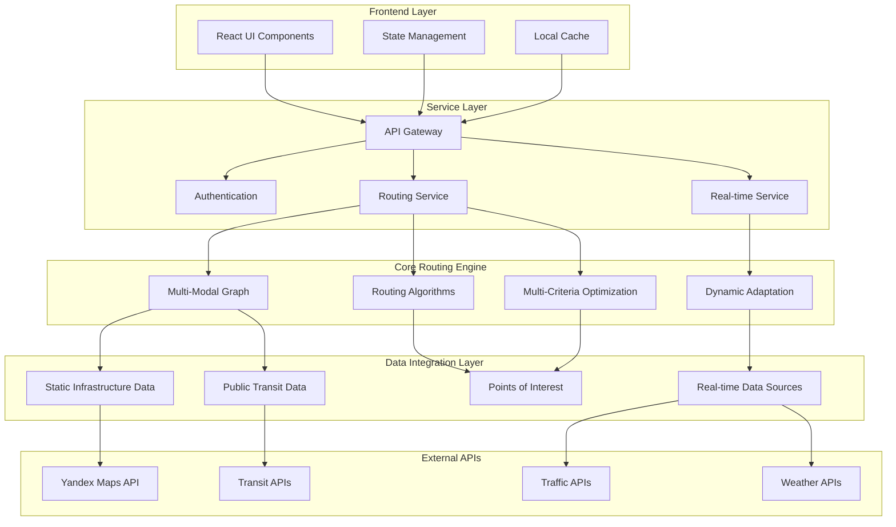

# Multi-Modal Routing System Architecture

## Executive Summary

This document outlines the comprehensive system architecture for extending the existing intelligent-trails project into a sophisticated multi-modal routing system. The architecture supports multiple transportation modes (car, public transport, bicycle, walking), real-time data integration, and dynamic route adaptation while building upon the existing React/TypeScript foundation with Yandex Maps integration.

## 1. High-Level System Architecture

### 1.1 System Overview



### 1.2 Core Components

#### Frontend Layer
- **React UI Components**: Extended from existing components to support multi-modal options
- **State Management**: Enhanced state management for complex routing scenarios
- **Local Cache**: Caching system for routes, places, and user preferences

#### Service Layer
- **API Gateway**: Unified interface for all routing operations
- **Authentication Service**: User management and preference storage
- **Routing Service**: Core routing logic and multi-modal integration
- **Real-time Service**: Live data updates and dynamic adaptations

#### Core Routing Engine
- **Multi-Modal Graph**: Unified graph representation of all transportation networks
- **Routing Algorithms**: Optimized algorithms for different transport modes
- **Multi-Criteria Optimization**: User preference-based route optimization
- **Dynamic Adaptation**: Real-time route adjustments based on conditions

#### Data Integration Layer
- **Static Infrastructure Data**: Road networks, transit routes, bike paths
- **Real-time Data Sources**: Traffic, transit delays, construction
- **Points of Interest**: Enhanced POI database with accessibility information
- **GTFS Integration**: Public transit schedule and route data

## 2. Detailed Component Architecture

### 2.1 Frontend Component Extensions

#### Enhanced RouteBuilder Component
```typescript
interface MultiModalRouteBuilder {
  transportModes: TransportMode[];
  preferences: UserPreferences;
  accessibility: AccessibilityOptions;
  waypoints: Waypoint[];
  constraints: RouteConstraints;
}

enum TransportMode {
  WALKING = 'walking',
  BICYCLE = 'bicycle',
  CAR = 'car',
  PUBLIC_TRANSPORT = 'public_transport',
  MIXED = 'mixed'
}

interface UserPreferences {
  speed: number; // 1-5 priority
  safety: number; // 1-5 priority
  accessibility: number; // 1-5 priority
  cost: number; // 1-5 priority
  comfort: number; // 1-5 priority
  environmental: number; // 1-5 priority
}
```

#### Enhanced Map Component
```typescript
interface MultiModalMap {
  routes: MultiModalRoute[];
  transportLayers: TransportLayer[];
  realTimeUpdates: RealTimeUpdate[];
  accessibilityLayer: AccessibilityLayer;
}

interface TransportLayer {
  mode: TransportMode;
  visible: boolean;
  data: LayerData;
  styling: LayerStyling;
}
```

### 2.2 Service Layer Architecture

#### Routing Service
```typescript
class MultiModalRoutingService {
  async calculateRoute(request: RouteRequest): Promise<RouteResponse>;
  async calculateRouteWithWaypoints(request: WaypointRouteRequest): Promise<RouteResponse>;
  async optimizeRoute(route: Route, preferences: UserPreferences): Promise<Route>;
  async getAlternativeRoutes(request: RouteRequest): Promise<RouteResponse[]>;
}

interface RouteRequest {
  origin: Coordinate;
  destination: Coordinate;
  transportModes: TransportMode[];
  preferences: UserPreferences;
  constraints: RouteConstraints;
  waypoints?: Coordinate[];
}
```

#### Real-time Service
```typescript
class RealTimeService {
  async subscribeToRouteUpdates(routeId: string): Promise<Observable<RouteUpdate>>;
  async getCurrentTrafficData(area: BoundingBox): Promise<TrafficData>;
  async getTransitUpdates(routeIds: string[]): Promise<TransitUpdate[]>;
  async detectRouteObstacles(route: Route): Promise<Obstacle[]>;
}
```

## 3. Data Models

### 3.1 Multi-Modal Graph Structure

```typescript
interface MultiModalGraph {
  nodes: GraphNode[];
  edges: GraphEdge[];
  transfers: TransferPoint[];
  constraints: GraphConstraints;
}

interface GraphNode {
  id: string;
  coordinate: Coordinate;
  modes: TransportMode[];
  accessibility: AccessibilityInfo;
  amenities: Amenity[];
  type: NodeType;
}

interface GraphEdge {
  id: string;
  from: string;
  to: string;
  distance: number;
  duration: number;
  mode: TransportMode;
  cost: number;
  accessibility: AccessibilityInfo;
  realTimeData?: RealTimeEdgeData;
}

interface TransferPoint {
  id: string;
  coordinate: Coordinate;
  fromMode: TransportMode;
  toMode: TransportMode;
  transferTime: number;
  accessibility: AccessibilityInfo;
  constraints: TransferConstraints;
}
```

### 3.2 Route Models

```typescript
interface MultiModalRoute {
  id: string;
  segments: RouteSegment[];
  totalDistance: number;
  totalDuration: number;
  totalCost: number;
  accessibilityScore: number;
  environmentalScore: number;
  safetyScore: number;
  waypoints: Waypoint[];
  alternatives: MultiModalRoute[];
}

interface RouteSegment {
  id: string;
  mode: TransportMode;
  from: Coordinate;
  to: Coordinate;
  distance: number;
  duration: number;
  cost: number;
  instructions: RouteInstruction[];
  realTimeData?: RealTimeSegmentData;
  geometry: LineString;
}

interface RouteInstruction {
  id: string;
  type: InstructionType;
  text: string;
  distance: number;
  duration: number;
  maneuver: Maneuver;
  landmarks: Landmark[];
  accessibilityInfo: AccessibilityInfo;
}
```

## 4. Integration with Existing Codebase

### 4.1 Extension Points

#### useYandexMaps Hook Enhancement
```typescript
// Existing hook will be extended with:
interface EnhancedYandexMaps {
  // Existing methods
  geocode: (address: string) => Promise<Coordinate | null>;
  calculateRoute: (from: Coordinate, to: Coordinate, mode: TransportMode) => Promise<Route | null>;
  searchOrganizations: (center: Coordinate, radius: number, types: string[]) => Promise<Place[]>;
  
  // New multi-modal methods
  calculateMultiModalRoute: (request: RouteRequest) => Promise<MultiModalRoute | null>;
  getPublicTransportData: (area: BoundingBox) => Promise<TransitData>;
  getBikePathData: (area: BoundingBox) => Promise<BikePathData>;
  getAccessibilityData: (area: BoundingBox) => Promise<AccessibilityData>;
  subscribeToRealTimeUpdates: (routeId: string) => Observable<RouteUpdate>;
}
```

#### useAdvancedRouting Hook Enhancement
```typescript
// Existing hook will be extended with:
interface EnhancedAdvancedRouting {
  // Existing methods
  calculateOptimalRoute: (from: Coordinate, to: Coordinate, places: Place[], preferences: RoutePreferences, mode: string) => AdvancedRoute;
  
  // New multi-modal methods
  calculateMultiModalRoute: (request: RouteRequest) => Promise<MultiModalRoute>;
  optimizeRouteWithPreferences: (route: MultiModalRoute, preferences: UserPreferences) => MultiModalRoute;
  calculateRouteWithWaypoints: (request: WaypointRouteRequest) => Promise<MultiModalRoute>;
  adaptRouteToRealTimeConditions: (route: MultiModalRoute, conditions: RealTimeConditions) => MultiModalRoute;
}
```

### 4.2 Component Migration Strategy

1. **Phase 1**: Extend existing components with multi-modal options
2. **Phase 2**: Implement new specialized components for complex scenarios
3. **Phase 3**: Migrate from mock data to real infrastructure data
4. **Phase 4**: Add real-time data integration and dynamic adaptation

## 5. Technology Stack Additions

### 5.1 New Dependencies
```json
{
  "dependencies": {
    // Existing dependencies...
    
    // Multi-modal routing
    "graphlib": "^2.1.8",
    "turf": "^3.0.14",
    "rxjs": "^7.8.1",
    
    // Real-time data
    "socket.io-client": "^4.7.2",
    "eventsource": "^2.0.2",
    
    // Public transport
    "gtfs-realtime-bindings": "^1.1.1",
    
    // Advanced routing
    "dijkstra": "^0.0.3",
    "a-star": "^0.2.0",
    
    // Data processing
    "lodash": "^4.17.21",
    "date-fns": "^2.30.0"
  }
}
```

### 5.2 API Integration
- **Yandex Maps API**: Enhanced with public transport and traffic layers
- **GTFS Feeds**: For public transport schedules and routes
- **Traffic APIs**: Real-time traffic conditions
- **Weather APIs**: For route optimization based on weather
- **Accessibility APIs**: For accessibility information

## 6. Performance Considerations

### 6.1 Caching Strategy
- **Route Caching**: Cache frequently calculated routes
- **Map Data Caching**: Cache map tiles and infrastructure data
- **Real-time Data Caching**: Short-term caching for real-time updates
- **User Preference Caching**: Cache user preferences for faster access

### 6.2 Optimization Techniques
- **Lazy Loading**: Load transport mode data on demand
- **Graph Pruning**: Remove irrelevant nodes based on user preferences
- **Incremental Updates**: Update only affected route segments
- **Background Processing**: Calculate alternative routes in background

## 7. Security Considerations

### 7.1 Data Privacy
- **Location Privacy**: Minimize location data collection
- **Preference Privacy**: Encrypt user preference data
- **Route Privacy**: Optional route anonymization
- **Data Retention**: Clear policies for data retention

### 7.2 API Security
- **Rate Limiting**: Implement API rate limiting
- **Authentication**: Secure API key management
- **Data Validation**: Validate all incoming data
- **CORS**: Proper CORS configuration for external APIs

## 8. Scalability Considerations

### 8.1 Horizontal Scaling
- **Service Decomposition**: Separate services for different transport modes
- **Database Sharding**: Distribute data across multiple databases
- **Load Balancing**: Distribute requests across multiple instances
- **Caching Layers**: Implement distributed caching

### 8.2 Performance Optimization
- **Graph Partitioning**: Divide large graphs into manageable partitions
- **Precomputation**: Precompute common routes and transfers
- **Database Optimization**: Optimize queries for spatial data
- **CDN Integration**: Use CDN for static assets and map tiles

## 9. Monitoring and Analytics

### 9.1 System Monitoring
- **Performance Metrics**: Track route calculation times
- **Error Tracking**: Monitor and log errors
- **Usage Analytics**: Track feature usage and patterns
- **Real-time Monitoring**: Monitor system health in real-time

### 9.2 User Analytics
- **Route Preferences**: Analyze user preference patterns
- **Transport Mode Usage**: Track popularity of different modes
- **Accessibility Features**: Monitor usage of accessibility features
- **User Feedback**: Collect and analyze user feedback

## 10. Future Enhancements

### 10.1 Advanced Features
- **Machine Learning**: Personalized route recommendations
- **Social Features**: Route sharing and community recommendations
- **AR Integration**: Augmented reality navigation
- **Voice Navigation**: Voice-guided multi-modal navigation

### 10.2 Expansion Opportunities
- **Multi-city Support**: Expand to multiple cities
- **International Support**: Support for international transit systems
- **IoT Integration**: Integration with smart city infrastructure
- **Mobility as a Service**: Integration with MaaS platforms