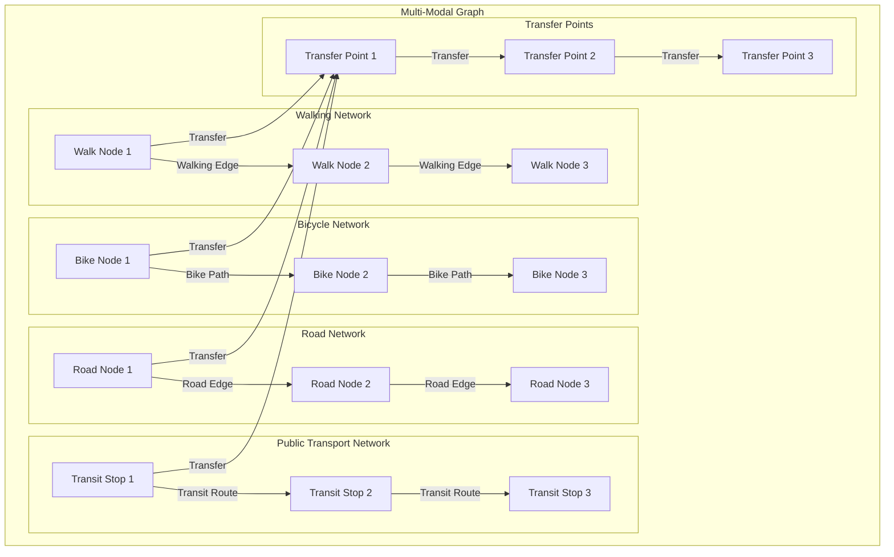

# Routing Engine Architecture for Multi-Modal Transport

## Executive Summary

This document details the architecture of the routing engine that powers the multi-modal routing system. The engine uses graph-based algorithms to calculate optimal routes across different transportation modes while considering user preferences, real-time conditions, and infrastructure constraints.

## 1. Graph-Based Routing Architecture

### 1.1 Multi-Modal Graph Structure



### 1.2 Graph Data Model

```typescript
interface MultiModalGraph {
  nodes: Map<string, GraphNode>;
  edges: Map<string, GraphEdge>;
  transfers: Map<string, TransferPoint>;
  spatialIndex: SpatialIndex;
  constraints: GraphConstraints;
  metadata: GraphMetadata;
}

interface GraphNode {
  id: string;
  coordinate: Coordinate;
  elevation?: number;
  modes: TransportMode[];
  accessibility: AccessibilityInfo;
  amenities: Amenity[];
  type: NodeType;
  properties: NodeProperties;
}

interface GraphEdge {
  id: string;
  from: string;
  to: string;
  distance: number;
  duration: number;
  mode: TransportMode;
  cost: number;
  accessibility: AccessibilityInfo;
  geometry: LineString;
  properties: EdgeProperties;
  realTimeData?: RealTimeEdgeData;
}

interface TransferPoint {
  id: string;
  coordinate: Coordinate;
  fromMode: TransportMode;
  toMode: TransportMode;
  transferTime: number;
  accessibility: AccessibilityInfo;
  constraints: TransferConstraints;
  facilities: TransferFacility[];
}

enum TransportMode {
  WALKING = 'walking',
  BICYCLE = 'bicycle',
  CAR = 'car',
  BUS = 'bus',
  METRO = 'metro',
  TRAM = 'tram',
  TRAIN = 'train',
  FERRY = 'ferry'
}

enum NodeType {
  INTERSECTION = 'intersection',
  TRANSIT_STOP = 'transit_stop',
  BIKE_STATION = 'bike_station',
  PARKING = 'parking',
  POI = 'poi',
  TRANSFER = 'transfer'
}
```

## 2. Routing Algorithms

### 2.1 Multi-Modal Dijkstra Algorithm

```typescript
class MultiModalDijkstra {
  private graph: MultiModalGraph;
  private preferences: UserPreferences;
  private constraints: RouteConstraints;
  
  constructor(graph: MultiModalGraph, preferences: UserPreferences, constraints: RouteConstraints) {
    this.graph = graph;
    this.preferences = preferences;
    this.constraints = constraints;
  }
  
  findShortestPath(start: string, end: string): MultiModalRoute {
    // Priority queue for nodes to visit
    const queue = new PriorityQueue<QueueItem>();
    const distances = new Map<string, number>();
    const previous = new Map<string, PathNode>();
    const visited = new Set<string>();
    
    // Initialize distances
    distances.set(start, 0);
    queue.enqueue({ node: start, distance: 0, modes: [], cost: 0 });
    
    while (!queue.isEmpty()) {
      const current = queue.dequeue();
      
      if (visited.has(current.node)) continue;
      visited.add(current.node);
      
      // Found destination
      if (current.node === end) {
        return this.reconstructPath(previous, start, end);
      }
      
      // Explore neighbors
      const neighbors = this.getNeighbors(current.node, current.modes);
      for (const neighbor of neighbors) {
        if (visited.has(neighbor.node)) continue;
        
        // Calculate weighted distance based on preferences
        const weightedDistance = this.calculateWeightedDistance(
          current.distance,
          neighbor.distance,
          neighbor.mode,
          neighbor.cost
        );
        
        // Check if this path is better
        if (!distances.has(neighbor.node) || weightedDistance < distances.get(neighbor.node)!) {
          distances.set(neighbor.node, weightedDistance);
          previous.set(neighbor.node, {
            node: current.node,
            mode: neighbor.mode,
            edge: neighbor.edge,
            transfer: neighbor.transfer
          });
          
          queue.enqueue({
            node: neighbor.node,
            distance: weightedDistance,
            modes: [...current.modes, neighbor.mode],
            cost: current.cost + neighbor.cost
          });
        }
      }
    }
    
    throw new Error('No path found');
  }
  
  private getNeighbors(nodeId: string, currentModes: TransportMode[]): Neighbor[] {
    const node = this.graph.nodes.get(nodeId);
    if (!node) return [];
    
    const neighbors: Neighbor[] = [];
    
    // Get direct edges for each available mode
    for (const mode of node.modes) {
      const edges = this.getEdgesForMode(nodeId, mode);
      for (const edge of edges) {
        neighbors.push({
          node: edge.to,
          distance: edge.duration,
          mode: mode,
          cost: edge.cost,
          edge: edge,
          transfer: null
        });
      }
    }
    
    // Get transfer points
    const transfers = this.getTransfersForNode(nodeId);
    for (const transfer of transfers) {
      // Check if transfer is allowed based on constraints
      if (this.isTransferAllowed(currentModes, transfer)) {
        neighbors.push({
          node: transfer.id,
          distance: transfer.transferTime,
          mode: transfer.toMode,
          cost: this.calculateTransferCost(transfer),
          edge: null,
          transfer: transfer
        });
      }
    }
    
    return neighbors;
  }
  
  private calculateWeightedDistance(
    currentDistance: number,
    edgeDistance: number,
    mode: TransportMode,
    cost: number
  ): number {
    // Base distance
    let weightedDistance = currentDistance + edgeDistance;
    
    // Apply preference weights
    const speedWeight = this.preferences.speed / 5;
    const costWeight = this.preferences.cost / 5;
    const safetyWeight = this.preferences.safety / 5;
    const environmentalWeight = this.preferences.environmental / 5;
    
    // Mode-specific adjustments
    switch (mode) {
      case TransportMode.WALKING:
        weightedDistance *= (2 - speedWeight); // Slower but more environmentally friendly
        weightedDistance *= (1 + environmentalWeight * 0.5);
        break;
      case TransportMode.BICYCLE:
        weightedDistance *= (1.5 - speedWeight * 0.5);
        weightedDistance *= (1 + environmentalWeight * 0.7);
        break;
      case TransportMode.CAR:
        weightedDistance *= (1 + speedWeight * 0.5);
        weightedDistance *= (1 + costWeight * cost / 10);
        weightedDistance *= (1 - environmentalWeight * 0.5);
        break;
      case TransportMode.METRO:
        weightedDistance *= (1.2 - speedWeight * 0.3);
        weightedDistance *= (1 + safetyWeight * 0.3);
        break;
      default:
        weightedDistance *= (1.5 - speedWeight * 0.3);
    }
    
    return weightedDistance;
  }
}
```

### 2.2 A* Algorithm for Multi-Modal Routing

```typescript
class MultiModalAStar {
  private graph: MultiModalGraph;
  private preferences: UserPreferences;
  private heuristic: HeuristicFunction;
  
  constructor(graph: MultiModalGraph, preferences: UserPreferences) {
    this.graph = graph;
    this.preferences = preferences;
    this.heuristic = this.createHeuristic();
  }
  
  findShortestPath(start: string, end: string): MultiModalRoute {
    const openSet = new PriorityQueue<QueueItem>();
    const closedSet = new Set<string>();
    const gScore = new Map<string, number>();
    const fScore = new Map<string, number>();
    const previous = new Map<string, PathNode>();
    
    // Initialize scores
    gScore.set(start, 0);
    fScore.set(start, this.heuristic(start, end));
    openSet.enqueue({ node: start, distance: 0, modes: [], cost: 0 });
    
    while (!openSet.isEmpty()) {
      const current = openSet.dequeue();
      
      if (current.node === end) {
        return this.reconstructPath(previous, start, end);
      }
      
      closedSet.add(current.node);
      
      const neighbors = this.getNeighbors(current.node, current.modes);
      for (const neighbor of neighbors) {
        if (closedSet.has(neighbor.node)) continue;
        
        const tentativeGScore = gScore.get(current.node)! + 
          this.calculateWeightedDistance(neighbor.distance, neighbor.mode, neighbor.cost);
        
        if (!gScore.has(neighbor.node) || tentativeGScore < gScore.get(neighbor.node)!) {
          previous.set(neighbor.node, {
            node: current.node,
            mode: neighbor.mode,
            edge: neighbor.edge,
            transfer: neighbor.transfer
          });
          
          gScore.set(neighbor.node, tentativeGScore);
          const fScoreValue = tentativeGScore + this.heuristic(neighbor.node, end);
          fScore.set(neighbor.node, fScoreValue);
          
          if (!openSet.contains(neighbor.node)) {
            openSet.enqueue({
              node: neighbor.node,
              distance: tentativeGScore,
              modes: [...current.modes, neighbor.mode],
              cost: current.cost + neighbor.cost
            });
          }
        }
      }
    }
    
    throw new Error('No path found');
  }
  
  private createHeuristic(): HeuristicFunction {
    return (nodeId: string, targetId: string): number => {
      const node = this.graph.nodes.get(nodeId);
      const target = this.graph.nodes.get(targetId);
      
      if (!node || !target) return Infinity;
      
      // Use Euclidean distance as base heuristic
      const distance = this.calculateEuclideanDistance(node.coordinate, target.coordinate);
      
      // Adjust based on available transport modes
      const avgSpeed = this.getAverageSpeed(node.modes);
      return distance / avgSpeed;
    };
  }
  
  private getAverageSpeed(modes: TransportMode[]): number {
    const speeds: Record<TransportMode, number> = {
      [TransportMode.WALKING]: 5,
      [TransportMode.BICYCLE]: 15,
      [TransportMode.CAR]: 40,
      [TransportMode.BUS]: 20,
      [TransportMode.METRO]: 30,
      [TransportMode.TRAM]: 25,
      [TransportMode.TRAIN]: 60,
      [TransportMode.FERRY]: 15
    };
    
    const totalSpeed = modes.reduce((sum, mode) => sum + speeds[mode], 0);
    return totalSpeed / modes.length;
  }
}
```

### 2.3 Contraction Hierarchies for Performance

```typescript
class ContractionHierarchies {
  private graph: MultiModalGraph;
  private hierarchy: ContractionHierarchy;
  private shortcuts: Map<string, GraphEdge>;
  
  constructor(graph: MultiModalGraph) {
    this.graph = graph;
    this.shortcuts = new Map();
    this.hierarchy = this.buildHierarchy();
  }
  
  private buildHierarchy(): ContractionHierarchy {
    const hierarchy: ContractionHierarchy = {
      levels: new Map(),
      order: []
    };
    
    // Calculate node importance
    const nodeImportance = new Map<string, number>();
    for (const [nodeId, node] of this.graph.nodes) {
      nodeImportance.set(nodeId, this.calculateNodeImportance(node));
    }
    
    // Sort nodes by importance (ascending)
    const sortedNodes = Array.from(nodeImportance.entries())
      .sort((a, b) => a[1] - b[1]);
    
    // Assign levels
    for (let i = 0; i < sortedNodes.length; i++) {
      const [nodeId] = sortedNodes[i];
      hierarchy.levels.set(nodeId, i);
      hierarchy.order.push(nodeId);
    }
    
    // Create shortcuts
    this.createShortcuts(hierarchy);
    
    return hierarchy;
  }
  
  private calculateNodeImportance(node: GraphNode): number {
    // Edge difference
    const edgeDifference = this.calculateEdgeDifference(node.id);
    
    // Number of contracted neighbors
    const contractedNeighbors = this.countContractedNeighbors(node.id);
    
    // Shortcut cover
    const shortcutCover = this.calculateShortcutCover(node.id);
    
    // Node importance is a combination of these factors
    return edgeDifference + contractedNeighbors + shortcutCover;
  }
  
  private createShortcuts(hierarchy: ContractionHierarchy): void {
    for (const nodeId of hierarchy.order) {
      const neighbors = this.getIncomingNeighbors(nodeId);
      const outgoingNeighbors = this.getOutgoingNeighbors(nodeId);
      
      // For each pair of incoming and outgoing neighbors
      for (const incoming of neighbors) {
        for (const outgoing of outgoingNeighbors) {
          // Check if we need a shortcut
          if (this.needsShortcut(incoming, nodeId, outgoing, hierarchy)) {
            this.createShortcut(incoming, outgoing);
          }
        }
      }
    }
  }
  
  query(start: string, end: string): MultiModalRoute {
    // Bidirectional search using the hierarchy
    const forwardSearch = this.forwardSearch(start, end);
    const backwardSearch = this.backwardSearch(start, end);
    
    // Find the meeting point
    const meetingPoint = this.findMeetingPoint(forwardSearch, backwardSearch);
    
    // Reconstruct the path
    return this.reconstructPath(forwardSearch, backwardSearch, meetingPoint);
  }
}
```

## 3. Public Transport Routing

### 3.1 Time-Dependent Routing

```typescript
class TimeDependentRouting {
  private graph: MultiModalGraph;
  private schedule: TransitSchedule;
  
  constructor(graph: MultiModalGraph, schedule: TransitSchedule) {
    this.graph = graph;
    this.schedule = schedule;
  }
  
  findEarliestArrival(start: string, end: string, departureTime: Date): MultiModalRoute {
    const labels = new Map<string, TimeLabel>();
    const queue = new PriorityQueue<TimeLabel>();
    
    // Initialize start label
    labels.set(start, {
      node: start,
      arrivalTime: departureTime,
      departureTime: departureTime,
      modes: [],
      transfers: 0
    });
    
    queue.enqueue(labels.get(start)!);
    
    while (!queue.isEmpty()) {
      const current = queue.dequeue();
      
      if (current.node === end) {
        return this.reconstructPath(labels, start, end);
      }
      
      // Explore walking edges
      const walkingEdges = this.getWalkingEdges(current.node);
      for (const edge of walkingEdges) {
        const walkingTime = edge.duration;
        const arrivalTime = new Date(current.arrivalTime.getTime() + walkingTime * 60000);
        
        this.updateLabel(edge.to, {
          node: edge.to,
          arrivalTime: arrivalTime,
          departureTime: current.arrivalTime,
          modes: [...current.modes, TransportMode.WALKING],
          transfers: current.transfers
        }, labels, queue);
      }
      
      // Explore transit edges
      const transitEdges = this.getTransitEdges(current.node);
      for (const edge of transitEdges) {
        const nextDeparture = this.schedule.getNextDeparture(
          edge.routeId,
          current.node,
          current.arrivalTime
        );
        
        if (nextDeparture) {
          const arrivalTime = this.schedule.getArrivalTime(
            edge.routeId,
            edge.to,
            nextDeparture
          );
          
          this.updateLabel(edge.to, {
            node: edge.to,
            arrivalTime: arrivalTime,
            departureTime: nextDeparture,
            modes: [...current.modes, edge.mode],
            transfers: current.transfers + 1
          }, labels, queue);
        }
      }
    }
    
    throw new Error('No path found');
  }
  
  private updateLabel(
    nodeId: string,
    newLabel: TimeLabel,
    labels: Map<string, TimeLabel>,
    queue: PriorityQueue<TimeLabel>
  ): void {
    const existingLabel = labels.get(nodeId);
    
    if (!existingLabel || newLabel.arrivalTime < existingLabel.arrivalTime) {
      labels.set(nodeId, newLabel);
      queue.enqueue(newLabel);
    }
  }
}
```

### 3.2 RAPTOR Algorithm for Public Transport

```typescript
class RAPTOR {
  private graph: MultiModalGraph;
  private schedule: TransitSchedule;
  private stops: Map<string, TransitStop>;
  private routes: Map<string, TransitRoute>;
  
  constructor(graph: MultiModalGraph, schedule: TransitSchedule) {
    this.graph = graph;
    this.schedule = schedule;
    this.stops = this.initializeStops();
    this.routes = this.initializeRoutes();
  }
  
  query(start: string, end: string, departureTime: Date): MultiModalRoute {
    const rounds: Round[] = [];
    const markedStops = new Set<string>();
    
    // Initialize first round
    const initialRound: Round = new Map();
    initialRound.set(start, {
      arrivalTime: departureTime,
      fromStop: null,
      fromRoute: null,
      transfers: 0
    });
    rounds.push(initialRound);
    markedStops.add(start);
    
    // Main loop
    let k = 0;
    while (true) {
      const currentRound = rounds[k];
      const nextRound: Round = new Map();
      
      // Copy previous best arrivals
      for (const [stopId, label] of currentRound) {
        nextRound.set(stopId, { ...label });
      }
      
      // Process each route
      for (const route of this.routes.values()) {
        this.processRoute(route, currentRound, nextRound, markedStops);
      }
      
      // Add walking connections
      this.addWalkingConnections(nextRound, markedStops);
      
      // Check if we've reached the destination
      if (nextRound.has(end)) {
        return this.reconstructPath(rounds, start, end);
      }
      
      // Check if we've made progress
      if (markedStops.size === 0) {
        break;
      }
      
      rounds.push(nextRound);
      k++;
      
      // Limit number of transfers
      if (k > 5) break;
    }
    
    throw new Error('No path found');
  }
  
  private processRoute(
    route: TransitRoute,
    currentRound: Round,
    nextRound: Round,
    markedStops: Set<string>
  ): void {
    const stops = route.stops;
    let earliestBoardingTime: Date | null = null;
    let boardingStop: string | null = null;
    
    // Iterate through stops in route order
    for (let i = 0; i < stops.length; i++) {
      const stopId = stops[i];
      
      // Check if this stop is marked
      if (markedStops.has(stopId)) {
        const currentLabel = currentRound.get(stopId);
        if (currentLabel) {
          earliestBoardingTime = currentLabel.arrivalTime;
          boardingStop = stopId;
        }
      }
      
      // If we can board at this stop
      if (earliestBoardingTime && boardingStop) {
        const departureTime = this.schedule.getNextDeparture(
          route.id,
          boardingStop,
          earliestBoardingTime
        );
        
        if (departureTime) {
          // Find all stops we can reach from this boarding
          for (let j = i + 1; j < stops.length; j++) {
            const arrivalStop = stops[j];
            const arrivalTime = this.schedule.getArrivalTime(
              route.id,
              arrivalStop,
              departureTime
            );
            
            // Update label if this is better
            const existingLabel = nextRound.get(arrivalStop);
            if (!existingLabel || arrivalTime < existingLabel.arrivalTime) {
              nextRound.set(arrivalStop, {
                arrivalTime: arrivalTime,
                fromStop: boardingStop,
                fromRoute: route.id,
                transfers: currentRound.get(boardingStop)!.transfers
              });
              markedStops.add(arrivalStop);
            }
          }
        }
      }
    }
  }
}
```

## 4. Multi-Criteria Optimization

### 4.1 Pareto-Optimal Routes

```typescript
class MultiCriteriaOptimizer {
  private graph: MultiModalGraph;
  private preferences: UserPreferences;
  private criteria: OptimizationCriteria[];
  
  constructor(graph: MultiModalGraph, preferences: UserPreferences) {
    this.graph = graph;
    this.preferences = preferences;
    this.criteria = this.initializeCriteria();
  }
  
  findParetoOptimalRoutes(start: string, end: string): MultiModalRoute[] {
    const routes: MultiModalRoute[] = [];
    const paretoFront: MultiModalRoute[] = [];
    
    // Generate candidate routes using different algorithms
    routes.push(...this.generateCandidateRoutes(start, end));
    
    // Filter Pareto-optimal routes
    for (const route of routes) {
      let isDominated = false;
      
      for (const other of routes) {
        if (route !== other && this.dominates(other, route)) {
          isDominated = true;
          break;
        }
      }
      
      if (!isDominated) {
        paretoFront.push(route);
      }
    }
    
    // Sort by overall score
    return paretoFront.sort((a, b) => this.calculateOverallScore(b) - this.calculateOverallScore(a));
  }
  
  private dominates(routeA: MultiModalRoute, routeB: MultiModalRoute): boolean {
    const scoreA = this.evaluateRoute(routeA);
    const scoreB = this.evaluateRoute(routeB);
    
    let atLeastOneBetter = false;
    
    for (const criterion of this.criteria) {
      if (scoreA[criterion.name] < scoreB[criterion.name]) {
        return false; // A is not better in all criteria
      }
      if (scoreA[criterion.name] > scoreB[criterion.name]) {
        atLeastOneBetter = true;
      }
    }
    
    return atLeastOneBetter;
  }
  
  private evaluateRoute(route: MultiModalRoute): RouteScore {
    return {
      time: route.totalDuration,
      cost: route.totalCost,
      distance: route.totalDistance,
      safety: route.safetyScore,
      accessibility: route.accessibilityScore,
      environmental: route.environmentalScore,
      transfers: route.segments.filter(s => s.type === 'transfer').length
    };
  }
  
  private calculateOverallScore(route: MultiModalRoute): number {
    const score = this.evaluateRoute(route);
    
    // Normalize scores
    const normalized = this.normalizeScores(score);
    
    // Apply preference weights
    let overallScore = 0;
    overallScore += normalized.time * (this.preferences.speed / 5);
    overallScore += normalized.cost * (this.preferences.cost / 5);
    overallScore += normalized.safety * (this.preferences.safety / 5);
    overallScore += normalized.accessibility * (this.preferences.accessibility / 5);
    overallScore += normalized.environmental * (this.preferences.environmental / 5);
    overallScore += normalized.transfers * 0.2; // Penalty for transfers
    
    return overallScore;
  }
}
```

## 5. Dynamic Adaptation System

### 5.1 Real-Time Route Monitoring

```typescript
class RouteMonitor {
  private routes: Map<string, MonitoredRoute>;
  private eventSource: EventSource;
  private updateInterval: number;
  
  constructor() {
    this.routes = new Map();
    this.updateInterval = 30000; // 30 seconds
    this.initializeEventSource();
  }
  
  monitorRoute(route: MultiModalRoute): string {
    const routeId = this.generateRouteId();
    const monitoredRoute: MonitoredRoute = {
      id: routeId,
      route: route,
      status: RouteStatus.ACTIVE,
      lastUpdate: new Date(),
      alerts: [],
      deviations: []
    };
    
    this.routes.set(routeId, monitoredRoute);
    this.startMonitoring(routeId);
    
    return routeId;
  }
  
  private startMonitoring(routeId: string): void {
    const monitoredRoute = this.routes.get(routeId);
    if (!monitoredRoute) return;
    
    // Set up periodic checks
    const interval = setInterval(async () => {
      try {
        const updates = await this.checkRouteConditions(monitoredRoute.route);
        this.processUpdates(routeId, updates);
      } catch (error) {
        console.error('Error monitoring route:', error);
      }
    }, this.updateInterval);
    
    monitoredRoute.intervalId = interval;
  }
  
  private async checkRouteConditions(route: MultiModalRoute): Promise<RouteUpdate[]> {
    const updates: RouteUpdate[] = [];
    
    // Check traffic conditions
    const trafficUpdates = await this.checkTrafficConditions(route);
    updates.push(...trafficUpdates);
    
    // Check public transport delays
    const transitUpdates = await this.checkTransitDelays(route);
    updates.push(...transitUpdates);
    
    // Check weather conditions
    const weatherUpdates = await this.checkWeatherConditions(route);
    updates.push(...weatherUpdates);
    
    // Check construction or obstacles
    const obstacleUpdates = await this.checkObstacles(route);
    updates.push(...obstacleUpdates);
    
    return updates;
  }
  
  private processUpdates(routeId: string, updates: RouteUpdate[]): void {
    const monitoredRoute = this.routes.get(routeId);
    if (!monitoredRoute) return;
    
    for (const update of updates) {
      switch (update.type) {
        case UpdateType.TRAFFIC:
          this.handleTrafficUpdate(monitoredRoute, update);
          break;
        case UpdateType.TRANSIT_DELAY:
          this.handleTransitUpdate(monitoredRoute, update);
          break;
        case UpdateType.WEATHER:
          this.handleWeatherUpdate(monitoredRoute, update);
          break;
        case UpdateType.OBSTACLE:
          this.handleObstacleUpdate(monitoredRoute, update);
          break;
      }
    }
    
    monitoredRoute.lastUpdate = new Date();
    
    // Check if route needs adaptation
    if (this.needsAdaptation(monitoredRoute)) {
      this.triggerAdaptation(routeId);
    }
  }
}
```

### 5.2 Dynamic Route Adaptation

```typescript
class RouteAdapter {
  private graph: MultiModalGraph;
  private monitor: RouteMonitor;
  private optimizer: MultiCriteriaOptimizer;
  
  constructor(graph: MultiModalGraph) {
    this.graph = graph;
    this.monitor = new RouteMonitor();
    this.optimizer = new MultiCriteriaOptimizer(graph, this.getDefaultPreferences());
  }
  
  async adaptRoute(routeId: string): Promise<AdaptedRoute> {
    const monitoredRoute = this.monitor.getRoute(routeId);
    if (!monitoredRoute) {
      throw new Error('Route not found');
    }
    
    const originalRoute = monitoredRoute.route;
    const currentPosition = this.getCurrentPosition(routeId);
    
    // Find alternative routes from current position
    const alternatives = await this.findAlternativeRoutes(
      currentPosition,
      originalRoute.segments[originalRoute.segments.length - 1].to,
      originalRoute
    );
    
    // Select best alternative based on current conditions
    const bestAlternative = this.selectBestAlternative(alternatives, monitoredRoute.alerts);
    
    // Create adapted route
    const adaptedRoute: AdaptedRoute = {
      originalRoute: originalRoute,
      adaptedRoute: bestAlternative,
      adaptationReason: this.getAdaptationReason(monitoredRoute.alerts),
      adaptationTime: new Date(),
      confidence: this.calculateAdaptationConfidence(bestAlternative, monitoredRoute.alerts)
    };
    
    return adaptedRoute;
  }
  
  private async findAlternativeRoutes(
    from: string,
    to: string,
    originalRoute: MultiModalRoute
  ): Promise<MultiModalRoute[]> {
    const alternatives: MultiModalRoute[] = [];
    
    // Get current constraints and preferences
    const constraints = this.getCurrentConstraints(originalRoute);
    const preferences = this.getCurrentPreferences(originalRoute);
    
    // Find routes avoiding problematic segments
    const avoidSegments = this.getProblematicSegments(originalRoute);
    
    // Use different algorithms to find alternatives
    const dijkstra = new MultiModalDijkstra(this.graph, preferences, constraints);
    const aStar = new MultiModalAStar(this.graph, preferences);
    
    try {
      const dijkstraRoute = dijkstra.findShortestPath(from, to);
      alternatives.push(dijkstraRoute);
    } catch (error) {
      console.error('Dijkstra failed:', error);
    }
    
    try {
      const aStarRoute = aStar.findShortestPath(from, to);
      alternatives.push(aStarRoute);
    } catch (error) {
      console.error('A* failed:', error);
    }
    
    // Find Pareto-optimal routes
    const paretoRoutes = this.optimizer.findParetoOptimalRoutes(from, to);
    alternatives.push(...paretoRoutes);
    
    // Filter and rank alternatives
    return this.filterAndRankAlternatives(alternatives, originalRoute, avoidSegments);
  }
  
  private selectBestAlternative(
    alternatives: MultiModalRoute[],
    alerts: RouteAlert[]
  ): MultiModalRoute {
    // Score each alternative based on current conditions
    const scoredAlternatives = alternatives.map(route => ({
      route,
      score: this.calculateAlternativeScore(route, alerts)
    }));
    
    // Sort by score
    scoredAlternatives.sort((a, b) => b.score - a.score);
    
    return scoredAlternatives[0].route;
  }
  
  private calculateAlternativeScore(route: MultiModalRoute, alerts: RouteAlert[]): number {
    let score = 0;
    
    // Base score from route evaluation
    score += this.optimizer.calculateOverallScore(route);
    
    // Penalty for route segments affected by alerts
    for (const alert of alerts) {
      const affectedSegments = this.getAffectedSegments(route, alert);
      score -= affectedSegments.length * 10;
    }
    
    // Bonus for using alternative transport modes if there are delays
    const transitDelays = alerts.filter(a => a.type === UpdateType.TRANSIT_DELAY);
    if (transitDelays.length > 0) {
      const nonTransitModes = route.segments
        .filter(s => s.mode !== TransportMode.BUS && s.mode !== TransportMode.METRO)
        .length;
      score += nonTransitModes * 5;
    }
    
    return score;
  }
}
```

## 6. Performance Optimization

### 6.1 Caching Strategy

```typescript
class RoutingCache {
  private cache: Map<string, CachedRoute>;
  private ttl: number;
  private maxSize: number;
  
  constructor(ttl: number = 300000, maxSize: number = 1000) {
    this.cache = new Map();
    this.ttl = ttl; // 5 minutes default
    this.maxSize = maxSize;
  }
  
  get(request: RouteRequest): MultiModalRoute | null {
    const key = this.generateKey(request);
    const cached = this.cache.get(key);
    
    if (!cached) return null;
    
    // Check if cache entry is expired
    if (Date.now() - cached.timestamp > this.ttl) {
      this.cache.delete(key);
      return null;
    }
    
    return cached.route;
  }
  
  set(request: RouteRequest, route: MultiModalRoute): void {
    const key = this.generateKey(request);
    
    // Check if cache is full
    if (this.cache.size >= this.maxSize) {
      this.evictLeastRecentlyUsed();
    }
    
    this.cache.set(key, {
      route,
      timestamp: Date.now(),
      accessCount: 0
    });
  }
  
  private generateKey(request: RouteRequest): string {
    // Create a unique key based on request parameters
    const keyData = {
      origin: request.origin,
      destination: request.destination,
      modes: request.transportModes.sort(),
      preferences: request.preferences,
      constraints: request.constraints,
      waypoints: request.waypoints || []
    };
    
    return JSON.stringify(keyData);
  }
  
  private evictLeastRecentlyUsed(): void {
    // Find the least recently used entry
    let lruKey: string | null = null;
    let lruAccessCount = Infinity;
    
    for (const [key, cached] of this.cache) {
      if (cached.accessCount < lruAccessCount) {
        lruKey = key;
        lruAccessCount = cached.accessCount;
      }
    }
    
    if (lruKey) {
      this.cache.delete(lruKey);
    }
  }
}
```

### 6.2 Parallel Processing

```typescript
class ParallelRouter {
  private graph: MultiModalGraph;
  private workerPool: Worker[];
  
  constructor(graph: MultiModalGraph, poolSize: number = 4) {
    this.graph = graph;
    this.workerPool = this.initializeWorkerPool(poolSize);
  }
  
  async findRoutes(request: RouteRequest): Promise<MultiModalRoute[]> {
    const promises: Promise<MultiModalRoute>[] = [];
    
    // Distribute different algorithms to workers
    promises.push(this.runInWorker(this.workerPool[0], 'dijkstra', request));
    promises.push(this.runInWorker(this.workerPool[1], 'astar', request));
    promises.push(this.runInWorker(this.workerPool[2], 'pareto', request));
    
    // Wait for all algorithms to complete
    const results = await Promise.allSettled(promises);
    
    // Collect successful results
    const routes: MultiModalRoute[] = [];
    for (const result of results) {
      if (result.status === 'fulfilled') {
        routes.push(result.value);
      }
    }
    
    return routes;
  }
  
  private async runInWorker(
    worker: Worker,
    algorithm: string,
    request: RouteRequest
  ): Promise<MultiModalRoute> {
    return new Promise((resolve, reject) => {
      const message = {
        type: 'compute',
        algorithm,
        request,
        graph: this.serializeGraph()
      };
      
      worker.onmessage = (event) => {
        if (event.data.type === 'result') {
          resolve(event.data.route);
        } else if (event.data.type === 'error') {
          reject(event.data.error);
        }
      };
      
      worker.postMessage(message);
    });
  }
}
```

## 7. Integration with Existing Codebase

### 7.1 Enhanced useAdvancedRouting Hook

```typescript
// Enhanced version of the existing useAdvancedRouting hook
const useEnhancedAdvancedRouting = () => {
  const [isCalculating, setIsCalculating] = useState(false);
  const [graph, setGraph] = useState<MultiModalGraph | null>(null);
  const [cache] = useState(() => new RoutingCache());
  
  // Initialize graph on mount
  useEffect(() => {
    const initializeGraph = async () => {
      const graphData = await fetchMultiModalGraph();
      setGraph(graphData);
    };
    
    initializeGraph();
  }, []);
  
  const calculateMultiModalRoute = async (
    request: RouteRequest
  ): Promise<MultiModalRoute> => {
    if (!graph) {
      throw new Error('Graph not initialized');
    }
    
    setIsCalculating(true);
    
    try {
      // Check cache first
      const cachedRoute = cache.get(request);
      if (cachedRoute) {
        return cachedRoute;
      }
      
      // Calculate route using appropriate algorithm
      const router = new MultiModalRouter(graph);
      const route = await router.calculateRoute(request);
      
      // Cache the result
      cache.set(request, route);
      
      return route;
    } finally {
      setIsCalculating(false);
    }
  };
  
  const calculateRouteWithWaypoints = async (
    request: WaypointRouteRequest
  ): Promise<MultiModalRoute> => {
    if (!graph) {
      throw new Error('Graph not initialized');
    }
    
    setIsCalculating(true);
    
    try {
      const router = new MultiModalRouter(graph);
      return await router.calculateRouteWithWaypoints(request);
    } finally {
      setIsCalculating(false);
    }
  };
  
  const adaptRouteToConditions = async (
    route: MultiModalRoute,
    conditions: RealTimeConditions
  ): Promise<MultiModalRoute> => {
    if (!graph) {
      throw new Error('Graph not initialized');
    }
    
    const adapter = new RouteAdapter(graph);
    const adapted = await adapter.adaptRoute(route.id);
    return adapted.adaptedRoute;
  };
  
  return {
    isCalculating,
    calculateMultiModalRoute,
    calculateRouteWithWaypoints,
    adaptRouteToConditions
  };
};
```

### 7.2 Enhanced useYandexMaps Hook

```typescript
// Enhanced version of the existing useYandexMaps hook
const useEnhancedYandexMaps = (apiKey: string) => {
  const { ymaps, loading, error, geocode, calculateRoute, searchOrganizations } = useYandexMaps(apiKey);
  const [multiModalGraph, setMultiModalGraph] = useState<MultiModalGraph | null>(null);
  
  // Initialize multi-modal graph
  useEffect(() => {
    if (ymaps) {
      const initializeGraph = async () => {
        const graph = await buildMultiModalGraph(ymaps);
        setMultiModalGraph(graph);
      };
      
      initializeGraph();
    }
  }, [ymaps]);
  
  const calculateMultiModalRoute = async (
    request: RouteRequest
  ): Promise<MultiModalRoute | null> => {
    if (!ymaps || !multiModalGraph) return null;
    
    const router = new MultiModalRouter(multiModalGraph);
    return await router.calculateRoute(request);
  };
  
  const getPublicTransportData = async (
    area: BoundingBox
  ): Promise<TransitData> => {
    if (!ymaps) return { routes: [], stops: [] };
    
    // Use Yandex Maps API to get public transport data
    const response = await ymaps.route(area, {
      routingMode: 'masstransit'
    });
    
    return transformYandexTransitData(response);
  };
  
  const getBikePathData = async (
    area: BoundingBox
  ): Promise<BikePathData> => {
    if (!ymaps) return { paths: [], stations: [] };
    
    // Use Yandex Maps API to get bike path data
    const response = await ymaps.route(area, {
      routingMode: 'bicycle'
    });
    
    return transformYandexBikeData(response);
  };
  
  const getAccessibilityData = async (
    area: BoundingBox
  ): Promise<AccessibilityData> => {
    if (!ymaps) return { features: [] };
    
    // Use Yandex Maps API to get accessibility data
    const response = await ymaps.search(area, {
      kind: 'accessibility'
    });
    
    return transformYandexAccessibilityData(response);
  };
  
  return {
    ymaps,
    loading,
    error,
    geocode,
    calculateRoute,
    searchOrganizations,
    multiModalGraph,
    calculateMultiModalRoute,
    getPublicTransportData,
    getBikePathData,
    getAccessibilityData
  };
};
```

## 8. Testing Strategy

### 8.1 Unit Testing

```typescript
// Example unit tests for routing algorithms
describe('MultiModalDijkstra', () => {
  let graph: MultiModalGraph;
  let dijkstra: MultiModalDijkstra;
  let preferences: UserPreferences;
  let constraints: RouteConstraints;
  
  beforeEach(() => {
    graph = createTestGraph();
    preferences = createTestPreferences();
    constraints = createTestConstraints();
    dijkstra = new MultiModalDijkstra(graph, preferences, constraints);
  });
  
  test('should find shortest path between two nodes', () => {
    const start = 'node1';
    const end = 'node5';
    
    const route = dijkstra.findShortestPath(start, end);
    
    expect(route).toBeDefined();
    expect(route.segments.length).toBeGreaterThan(0);
    expect(route.segments[0].from).toBe(start);
    expect(route.segments[route.segments.length - 1].to).toBe(end);
  });
  
  test('should handle multi-modal transfers', () => {
    const start = 'walk1';
    const end = 'metro3';
    
    const route = dijkstra.findShortestPath(start, end);
    
    expect(route).toBeDefined();
    
    // Should have at least one transfer
    const transfers = route.segments.filter(s => s.type === 'transfer');
    expect(transfers.length).toBeGreaterThan(0);
  });
  
  test('should respect user preferences', () => {
    // Test with high safety preference
    preferences.safety = 5;
    const safeRoute = dijkstra.findShortestPath('node1', 'node5');
    
    // Test with high speed preference
    preferences.safety = 1;
    preferences.speed = 5;
    const fastRoute = dijkstra.findShortestPath('node1', 'node5');
    
    // Safe route should have higher safety score
    expect(safeRoute.safetyScore).toBeGreaterThanOrEqual(fastRoute.safetyScore);
  });
});
```

### 8.2 Integration Testing

```typescript
// Example integration tests for the complete routing system
describe('MultiModalRoutingSystem', () => {
  let system: MultiModalRoutingSystem;
  let mockYandexMaps: any;
  
  beforeEach(async () => {
    mockYandexMaps = createMockYandexMaps();
    system = new MultiModalRoutingSystem(mockYandexMaps);
    await system.initialize();
  });
  
  test('should calculate multi-modal route with real data', async () => {
    const request: RouteRequest = {
      origin: [55.7558, 37.6173], // Moscow
      destination: [55.7541, 37.6201], // Nearby location
      transportModes: [TransportMode.WALKING, TransportMode.METRO],
      preferences: {
        speed: 3,
        safety: 4,
        accessibility: 3,
        cost: 3,
        comfort: 3,
        environmental: 3
      },
      constraints: {
        maxDistance: 10000,
        maxDuration: 3600,
        maxTransfers: 3
      }
    };
    
    const route = await system.calculateRoute(request);
    
    expect(route).toBeDefined();
    expect(route.segments.length).toBeGreaterThan(0);
    expect(route.totalDistance).toBeLessThanOrEqual(request.constraints.maxDistance);
    expect(route.totalDuration).toBeLessThanOrEqual(request.constraints.maxDuration);
  });
  
  test('should adapt route based on real-time conditions', async () => {
    // First calculate a route
    const request: RouteRequest = {
      origin: [55.7558, 37.6173],
      destination: [55.7541, 37.6201],
      transportModes: [TransportMode.WALKING, TransportMode.METRO],
      preferences: createTestPreferences(),
      constraints: createTestConstraints()
    };
    
    const originalRoute = await system.calculateRoute(request);
    
    // Simulate real-time conditions
    const conditions: RealTimeConditions = {
      traffic: [
        {
          segmentId: originalRoute.segments[0].id,
          delay: 300 // 5 minutes delay
        }
      ],
      transit: [
        {
          routeId: 'metro-line-1',
          delay: 600 // 10 minutes delay
        }
      ]
    };
    
    const adaptedRoute = await system.adaptRoute(originalRoute, conditions);
    
    expect(adaptedRoute).toBeDefined();
    expect(adaptedRoute.id).not.toBe(originalRoute.id);
    expect(adaptedRoute.totalDuration).toBeLessThan(originalRoute.totalDuration + conditions.transit[0].delay);
  });
});
```

## 9. Performance Benchmarks

### 9.1 Benchmarking Setup

```typescript
// Performance benchmarking for routing algorithms
describe('RoutingPerformance', () => {
  let graph: MultiModalGraph;
  let smallGraph: MultiModalGraph;
  let mediumGraph: MultiModalGraph;
  let largeGraph: MultiModalGraph;
  
  beforeAll(async () => {
    smallGraph = await loadTestGraph('small');
    mediumGraph = await loadTestGraph('medium');
    largeGraph = await loadTestGraph('large');
  });
  
  test('Dijkstra performance on different graph sizes', () => {
    const preferences = createTestPreferences();
    const constraints = createTestConstraints();
    
    // Small graph
    const smallDijkstra = new MultiModalDijkstra(smallGraph, preferences, constraints);
    const smallTime = measureTime(() => {
      smallDijkstra.findShortestPath('start', 'end');
    });
    console.log(`Small graph Dijkstra: ${smallTime}ms`);
    
    // Medium graph
    const mediumDijkstra = new MultiModalDijkstra(mediumGraph, preferences, constraints);
    const mediumTime = measureTime(() => {
      mediumDijkstra.findShortestPath('start', 'end');
    });
    console.log(`Medium graph Dijkstra: ${mediumTime}ms`);
    
    // Large graph
    const largeDijkstra = new MultiModalDijkstra(largeGraph, preferences, constraints);
    const largeTime = measureTime(() => {
      largeDijkstra.findShortestPath('start', 'end');
    });
    console.log(`Large graph Dijkstra: ${largeTime}ms`);
    
    // Performance should not degrade exponentially
    expect(mediumTime).toBeLessThan(smallTime * 10);
    expect(largeTime).toBeLessThan(mediumTime * 10);
  });
  
  test('A* vs Dijkstra performance comparison', () => {
    const preferences = createTestPreferences();
    const constraints = createTestConstraints();
    
    const dijkstra = new MultiModalDijkstra(mediumGraph, preferences, constraints);
    const aStar = new MultiModalAStar(mediumGraph, preferences);
    
    const dijkstraTime = measureTime(() => {
      dijkstra.findShortestPath('start', 'end');
    });
    
    const aStarTime = measureTime(() => {
      aStar.findShortestPath('start', 'end');
    });
    
    console.log(`Dijkstra: ${dijkstraTime}ms`);
    console.log(`A*: ${aStarTime}ms`);
    
    // A* should be faster with a good heuristic
    expect(aStarTime).toBeLessThan(dijkstraTime);
  });
  
  test('Cache performance', () => {
    const cache = new RoutingCache();
    const request = createTestRequest();
    
    // First call - cache miss
    const missTime = measureTime(() => {
      cache.get(request);
    });
    
    // Set cache
    const route = createTestRoute();
    cache.set(request, route);
    
    // Second call - cache hit
    const hitTime = measureTime(() => {
      cache.get(request);
    });
    
    console.log(`Cache miss: ${missTime}ms`);
    console.log(`Cache hit: ${hitTime}ms`);
    
    // Cache hit should be much faster
    expect(hitTime).toBeLessThan(missTime / 100);
  });
});

function measureTime(fn: () => void): number {
  const start = performance.now();
  fn();
  return performance.now() - start;
}
```

## 10. Error Handling and Resilience

### 10.1 Error Handling Strategy

```typescript
class RoutingErrorHandler {
  private graph: MultiModalGraph;
  private fallbackStrategies: Map<ErrorType, FallbackStrategy>;
  
  constructor(graph: MultiModalGraph) {
    this.graph = graph;
    this.fallbackStrategies = this.initializeFallbackStrategies();
  }
  
  async handleRoutingError(
    error: Error,
    request: RouteRequest,
    attempt: number
  ): Promise<MultiModalRoute> {
    const errorType = this.classifyError(error);
    const strategy = this.fallbackStrategies.get(errorType);
    
    if (!strategy) {
      throw error; // No fallback strategy available
    }
    
    console.warn(`Routing error (${errorType}), attempting fallback strategy`);
    
    try {
      return await strategy.execute(request, attempt);
    } catch (fallbackError) {
      console.error('Fallback strategy failed:', fallbackError);
      throw this.createEnhancedError(error, fallbackError);
    }
  }
  
  private classifyError(error: Error): ErrorType {
    if (error.message.includes('No path found')) {
      return ErrorType.NO_PATH;
    } else if (error.message.includes('Graph not initialized')) {
      return ErrorType.GRAPH_ERROR;
    } else if (error.message.includes('Timeout')) {
      return ErrorType.TIMEOUT;
    } else if (error.message.includes('API rate limit')) {
      return ErrorType.RATE_LIMIT;
    } else {
      return ErrorType.UNKNOWN;
    }
  }
  
  private initializeFallbackStrategies(): Map<ErrorType, FallbackStrategy> {
    const strategies = new Map();
    
    strategies.set(ErrorType.NO_PATH, new NoPathFallback(this.graph));
    strategies.set(ErrorType.GRAPH_ERROR, new GraphErrorFallback(this.graph));
    strategies.set(ErrorType.TIMEOUT, new TimeoutFallback(this.graph));
    strategies.set(ErrorType.RATE_LIMIT, new RateLimitFallback(this.graph));
    strategies.set(ErrorType.UNKNOWN, new UnknownErrorFallback(this.graph));
    
    return strategies;
  }
}

// Example fallback strategy
class NoPathFallback implements FallbackStrategy {
  private graph: MultiModalGraph;
  
  constructor(graph: MultiModalGraph) {
    this.graph = graph;
  }
  
  async execute(request: RouteRequest, attempt: number): Promise<MultiModalRoute> {
    // Try to find a path with relaxed constraints
    const relaxedConstraints = {
      ...request.constraints,
      maxDistance: request.constraints.maxDistance * 1.5,
      maxDuration: request.constraints.maxDuration * 1.5,
      maxTransfers: request.constraints.maxTransfers + 2
    };
    
    const relaxedRequest: RouteRequest = {
      ...request,
      constraints: relaxedConstraints
    };
    
    const router = new MultiModalRouter(this.graph);
    return await router.calculateRoute(relaxedRequest);
  }
}
```

### 10.2 Circuit Breaker Pattern

```typescript
class RoutingCircuitBreaker {
  private failureCount: number = 0;
  private lastFailureTime: number = 0;
  private state: CircuitState = CircuitState.CLOSED;
  private threshold: number;
  private timeout: number;
  
  constructor(threshold: number = 5, timeout: number = 60000) {
    this.threshold = threshold;
    this.timeout = timeout;
  }
  
  async execute<T>(fn: () => Promise<T>): Promise<T> {
    if (this.state === CircuitState.OPEN) {
      if (Date.now() - this.lastFailureTime > this.timeout) {
        this.state = CircuitState.HALF_OPEN;
      } else {
        throw new Error('Circuit breaker is open');
      }
    }
    
    try {
      const result = await fn();
      this.onSuccess();
      return result;
    } catch (error) {
      this.onFailure();
      throw error;
    }
  }
  
  private onSuccess(): void {
    this.failureCount = 0;
    this.state = CircuitState.CLOSED;
  }
  
  private onFailure(): void {
    this.failureCount++;
    this.lastFailureTime = Date.now();
    
    if (this.failureCount >= this.threshold) {
      this.state = CircuitState.OPEN;
    }
  }
}

enum CircuitState {
  CLOSED = 'CLOSED',
  OPEN = 'OPEN',
  HALF_OPEN = 'HALF_OPEN'
}
```

This comprehensive routing engine architecture provides a solid foundation for implementing sophisticated multi-modal routing capabilities in the intelligent-trails project. The architecture is designed to be extensible, performant, and resilient while integrating seamlessly with the existing React/TypeScript codebase.