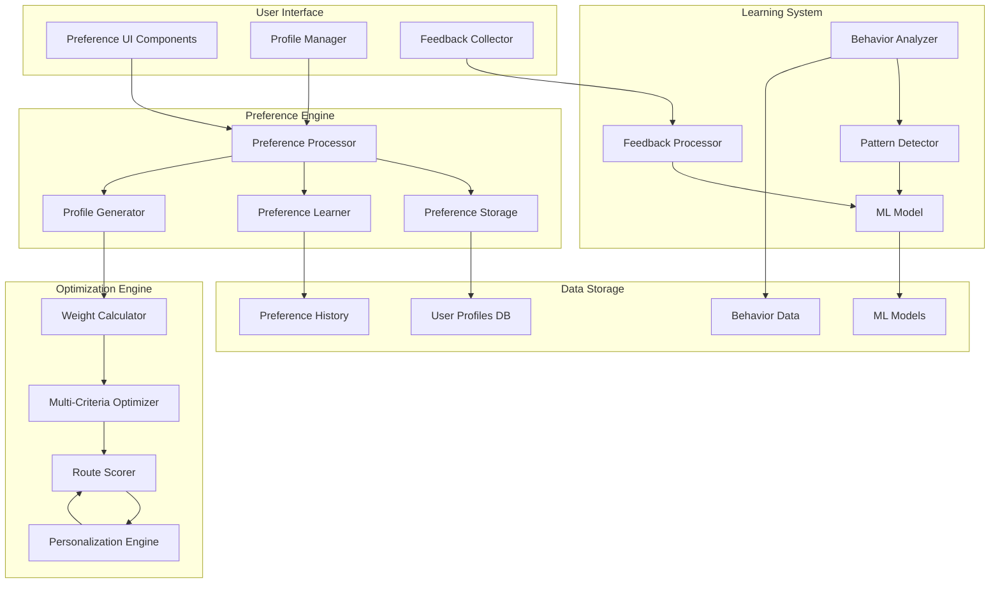
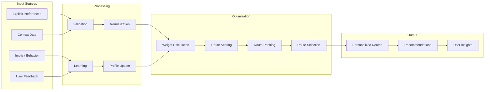

# User Preference System with Multi-Criteria Optimization

## Executive Summary

This document outlines the architecture of the user preference system that enables personalized multi-modal route optimization. The system captures user preferences, learns from user behavior, and applies multi-criteria optimization algorithms to generate routes that match individual needs and priorities.

## 1. Preference System Architecture

### 1.1 High-Level Architecture



### 1.2 Data Flow Architecture



## 2. User Preference Models

### 2.1 Preference Data Model

```typescript
interface UserPreferences {
  id: string;
  userId: string;
  profileId?: string;
  criteria: PreferenceCriteria;
  constraints: PreferenceConstraints;
  context: ContextPreferences;
  meta: PreferenceMetadata;
}

interface PreferenceCriteria {
  speed: Criterion;
  safety: Criterion;
  cost: Criterion;
  comfort: Criterion;
  environmental: Criterion;
  accessibility: Criterion;
  reliability: Criterion;
  scenery: Criterion;
}

interface Criterion {
  weight: number; // 0-1
  importance: ImportanceLevel;
  preferences: CriterionPreferences;
  constraints: CriterionConstraints;
}

interface CriterionPreferences {
  // Speed preferences
  maxWalkingSpeed?: number;
  preferredTransitModes?: TransportMode[];
  avoidTraffic?: boolean;
    
  // Safety preferences
  avoidUnlitAreas?: boolean;
  preferCrosswalks?: boolean;
  avoidHighTraffic?: boolean;
    
  // Cost preferences
  maxCost?: number;
  preferFreeOptions?: boolean;
  costSensitivity?: number;
    
  // Comfort preferences
  minComfort?: number;
  avoidCrowds?: boolean;
    preferSeating?: boolean;
    
  // Environmental preferences
  preferEcoFriendly?: boolean;
  carbonFootprintWeight?: number;
    
  // Accessibility preferences
  wheelchairAccessible?: boolean;
    avoidStairs?: boolean;
    requireElevator?: boolean;
    
  // Reliability preferences
    requireRealTimeInfo?: boolean;
    maxDelay?: number;
    
  // Scenery preferences
    preferScenicRoutes?: boolean;
    scenicTypes?: SceneryType[];
}

interface PreferenceConstraints {
  maxWalkingDistance: number;
  maxTotalTime: number;
  maxTransfers: number;
  avoidModes: TransportMode[];
  requiredModes: TransportMode[];
  timeConstraints: TimeConstraints;
  accessibilityConstraints: AccessibilityConstraints;
}

interface ContextPreferences {
    timeOfDay: Record<TimeOfDay, Partial<PreferenceCriteria>>;
    dayOfWeek: Record<DayOfWeek, Partial<PreferenceCriteria>>;
    weather: Record<WeatherCondition, Partial<PreferenceCriteria>>;
    season: Record<Season, Partial<PreferenceCriteria>>;
    tripPurpose: Record<TripPurpose, Partial<PreferenceCriteria>>;
}

enum ImportanceLevel {
    CRITICAL = 'critical',
    HIGH = 'high',
    MEDIUM = 'medium',
    LOW = 'low',
    OPTIONAL = 'optional'
}

enum TransportMode {
    WALKING = 'walking',
    BICYCLE = 'bicycle',
    CAR = 'car',
    BUS = 'bus',
    METRO = 'metro',
    TRAM = 'tram',
    TRAIN = 'train',
    FERRY = 'ferry'
}
```

### 2.2 User Profile Model

```typescript
interface UserProfile {
    id: string;
    userId: string;
    name: string;
    type: ProfileType;
    basePreferences: UserPreferences;
    adaptivePreferences: AdaptivePreferences;
    behaviorPatterns: BehaviorPattern[];
    created: Date;
    updated: Date;
}

interface AdaptivePreferences {
    learnedWeights: LearnedWeights;
    contextualAdjustments: ContextualAdjustment[];
    recentFeedback: FeedbackEntry[];
    adaptationHistory: AdaptationRecord[];
}

interface LearnedWeights {
    speed: number;
    safety: number;
    cost: number;
    comfort: number;
    environmental: number;
    accessibility: number;
    reliability: number;
    scenery: number;
    confidence: Record<string, number>;
}

interface BehaviorPattern {
    id: string;
    type: PatternType;
    frequency: number;
    conditions: PatternConditions;
    outcome: PatternOutcome;
    confidence: number;
    lastSeen: Date;
}

interface PatternConditions {
    timeOfDay?: TimeOfDay;
    dayOfWeek?: DayOfWeek;
    weather?: WeatherCondition;
    originType?: LocationType;
    destinationType?: LocationType;
    tripPurpose?: TripPurpose;
    companions?: CompanionType[];
}

interface PatternOutcome {
    preferredMode: TransportMode[];
    averageDeviation: number;
    satisfactionScore: number;
    commonAvoidances: string[];
}

enum ProfileType {
    DEFAULT = 'default',
    COMMUTER = 'commuter',
    TOURIST = 'tourist',
    STUDENT = 'student',
    ELDERLY = 'elderly',
    DISABILITY = 'disability',
    CUSTOM = 'custom'
}
```

## 3. Multi-Criteria Optimization Engine

### 3.1 Weight Calculation System

```typescript
class WeightCalculator {
    private preferenceEngine: PreferenceEngine;
    private contextAnalyzer: ContextAnalyzer;
    private mlModel: MLModel;
    
    constructor(
        preferenceEngine: PreferenceEngine,
        contextAnalyzer: ContextAnalyzer,
        mlModel: MLModel
    ) {
        this.preferenceEngine = preferenceEngine;
        this.contextAnalyzer = contextAnalyzer;
        this.mlModel = mlModel;
    }
    
    async calculateWeights(
        userId: string,
        context: RoutingContext,
        request: RouteRequest
    ): Promise<OptimizationWeights> {
        // Get base preferences
        const basePreferences = await this.preferenceEngine.getUserPreferences(userId);
        
        // Adjust for context
        const contextAdjustments = await this.contextAnalyzer.getContextualAdjustments(
            basePreferences,
            context
        );
        
        // Apply ML-based personalization
        const mlAdjustments = await this.mlModel.predictAdjustments(
            userId,
            context,
            request
        );
        
        // Combine all weights
        const combinedWeights = this.combineWeights(
            basePreferences.criteria,
            contextAdjustments,
            mlAdjustments
        );
        
        // Normalize weights
        return this.normalizeWeights(combinedWeights);
    }
    
    private combineWeights(
        baseCriteria: PreferenceCriteria,
        contextAdjustments: ContextualAdjustment[],
        mlAdjustments: MLAdjustment[]
    ): OptimizationWeights {
        const weights: OptimizationWeights = {};
        
        // Start with base weights
        weights.speed = baseCriteria.speed.weight;
        weights.safety = baseCriteria.safety.weight;
        weights.cost = baseCriteria.cost.weight;
        weights.comfort = baseCriteria.comfort.weight;
        weights.environmental = baseCriteria.environmental.weight;
        weights.accessibility = baseCriteria.accessibility.weight;
        weights.reliability = baseCriteria.reliability.weight;
        weights.scenery = baseCriteria.scenery.weight;
        
        // Apply context adjustments
        for (const adjustment of contextAdjustments) {
            if (weights[adjustment.criterion] !== undefined) {
                weights[adjustment.criterion] *= adjustment.factor;
            }
        }
        
        // Apply ML adjustments
        for (const adjustment of mlAdjustments) {
            if (weights[adjustment.criterion] !== undefined) {
                weights[adjustment.criterion] *= adjustment.factor;
            }
        }
        
        return weights;
    }
    
    private normalizeWeights(weights: OptimizationWeights): OptimizationWeights {
        const total = Object.values(weights).reduce((sum, weight) => sum + weight, 0);
        const normalized: OptimizationWeights = {};
        
        for (const [key, weight] of Object.entries(weights)) {
            normalized[key] = weight / total;
        }
        
        return normalized;
    }
}

interface OptimizationWeights {
    speed: number;
    safety: number;
    cost: number;
    comfort: number;
    environmental: number;
    accessibility: number;
    reliability: number;
    scenery: number;
}
```

### 3.2 Multi-Criteria Route Scoring

```typescript
class MultiCriteriaScorer {
    private weights: OptimizationWeights;
    private criteriaEvaluators: Map<string, CriterionEvaluator>;
    
    constructor(weights: OptimizationWeights) {
        this.weights = weights;
        this.criteriaEvaluators = new Map();
        this.initializeEvaluators();
    }
    
    private initializeEvaluators(): void {
        this.criteriaEvaluators.set('speed', new SpeedEvaluator());
        this.criteriaEvaluators.set('safety', new SafetyEvaluator());
        this.criteriaEvaluators.set('cost', new CostEvaluator());
        this.criteriaEvaluators.set('comfort', new ComfortEvaluator());
        this.criteriaEvaluators.set('environmental', new EnvironmentalEvaluator());
        this.criteriaEvaluators.set('accessibility', new AccessibilityEvaluator());
        this.criteriaEvaluators.set('reliability', new ReliabilityEvaluator());
        this.criteriaEvaluators.set('scenery', new SceneryEvaluator());
    }
    
    scoreRoute(route: MultiModalRoute, context: RoutingContext): RouteScore {
        const criteriaScores: Record<string, number> = {};
        
        // Evaluate each criterion
        for (const [criterionName, weight] of Object.entries(this.weights)) {
            const evaluator = this.criteriaEvaluators.get(criterionName);
            if (evaluator) {
                criteriaScores[criterionName] = evaluator.evaluate(route, context);
            }
        }
        
        // Calculate weighted score
        const totalScore = this.calculateWeightedScore(criteriaScores);
        
        // Calculate individual component scores for UI
        const components = this.calculateComponentScores(criteriaScores);
        
        return {
            total: totalScore,
            components,
            criteria: criteriaScores,
            confidence: this.calculateConfidence(criteriaScores)
        };
    }
    
    private calculateWeightedScore(criteriaScores: Record<string, number>): number {
        let totalScore = 0;
        
        for (const [criterion, score] of Object.entries(criteriaScores)) {
            const weight = this.weights[criterion];
            totalScore += score * weight;
        }
        
        return totalScore;
    }
    
    private calculateComponentScores(criteriaScores: Record<string, number>): ScoreComponents {
        return {
            speed: criteriaScores.speed || 0,
            safety: criteriaScores.safety || 0,
            cost: criteriaScores.cost || 0,
            comfort: criteriaScores.comfort || 0,
            environmental: criteriaScores.environmental || 0,
            accessibility: criteriaScores.accessibility || 0,
            reliability: criteriaScores.reliability || 0,
            scenery: criteriaScores.scenery || 0
        };
    }
    
    private calculateConfidence(criteriaScores: Record<string, number>): number {
        // Calculate confidence based on data availability and consistency
        const availableScores = Object.values(criteriaScores).filter(score => score > 0).length;
        const totalScores = Object.keys(criteriaScores).length;
        
        return availableScores / totalScores;
    }
}

// Example criterion evaluator
class SafetyEvaluator implements CriterionEvaluator {
    evaluate(route: MultiModalRoute, context: RoutingContext): number {
        let safetyScore = 0.5; // Base score

        // Evaluate based on transport mode
        for (const segment of route.segments) {
            switch (segment.mode) {
                case TransportMode.WALKING:
                    safetyScore += this.evaluateWalkingSafety(segment);
                    break;
                case TransportMode.BICYCLE:
                    safetyScore += this.evaluateBicycleSafety(segment);
                    break;
                case TransportMode.CAR:
                    safetyScore += this.evaluateDrivingSafety(segment);
                    break;
                case TransportMode.METRO:
                case TransportMode.BUS:
                    safetyScore += this.evaluateTransitSafety(segment);
                    break;
            }
        }

        // Adjust for time of day
        if (context.timeOfDay === TimeOfDay.NIGHT) {
            safetyScore *= 0.8;
        }

        // Normalize to 0-1 range
        return Math.min(1, Math.max(0, safetyScore / route.segments.length));
    }

    private evaluateWalkingSafety(segment: RouteSegment): number {
        let score = 0.5;

        // Check for sidewalks
        if (segment.attributes.hasSidewalk) {
            score += 0.3;
        }

        // Check for lighting
        if (segment.attributes.isWellLit) {
            score += 0.2;
        }

        // Check traffic density
        if (segment.attributes.trafficDensity === 'low') {
            score += 0.2;
        } else if (segment.attributes.trafficDensity === 'high') {
            score -= 0.2;
        }

        // Check for crosswalks
        if (segment.attributes.hasCrosswalk) {
            score += 0.1;
        }

        return score;
    }

    // Other evaluation methods...
}
```

### 3.3 Pareto-Optimal Route Selection

```typescript
class ParetoOptimizer {
    private criteria: string[];
    private objectives: Record<string, Objective>;
    
    constructor(criteria: string[]) {
        this.criteria = criteria;
        this.objectives = this.initializeObjectives();
    }
    
    findParetoOptimalRoutes(routes: MultiModalRoute[]): ParetoResult {
        // Evaluate all routes
        const evaluatedRoutes = routes.map(route => ({
            route,
            scores: this.evaluateRoute(route)
        }));
        
        // Find Pareto front
        const paretoFront = this.findParetoFront(evaluatedRoutes);
        
        // Rank Pareto-optimal routes
        const rankedRoutes = this.rankParetoRoutes(paretoFront);
        
        return {
            paretoOptimal: rankedRoutes,
            dominatedRoutes: this.findDominatedRoutes(evaluatedRoutes, paretoFront),
            tradeoffs: this.calculateTradeoffs(paretoFront)
        };
    }
    
    private evaluateRoute(route: MultiModalRoute): RouteEvaluation {
        const evaluation: RouteEvaluation = {};
        
        for (const criterion of this.criteria) {
            evaluation[criterion] = this.objectives[criterion].evaluate(route);
        }
        
        return evaluation;
    }
    
    private findParetoFront(evaluatedRoutes: EvaluatedRoute[]): EvaluatedRoute[] {
        const paretoFront: EvaluatedRoute[] = [];
        
        for (const current of evaluatedRoutes) {
            let isDominated = false;
            
            for (const other of evaluatedRoutes) {
                if (current !== other && this.dominates(other, current)) {
                    isDominated = true;
                    break;
                }
            }
            
            if (!isDominated) {
                paretoFront.push(current);
            }
        }
        
        return paretoFront;
    }
    
    private dominates(a: EvaluatedRoute, b: EvaluatedRoute): boolean {
        let atLeastOneBetter = false;
        
        for (const criterion of this.criteria) {
            const objective = this.objectives[criterion];
            const aScore = a.scores[criterion];
            const bScore = b.scores[criterion];
            
            if (objective.type === ObjectiveType.MAXIMIZE) {
                if (aScore < bScore) {
                    return false; // a is not better in all criteria
                }
                if (aScore > bScore) {
                    atLeastOneBetter = true;
                }
            } else { // MINIMIZE
                if (aScore > bScore) {
                    return false; // a is not better in all criteria
                }
                if (aScore < bScore) {
                    atLeastOneBetter = true;
                }
            }
        }
        
        return atLeastOneBetter;
    }
    
    private rankParetoRoutes(paretoFront: EvaluatedRoute[]): RankedRoute[] {
        const ranked: RankedRoute[] = [];
        
        for (const evaluated of paretoFront) {
            // Calculate compromise score (distance from ideal point)
            const compromiseScore = this.calculateCompromiseScore(evaluated);
            
            ranked.push({
                route: evaluated.route,
                rank: 0, // Will be set after sorting
                score: compromiseScore,
                criteria: evaluated.scores
            });
        }
        
        // Sort by compromise score
        ranked.sort((a, b) => b.score - a.score);
        
        // Set ranks
        ranked.forEach((route, index) => {
            route.rank = index + 1;
        });
        
        return ranked;
    }
    
    private calculateCompromiseScore(evaluated: EvaluatedRoute): number {
        // Find ideal and nadir points
        const ideal = this.findIdealPoint(evaluated);
        const nadir = this.findNadirPoint(evaluated);
        
        // Calculate normalized distance from ideal
        let distance = 0;
        for (const criterion of this.criteria) {
            const value = evaluated.scores[criterion];
            const idealValue = ideal[criterion];
            const nadirValue = nadir[criterion];
            
            // Normalize to 0-1 range
            const normalizedValue = (value - nadirValue) / (idealValue - nadirValue);
            distance += Math.pow(1 - normalizedValue, 2);
        }
        
        return 1 - Math.sqrt(distance / this.criteria.length);
    }
    
    private calculateTradeoffs(paretoFront: EvaluatedRoute[]): TradeoffAnalysis {
        const tradeoffs: TradeoffAnalysis = {
            pairs: [],
            criteria: this.criteria
        };
        
        // Analyze tradeoffs between each pair of criteria
        for (let i = 0; i < this.criteria.length; i++) {
            for (let j = i + 1; j < this.criteria.length; j++) {
                const criterion1 = this.criteria[i];
                const criterion2 = this.criteria[j];
                
                const pairAnalysis = this.analyzeCriterionPair(
                    paretoFront,
                    criterion1,
                    criterion2
                );
                
                tradeoffs.pairs.push(pairAnalysis);
            }
        }
        
        return tradeoffs;
    }
}
```

## 4. Preference Learning System

### 4.1 Behavior Analysis Engine

```typescript
class BehaviorAnalyzer {
    private storage: BehaviorStorage;
    private patternDetector: PatternDetector;
    private feedbackProcessor: FeedbackProcessor;
    
    constructor(storage: BehaviorStorage) {
        this.storage = storage;
        this.patternDetector = new PatternDetector();
        this.feedbackProcessor = new FeedbackProcessor();
    }
    
    async analyzeUserBehavior(userId: string, timeRange: TimeRange): Promise<BehaviorAnalysis> {
        // Get user's route history
        const routeHistory = await this.storage.getRouteHistory(userId, timeRange);
        
        // Get user's feedback
        const feedback = await this.storage.getUserFeedback(userId, timeRange);
        
        // Analyze selections
        const selectionAnalysis = this.analyzeRouteSelections(routeHistory);
        
        // Analyze deviations
        const deviationAnalysis = this.analyzeRouteDeviations(routeHistory);
        
        // Analyze feedback patterns
        const feedbackAnalysis = await this.feedbackProcessor.analyzeFeedback(feedback);
        
        // Detect behavior patterns
        const patterns = await this.patternDetector.detectPatterns(routeHistory, feedback);
        
        return {
            userId,
            timeRange,
            selections: selectionAnalysis,
            deviations: deviationAnalysis,
            feedback: feedbackAnalysis,
            patterns,
            insights: this.generateInsights(selectionAnalysis, deviationAnalysis, feedbackAnalysis, patterns)
        };
    }
    
    private analyzeRouteSelections(history: RouteHistoryEntry[]): SelectionAnalysis {
        const selections: SelectionAnalysis = {
            modePreferences: new Map(),
            timePreferences: new Map(),
            distancePreferences: new Map(),
            costPreferences: new Map(),
            totalRoutes: history.length
        };
        
        for (const entry of history) {
            // Analyze mode preferences
            const mode = entry.selectedRoute.primaryMode;
            selections.modePreferences.set(
                mode,
                (selections.modePreferences.get(mode) || 0) + 1
            );
            
            // Analyze time preferences
            const timeOfDay = this.getTimeOfDay(entry.startTime);
            selections.timePreferences.set(
                timeOfDay,
                (selections.timePreferences.get(timeOfDay) || 0) + 1
            );
            
            // Analyze distance preferences
            const distanceRange = this.getDistanceRange(entry.selectedRoute.distance);
            selections.distancePreferences.set(
                distanceRange,
                (selections.distancePreferences.get(distanceRange) || 0) + 1
            );
            
            // Analyze cost preferences
            const costRange = this.getCostRange(entry.selectedRoute.cost);
            selections.costPreferences.set(
                costRange,
                (selections.costPreferences.get(costRange) || 0) + 1
            );
        }
        
        return selections;
    }
    
    private analyzeRouteDeviations(history: RouteHistoryEntry[]): DeviationAnalysis {
        const deviations: DeviationAnalysis = {
            totalDeviations: 0,
            deviationReasons: new Map(),
            commonDetourPoints: new Map(),
            averageDeviationTime: 0
        };
        
        let totalDeviationTime = 0;
        let deviationCount = 0;
        
        for (const entry of history) {
            if (entry.deviations && entry.deviations.length > 0) {
                deviations.totalDeviations += entry.deviations.length;
                
                for (const deviation of entry.deviations) {
                    // Analyze deviation reasons
                    const reason = deviation.reason;
                    deviations.deviationReasons.set(
                        reason,
                        (deviations.deviationReasons.get(reason) || 0) + 1
                    );
                    
                    // Track common detour points
                    const point = this.getDetourPoint(deviation);
                    deviations.commonDetourPoints.set(
                        point,
                        (deviations.commonDetourPoints.get(point) || 0) + 1
                    );
                    
                    totalDeviationTime += deviation.additionalTime;
                    deviationCount++;
                }
            }
        }
        
        deviations.averageDeviationTime = deviationCount > 0 ? totalDeviationTime / deviationCount : 0;
        
        return deviations;
    }
    
    private generateInsights(
        selection: SelectionAnalysis,
        deviation: DeviationAnalysis,
        feedback: FeedbackAnalysis,
        patterns: BehaviorPattern[]
    ): UserInsight[] {
        const insights: UserInsight[] = [];
        
        // Generate mode preference insight
        const dominantMode = this.getDominantPreference(selection.modePreferences);
        if (dominantMode && dominantMode.percentage > 70) {
            insights.push({
                type: InsightType.MODE_PREFERENCE,
                confidence: 0.8,
                value: dominantMode.mode,
                description: `User strongly prefers ${dominantMode.mode} transport`,
                recommendations: [
                    `Prioritize ${dominantMode.mode} routes`,
                    `Consider ${dominantMode.mode} alternatives when primary mode is unavailable`
                ]
            });
        }
        
        // Generate time preference insight
        const timePreference = this.getDominantPreference(selection.timePreferences);
        if (timePreference && timePreference.percentage > 60) {
            insights.push({
                type: InsightType.TIME_PATTERN,
                confidence: 0.7,
                value: timePreference.preference,
                description: `User frequently travels during ${timePreference.preference}`,
                recommendations: [
                    `Optimize routes for ${timePreference.preference} conditions`,
                    `Consider typical traffic patterns for ${timePreference.preference}`
                ]
            });
        }
        
        // Generate deviation insight
        if (deviation.totalDeviations > 0) {
            const dominantReason = this.getDominantPreference(deviation.deviationReasons);
            if (dominantReason) {
                insights.push({
                    type: InsightType.DEVIATION_PATTERN,
                    confidence: 0.6,
                    value: dominantReason.reason,
                    description: `User frequently deviates due to ${dominantReason.reason}`,
                    recommendations: [
                        `Avoid routes with ${dominantReason.reason} issues`,
                        `Provide alternatives that minimize ${dominantReason.reason} risks`
                    ]
                });
            }
        }
        
        return insights;
    }
}
```

### 4.2 Machine Learning Model

```typescript
class PreferenceLearningModel {
    private model: TensorFlowModel;
    private featureExtractor: FeatureExtractor;
    private trainer: ModelTrainer;
    
    constructor() {
        this.featureExtractor = new FeatureExtractor();
        this.trainer = new ModelTrainer();
    }
    
    async initialize(): Promise<void> {
        this.model = await this.loadOrCreateModel();
    }
    
    async trainModel(trainingData: TrainingData[]): Promise<TrainingResults> {
        // Extract features from training data
        const features = trainingData.map(data => 
            this.featureExtractor.extractFeatures(data)
        );
        
        const labels = trainingData.map(data => 
            this.featureExtractor.extractLabels(data)
        );
        
        // Train the model
        const results = await this.trainer.train(this.model, features, labels);
        
        // Save the updated model
        await this.saveModel(this.model);
        
        return results;
    }
    
    async predictWeights(
        userId: string,
        context: RoutingContext,
        request: RouteRequest
    ): Promise<WeightPrediction> {
        // Extract features for prediction
        const features = this.featureExtractor.extractContextFeatures(
            userId,
            context,
            request
        );
        
        // Make prediction
        const prediction = await this.model.predict(features);
        
        // Convert prediction to weight adjustments
        const adjustments = this.convertToWeightAdjustments(prediction);
        
        return {
            adjustments,
            confidence: this.calculatePredictionConfidence(prediction),
            features: features
        };
    }
    
    private async loadOrCreateModel(): Promise<TensorFlowModel> {
        try {
            // Try to load existing model
            return await tf.loadLayersModel('localstorage://preference-model');
        } catch {
            // Create new model if none exists
            return this.createNewModel();
        }
    }
    
    private createNewModel(): TensorFlowModel {
        const model = tf.sequential({
            layers: [
                tf.layers.dense({
                    inputShape: [this.featureExtractor.getFeatureCount()],
                    units: 128,
                    activation: 'relu'
                }),
                tf.layers.dropout({ rate: 0.2 }),
                tf.layers.dense({
                    units: 64,
                    activation: 'relu'
                }),
                tf.layers.dropout({ rate: 0.2 }),
                tf.layers.dense({
                    units: 8, // One for each criterion
                    activation: 'sigmoid'
                })
            ]
        });
        
        model.compile({
            optimizer: 'adam',
            loss: 'meanSquaredError',
            metrics: ['mae']
        });
        
        return model;
    }
    
    private convertToWeightAdjustments(prediction: tf.Tensor): WeightAdjustment[] {
        const values = prediction.dataSync();
        const criteria = ['speed', 'safety', 'cost', 'comfort', 'environmental', 'accessibility', 'reliability', 'scenery'];
        
        return criteria.map((criterion, index) => ({
            criterion,
            factor: values[index]
        }));
    }
}

class FeatureExtractor {
    getUserFeatures(userId: string): UserFeatures {
        // Extract user-specific features
        return {
            age: this.getUserAge(userId),
            mobilityImpairment: this.hasMobilityImpairment(userId),
            commuteFrequency: this.getCommuteFrequency(userId),
            typicalTripDistance: this.getTypicalTripDistance(userId),
            costSensitivity: this.getCostSensitivity(userId),
            environmentalConsciousness: this.getEnvironmentalConsciousness(userId)
        };
    }
    
    getContextFeatures(context: RoutingContext): ContextFeatures {
        return {
            timeOfDay: this.encodeTimeOfDay(context.timeOfDay),
            dayOfWeek: this.encodeDayOfWeek(context.dayOfWeek),
            weather: this.encodeWeather(context.weather),
            temperature: this.normalizeTemperature(context.temperature),
            isHoliday: context.isHoliday ? 1 : 0,
            isRushHour: this.isRushHour(context.timeOfDay) ? 1 : 0
        };
    }
    
    getRequestFeatures(request: RouteRequest): RequestFeatures {
        return {
            distance: this.normalizeDistance(this.calculateDirectDistance(request.origin, request.destination)),
            urbanDensity: this.getUrbanDensity(request.origin, request.destination),
            transportAvailability: this.getTransportAvailability(request.origin, request.destination),
            terrainDifficulty: this.getTerrainDifficulty(request.origin, request.destination)
        };
    }
}
```

## 5. Preference UI Components

### 5.1 Preference Settings Component

```typescript
const PreferenceSettings: React.FC<PreferenceSettingsProps> = ({ userId, onSave, initialPreferences }) => {
    const [preferences, setPreferences] = useState<UserPreferences>(initialPreferences || getDefaultPreferences());
    const [activeTab, setActiveTab] = useState<string>('criteria');
    const [isLoading, setIsLoading] = useState(false);
    
    const handleCriterionChange = (criterion: string, field: string, value: any) => {
        setPreferences(prev => ({
            ...prev,
            criteria: {
                ...prev.criteria,
                [criterion]: {
                    ...prev.criteria[criterion],
                    [field]: value
                }
            }
        }));
    };
    
    const handleConstraintChange = (field: string, value: any) => {
        setPreferences(prev => ({
            ...prev,
            constraints: {
                ...prev.constraints,
                [field]: value
            }
        }));
    };
    
    const handleContextChange = (context: string, criterion: string, value: any) => {
        setPreferences(prev => ({
            ...prev,
            context: {
                ...prev.context,
                [context]: {
                    ...prev.context[context],
                    [criterion]: value
                }
            }
        }));
    };
    
    const handleSave = async () => {
        setIsLoading(true);
        try {
            await onSave(preferences);
            toast.success('Preferences saved successfully');
        } catch (error) {
            toast.error('Failed to save preferences');
        } finally {
            setIsLoading(false);
        }
    };
    
    return (
        <Card className="w-full max-w-4xl mx-auto">
            <CardHeader>
                <CardTitle>Route Preferences</CardTitle>
                <CardDescription>
                    Customize your routing preferences to get personalized recommendations
                </CardDescription>
            </CardHeader>
            <CardContent>
                <Tabs value={activeTab} onValueChange={setActiveTab}>
                    <TabsList className="grid w-full grid-cols-4">
                        <TabsTrigger value="criteria">Criteria</TabsTrigger>
                        <TabsTrigger value="constraints">Constraints</TabsTrigger>
                        <TabsTrigger value="context">Context</TabsTrigger>
                        <TabsTrigger value="profiles">Profiles</TabsTrigger>
                    </TabsList>
                    
                    <TabsContent value="criteria" className="space-y-4">
                        <CriteriaSettings
                            criteria={preferences.criteria}
                            onChange={handleCriterionChange}
                        />
                    </TabsContent>
                    
                    <TabsContent value="constraints" className="space-y-4">
                        <ConstraintsSettings
                            constraints={preferences.constraints}
                            onChange={handleConstraintChange}
                        />
                    </TabsContent>
                    
                    <TabsContent value="context" className="space-y-4">
                        <ContextSettings
                            context={preferences.context}
                            onChange={handleContextChange}
                        />
                    </TabsContent>
                    
                    <TabsContent value="profiles" className="space-y-4">
                        <ProfileSettings
                            userId={userId}
                            currentPreferences={preferences}
                            onSelect={setPreferences}
                        />
                    </TabsContent>
                </Tabs>
                
                <div className="mt-6 flex justify-end">
                    <Button onClick={handleSave} disabled={isLoading}>
                        {isLoading ? <Loader2 className="mr-2 h-4 w-4 animate-spin" /> : null}
                        Save Preferences
                    </Button>
                </div>
            </CardContent>
        </Card>
    );
};

const CriteriaSettings: React.FC<CriteriaSettingsProps> = ({ criteria, onChange }) => {
    return (
        <div className="space-y-6">
            {Object.entries(criteria).map(([name, criterion]) => (
                <CriterionSettings
                    key={name}
                    name={name}
                    criterion={criterion}
                    onChange={(field, value) => onChange(name, field, value)}
                />
            ))}
        </div>
    );
};

const CriterionSettings: React.FC<CriterionSettingsProps> = ({ name, criterion, onChange }) => {
    const criterionInfo = getCriterionInfo(name);
    
    return (
        <Card>
            <CardHeader>
                <CardTitle className="flex items-center gap-2">
                    {criterionInfo.icon}
                    {criterionInfo.label}
                </CardTitle>
                <CardDescription>{criterionInfo.description}</CardDescription>
            </CardHeader>
            <CardContent className="space-y-4">
                <div className="space-y-2">
                    <Label>Importance</Label>
                    <Select
                        value={criterion.importance}
                        onValueChange={(value) => onChange('importance', value)}
                    >
                        <SelectTrigger>
                            <SelectValue />
                        </SelectTrigger>
                        <SelectContent>
                            <SelectItem value="optional">Optional</SelectItem>
                            <SelectItem value="low">Low</SelectItem>
                            <SelectItem value="medium">Medium</SelectItem>
                            <SelectItem value="high">High</SelectItem>
                            <SelectItem value="critical">Critical</SelectItem>
                        </SelectContent>
                    </Select>
                </div>
                
                <div className="space-y-2">
                    <Label>Weight ({(criterion.weight * 100).toFixed(0)}%)</Label>
                    <Slider
                        value={[criterion.weight * 100]}
                        onValueChange={([value]) => onChange('weight', value / 100)}
                        min={0}
                        max={100}
                        step={5}
                    />
                </div>
                
                {criterionInfo.preferenceFields && (
                    <div className="space-y-2">
                        <Label>Preferences</Label>
                        <div className="grid grid-cols-2 gap-4">
                            {criterionInfo.preferenceFields.map(field => (
                                <PreferenceField
                                    key={field.name}
                                    field={field}
                                    value={criterion.preferences[field.name]}
                                    onChange={(value) => onChange('preferences', {
                                        ...criterion.preferences,
                                        [field.name]: value
                                    })}
                                />
                            ))}
                        </div>
                    </div>
                )}
            </CardContent>
        </Card>
    );
};
```

### 5.2 Preference Visualization Component

```typescript
const PreferenceVisualization: React.FC<PreferenceVisualizationProps> = ({ preferences, routes }) => {
    const [selectedRoute, setSelectedRoute] = useState<MultiModalRoute | null>(null);
    const [comparisonMode, setComparisonMode] = useState<'radar' | 'bar'>('radar');
    
    const routeScores = useMemo(() => {
        if (!routes.length) return [];
        
        const scorer = new MultiCriteriaScorer(preferences.criteria);
        const context = getDefaultRoutingContext();
        
        return routes.map(route => ({
            route,
            score: scorer.scoreRoute(route, context)
        })).sort((a, b) => b.score.total - a.score.total);
    }, [preferences, routes]);
    
    return (
        <div className="space-y-6">
            <Card>
                <CardHeader>
                    <div className="flex items-center justify-between">
                        <CardTitle>Preference Analysis</CardTitle>
                        <div className="flex gap-2">
                            <Button
                                variant={comparisonMode === 'radar' ? 'default' : 'outline'}
                                size="sm"
                                onClick={() => setComparisonMode('radar')}
                            >
                                Radar Chart
                            </Button>
                            <Button
                                variant={comparisonMode === 'bar' ? 'default' : 'outline'}
                                size="sm"
                                onClick={() => setComparisonMode('bar')}
                            >
                                Bar Chart
                            </Button>
                        </div>
                    </div>
                </CardHeader>
                <CardContent>
                    {comparisonMode === 'radar' ? (
                        <RadarChart
                            data={routeScores}
                            criteria={Object.keys(preferences.criteria)}
                            selectedRoute={selectedRoute}
                            onSelectRoute={setSelectedRoute}
                        />
                    ) : (
                        <BarChart
                            data={routeScores}
                            criteria={Object.keys(preferences.criteria)}
                            selectedRoute={selectedRoute}
                            onSelectRoute={setSelectedRoute}
                        />
                    )}
                </CardContent>
            </Card>
            
            {selectedRoute && (
                <Card>
                    <CardHeader>
                        <CardTitle>Route Details</CardTitle>
                    </CardHeader>
                    <CardContent>
                        <RouteDetails
                            route={selectedRoute}
                            score={routeScores.find(r => r.route.id === selectedRoute.id)?.score}
                            preferences={preferences}
                        />
                    </CardContent>
                </Card>
            )}
            
            <Card>
                <CardHeader>
                    <CardTitle>Route Rankings</CardTitle>
                </CardHeader>
                <CardContent>
                    <RouteRankingTable
                        routeScores={routeScores}
                        selectedRoute={selectedRoute}
                        onSelectRoute={setSelectedRoute}
                    />
                </CardContent>
            </Card>
        </div>
    );
};

const RadarChart: React.FC<RadarChartProps> = ({ data, criteria, selectedRoute, onSelectRoute }) => {
    return (
        <div className="h-96">
            <ResponsiveContainer width="100%" height="100%">
                <RadarChart data={data.map(d => ({
                    name: d.route.name,
                    ...d.score.criteria
                }))}>
                    <PolarGrid />
                    <PolarAngleAxis dataKey="name" />
                    <PolarRadiusAxis angle={90} domain={[0, 1]} />
                    {data.map((d, index) => (
                        <Radar
                            key={d.route.id}
                            name={d.route.name}
                            dataKey={d.route.id}
                            stroke={colors[index % colors.length]}
                            fill={colors[index % colors.length]}
                            fillOpacity={0.1}
                            strokeWidth={selectedRoute?.id === d.route.id ? 3 : 1}
                        />
                    ))}
                    <Tooltip />
                    <Legend />
                </RadarChart>
            </ResponsiveContainer>
        </div>
    );
};
```

## 6. Integration with Existing Codebase

### 6.1 Enhanced useAdvancedRouting Hook

```typescript
// Enhanced version of existing useAdvancedRouting hook with preference system
const useEnhancedAdvancedRouting = () => {
    const [preferences, setPreferences] = useState<UserPreferences>(getDefaultPreferences());
    const [isLearning, setIsLearning] = useState(false);
    const [feedbackOpen, setFeedbackOpen] = useState(false);
    const [currentRoute, setCurrentRoute] = useState<MultiModalRoute | null>(null);
    
    // Initialize preference engine
    const preferenceEngine = useMemo(() => new PreferenceEngine(), []);
    const weightCalculator = useMemo(() => new WeightCalculator(preferenceEngine, new ContextAnalyzer(), new MLModel()), [preferenceEngine]);
    const multiCriteriaScorer = useMemo(() => new MultiCriteriaScorer(preferences.criteria), [preferences.criteria]);
    
    // Load user preferences
    useEffect(() => {
        const loadPreferences = async () => {
            try {
                const userPrefs = await preferenceEngine.getUserPreferences(getCurrentUserId());
                setPreferences(userPrefs);
            } catch (error) {
                console.error('Failed to load preferences:', error);
            }
        };
        
        loadPreferences();
    }, [preferenceEngine]);
    
    const calculateOptimalRoute = useCallback(async (
        from: [number, number],
        to: [number, number],
        places: any[],
        requestPrefs: UserPreferences,
        mode: string
    ): Promise<EnhancedAdvancedRoute> => {
        // Get context
        const context = await getContext();
        
        // Calculate personalized weights
        const weights = await weightCalculator.calculateWeights(
            getCurrentUserId(),
            context,
            {
                origin: from,
                destination: to,
                transportModes: [mode as TransportMode],
                preferences: requestPrefs.criteria,
                constraints: requestPrefs.constraints
            }
        );
        
        // Calculate routes using different algorithms
        const routes = await calculateMultipleRoutes(from, to, mode, places);
        
        // Score routes with personalized weights
        const scoredRoutes = routes.map(route => ({
            route,
            score: multiCriteriaScorer.scoreRoute(route, context)
        }));
        
        // Find Pareto-optimal routes
        const paretoOptimizer = new ParetoOptimizer(Object.keys(weights));
        const paretoResult = paretoOptimizer.findParetoOptimalRoutes(routes);
        
        // Select best route
        const bestRoute = scoredRoutes[0];
        
        const enhancedRoute: EnhancedAdvancedRoute = {
            ...bestRoute.route,
            personalizedScore: bestRoute.score,
            alternatives: paretoResult.paretoOptimal.slice(1).map(r => r.route),
            tradeoffs: paretoResult.tradeoffs,
            personalizationInsights: generatePersonalizationInsights(bestRoute.score, weights),
            weightExplanation: explainWeights(weights)
        };
        
        setCurrentRoute(enhancedRoute);
        
        return enhancedRoute;
    }, [weightCalculator, multiCriteriaScorer]);
    
    const provideFeedback = useCallback(async (feedback: RouteFeedback) => {
        if (!currentRoute) return;
        
        try {
            // Store feedback
            await preferenceEngine.storeFeedback(getCurrentUserId(), currentRoute.id, feedback);
            
            // Trigger learning process
            setIsLearning(true);
            await preferenceEngine.updatePreferences(getCurrentUserId(), feedback);
            
            // Update local preferences
            const updatedPrefs = await preferenceEngine.getUserPreferences(getCurrentUserId());
            setPreferences(updatedPrefs);
            
            setFeedbackOpen(false);
            toast.success('Thank you for your feedback!');
        } catch (error) {
            console.error('Failed to process feedback:', error);
            toast.error('Failed to process feedback');
        } finally {
            setIsLearning(false);
        }
    }, [currentRoute, preferenceEngine]);
    
    const updatePreferences = useCallback(async (newPreferences: UserPreferences) => {
        try {
            await preferenceEngine.updateUserPreferences(getCurrentUserId(), newPreferences);
            setPreferences(newPreferences);
            toast.success('Preferences updated successfully');
        } catch (error) {
            console.error('Failed to update preferences:', error);
            toast.error('Failed to update preferences');
        }
    }, [preferenceEngine]);
    
    return {
        isCalculating: false, // From existing hook
        calculateOptimalRoute,
        currentPreferences: preferences,
        updatePreferences,
        provideFeedback,
        currentRoute,
        isLearning,
        feedbackOpen,
        setFeedbackOpen
    };
};
```

### 6.2 Enhanced RouteBuilder Component

```typescript
const EnhancedRouteBuilder: React.FC<EnhancedRouteBuilderProps> = ({ userId }) => {
    const { calculateOptimalRoute, currentPreferences, updatePreferences, currentRoute, provideFeedback } = useEnhancedAdvancedRouting();
    const [showPreferences, setShowPreferences] = useState(false);
    const [showAnalysis, setShowAnalysis] = useState(false);
    const [selectedAlternative, setSelectedAlternative] = useState<number>(0);
    const [fromLocation, setFromLocation] = useState("");
    const [toLocation, setToLocation] = useState("");
    const [transportMode, setTransportMode] = useState<string>("walking");
    const [isBuilding, setIsBuilding] = useState(false);
    
    const handleBuildRoute = async (isSmart: boolean = false) => {
        if (!fromLocation || !toLocation) {
            toast.error("Заполните точки маршрута");
            return;
        }
        
        setIsBuilding(true);
        
        try {
            // Geocode addresses
            const fromCoords = await geocode(fromLocation);
            const toCoords = await geocode(toLocation);
            
            if (!fromCoords || !toCoords) {
                toast.error("Не удалось найти указанные адреса");
                return;
            }
            
            // Calculate optimal route with preferences
            const route = await calculateOptimalRoute(
                fromCoords,
                toCoords,
                [], // places
                currentPreferences,
                transportMode
            );
            
            // Store route data for map display
            const routeData = {
                ...route,
                from: fromLocation,
                to: toLocation,
                fromCoords,
                toCoords,
                mode: transportMode,
                isSmart
            };
            
            localStorage.setItem('routeData', JSON.stringify(routeData));
            
            toast.success("Персонализированный маршрут построен!");
            
            // Navigate to map
            setTimeout(() => {
                navigate("/map");
            }, 800);
            
        } catch (error) {
            toast.error("Ошибка при построении маршрута");
        } finally {
            setIsBuilding(false);
        }
    };
    
    return (
        <div className="w-full max-w-4xl mx-auto space-y-6 min-h-screen py-6">
            <Card className="shadow-lg">
                <CardHeader className="space-y-1">
                    <div className="flex items-center justify-between">
                        <CardTitle className="text-2xl flex items-center gap-2">
                            <MapPin className="h-6 w-6 text-primary" />
                            Построение маршрута
                        </CardTitle>
                        <div className="flex gap-2">
                            <Button
                                variant="outline"
                                size="sm"
                                onClick={() => setShowPreferences(true)}
                            >
                                <Settings className="h-4 w-4 mr-2" />
                                Preferences
                            </Button>
                            {currentRoute && (
                                <Button
                                    variant="outline"
                                    size="sm"
                                    onClick={() => setShowAnalysis(true)}
                                >
                                    <BarChart className="h-4 w-4 mr-2" />
                                    Analysis
                                </Button>
                            )}
                        </div>
                    </div>
                    <CardDescription>
                        Постройте маршрут с учетом ваших личных предпочтений
                    </CardDescription>
                </CardHeader>
                <CardContent className="space-y-4">
                    {/* Existing route builder UI */}
                    <div className="space-y-2">
                        <Label htmlFor="from">Откуда</Label>
                        <div className="relative">
                            <MapPin className="absolute left-3 top-3 h-4 w-4 text-muted-foreground" />
                            <Input
                                id="from"
                                placeholder="Введите адрес или название места"
                                value={fromLocation}
                                onChange={(e) => setFromLocation(e.target.value)}
                                className="pl-10"
                            />
                        </div>
                    </div>
                    
                    <div className="space-y-2">
                        <Label htmlFor="to">Куда</Label>
                        <div className="relative">
                            <MapPin className="absolute left-3 top-3 h-4 w-4 text-accent" />
                            <Input
                                id="to"
                                placeholder="Введите адрес или название места"
                                value={toLocation}
                                onChange={(e) => setToLocation(e.target.value)}
                                className="pl-10"
                            />
                        </div>
                    </div>
                    
                    <div className="space-y-2">
                        <Label>Способ передвижения</Label>
                        <div className="grid grid-cols-2 md:grid-cols-4 gap-2">
                            {transportModes.map((mode) => {
                                const Icon = mode.icon;
                                return (
                                    <button
                                        key={mode.id}
                                        onClick={() => setTransportMode(mode.id)}
                                        className={`flex flex-col items-center gap-1 p-3 rounded-lg border-2 transition-all text-xs ${
                                            transportMode === mode.id
                                                ? "border-primary bg-primary/5 text-primary"
                                                : "border-border hover:border-primary/50"
                                        }`}
                                    >
                                        <Icon className="h-4 w-4" />
                                        <span>{mode.label}</span>
                                    </button>
                                );
                            })}
                        </div>
                    </div>
                    
                    {currentRoute && (
                        <div className="space-y-2">
                            <Label>Текущие приоритеты</Label>
                            <div className="grid grid-cols-2 gap-2 text-sm">
                                {Object.entries(currentRoute.personalizedScore.components).map(([criterion, score]) => (
                                    <div key={criterion} className="flex justify-between">
                                        <span className="capitalize">{criterion}</span>
                                        <span>{(score * 100).toFixed(0)}%</span>
                                    </div>
                                ))}
                            </div>
                        </div>
                    )}
                    
                    <Button 
                        onClick={() => handleBuildRoute(false)} 
                        className="w-full" 
                        size="lg"
                        disabled={isBuilding}
                    >
                        {isBuilding ? (
                            <Loader2 className="h-4 w-4 animate-spin" />
                        ) : (
                            <Search className="h-4 w-4" />
                        )}
                        {isBuilding ? "Строим маршрут..." : "Построить персонализированный маршрут"}
                    </Button>
                </CardContent>
            </Card>
            
            <Dialog open={showPreferences} onOpenChange={setShowPreferences}>
                <DialogContent className="max-w-4xl max-h-[80vh] overflow-auto">
                    <DialogHeader>
                        <DialogTitle>Настройки предпочтений</DialogTitle>
                        <DialogDescription>
                            Настройте параметры для получения персонализированных маршрутов
                        </DialogDescription>
                    </DialogHeader>
                    <PreferenceSettings
                        userId={userId}
                        initialPreferences={currentPreferences}
                        onSave={updatePreferences}
                    />
                </DialogContent>
            </Dialog>
            
            <Dialog open={showAnalysis} onOpenChange={setShowAnalysis}>
                <DialogContent className="max-w-6xl max-h-[80vh] overflow-auto">
                    <DialogHeader>
                        <DialogTitle>Анализ маршрута</DialogTitle>
                        <DialogDescription>
                            Детальный анализ маршрута с учетом ваших предпочтений
                        </DialogDescription>
                    </DialogHeader>
                    {currentRoute && (
                        <PreferenceVisualization
                            preferences={currentPreferences}
                            routes={[currentRoute, ...currentRoute.alternatives]}
                        />
                    )}
                </DialogContent>
            </Dialog>
            
            {currentRoute && (
                <Dialog open={currentRoute?.feedbackOpen || false} onOpenChange={(open) => {
                    if (!open) provideFeedback({ rating: 0, comments: '' });
                }}>
                    <DialogContent>
                        <DialogHeader>
                            <DialogTitle>Обратная связь</DialogTitle>
                            <DialogDescription>
                                Помогите нам улучшить рекомендации, поделившись мнением о маршруте
                            </DialogDescription>
                        </DialogHeader>
                        <FeedbackForm
                            route={currentRoute}
                            onSubmit={provideFeedback}
                        />
                    </DialogContent>
                </Dialog>
            )}
        </div>
    );
};
```

This comprehensive user preference system with multi-criteria optimization provides a robust foundation for delivering personalized routing experiences. The system learns from user behavior, adapts to context, and provides transparent preference management while integrating seamlessly with the existing React/TypeScript codebase.